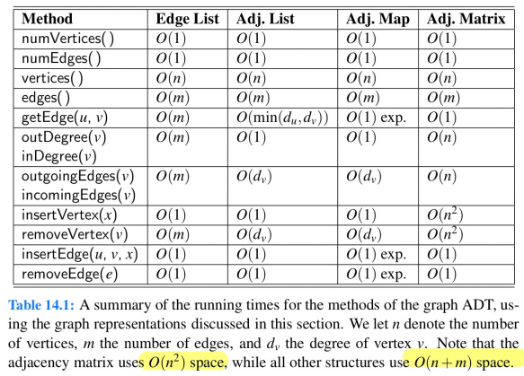

# Answers to Weblab Questions

---

# Week 1
## 1
1. T
2. F
3. T
4. F

## 2
line 1: c0 = 1 (calling the method) 
line 2: c1 = 2 (initialisation, getting the length of arr)  
line 3: c2 = 1 (initialisation) 
line 4: c3 + c4 * n = 1 + (n+1) + 2n (initialisation, comparing, incrementing) 
line 5: c5 * n = 2n (getting arr[j] and multiplication, but it is done n times) 
line 7: c6 = 1  (return)

T(n) = c0 + c1 + c2 + c3 + c4 + n * c5 + n * c6  
     = (c4 + c5) * n + c0 + c1 + c2 + c3 + c6 
     = 3n + 7  
     = O(n)

## 3
f1: 
line 1: c0  
line 2: c1 
line 3: c2 
line 5: c3 + c4 * n 
line 6: c5 * n 
line 8: c6 

T(n) = (c0 + c1 + c2 + c3 + c6 + (c4 + c5) * n)
     = ca + cb * n

The method is called n times, each time n = n - 1.

T(n) = c * (n + n-1 + ... + 1) 
     = c * n(n+1)/2 
     = O(n^2)

f2: 
line 1: c0 
line 2: c1 
line 3: c2 
line 6: c3 
line 8: c4 

The method is called n times.

T(n) = (c0 + c1 + c2 + c3 + c4) * n 
     = O(n)

## 4
1. 2^15, 2log2n, 2n+100log2n, 6n, 2nlog2n, 4nlog2n+2n, n^2+5n, 100n^3, 2^n
   - 2^n -> O(2^n)
   - 100n^3 -> O(n^3)
   - 2^log2n -> O(n)
   - 2n + 100log2n -> O(n)
   - 4nlog2n + 2n -> O(nlogn)
   - n^2 + 5n -> O(n^2)
   - 6n -> O(n)
   - 2^15 -> O(1)
   - 2nlog2n -> O(nlogn)
2. 1, 2

## 5

## 6
1. 2
   - T(1) cannot call T(n)
   - correct
   - not a recurrence relationship
   - T(1) does not have n
   - not a recurrence relationship
2. 3, 5
   - not a valid recurrence equation
   - not a closed form
   - correct
   - not a closed form
   - correct
3. 4
   - not necessarily, because T(n) is in terms of T(n-5) which means it is number of times it was called / 5.
   - incorrect
   - it is the length of the input array.

## 7
1. T(n) = T(n-2) + c, T(-2) = T(-1) = b
   - b is the set of constant operations that account for the bases cases (line 3, 5, 7)
   - c accounts for the guards of the if statements and the additions needed for the recursive call.
   - T is the function that represents the recursive function
   - The base cases are T(-2) and T(-1) to account for both the odd and even cases respectively.
   - Each recursive call n decreases by 2 because we increment low and decrement high.
2. .
   - a) b + cn/2 + c
     - T(n) = T(n-2) + c
     - T(n) = (T(n-4) + c) + c
     - T(n) = T(n-2k) + kc
     - take k = n/2 + 1
     - T(n) = T(-2) + cn/2 + c
     - T(n) = b + cn/2 + c
   - b) Proof by Induction
     - Base case:
       - At n = -2, T(-2) = b + (c * -2) / 2 + c = b
       - This correctly corresponds to the base case of the code
     - Inductive Hypothesis:
       - Suppose that the closed form of T(n-2) is correct: T(n-2) = c * (n-2)/2 + c + b
     - Inductive case: prove that the recursive case T(n) = T(n-2) + c correctly corresponds to the closed-form solution.
       - T(n) = T(n-2) + c
       - = (c * (n-2)/2 + c + b) + c (IH)
       - = ((n-2)/2 + 1) * c + c + b
       - = (n/2) * c + c + b
     - This correctly yields the closed form. By induction, it is now proven that T(n) = c * n/2 + c + b is correct for every integer n >= -2
3. O(n)
   - T(n) = n*d + e where d = c/2 and e = c+d.
   - The constant term can be removed because as n grows larger this constant will be insignificant.
   - The coefficient d can also be removed because with or without this factor the function will still have linear growth rate.
   - This leaves us with T(n) = n, which is a linear growth.
   - Therefore, the time complexity is O(n).
4. Proof
   - Show that there exists a real cA' > 0 and an integer n0 >= 1 such that b + cn/2 + c <= c'n for all n >= n0.
   - Take c' = 1 + b + c and n0 = 2
   - Prove that b + cn/2 + c <= n + bn + cn for all n >= 2
   - n - cn/2 -c + cn + bn - b = n + (n/2 - 1)c + (n - 1)b >= 0 for all n >= 2
   - We know that c and b are all positive, so we can tell that all terms are positive (or zero)
   - The equation holds.

## 8
1. True
2. False
   - If the array is never used it can be less than n.
3. False

## 9
1. False
2. False
3. False
4. True
5. False
6. True
7. True
8. True
9. False
10. True

## 10
1. False
2. 5
3. 3
4. 6

## 11
1. Linear recursion
2. Binary recursion

Types of recursive functions:
- Linear recursive functions
  - functions that only make a single call to itself each time the function runs
- Binary recursive functions
  - functions that call itself twice in each run
- Multiple recursive functions
  - more than twice

# Week 2
## 1
1. T
2. F
3. T
4. T
5. F
6. F
7. T

## 2
1. addFirst
2. DLL

## 3
3
- We don't have to manually set to null because there is no prev pointer and the garbage collector will remove the implicit head.

## 4
1. addFirst
2. removeLast
3. addFirst
4. removeFirst

## 5
1. dequeue
2. Queue
3. Array

## 6
1. T(n) = c0 + c1n + c2(n+1) = c3 + c4 * n
   - c3 = c0 + c2
   - c4 = c1 + c2
   - n is the size of the stack s
   - c0 represents the constant-time operations on line 2, 3, 4[1], 8, 9, 10[1], 14
   - c1 represents the constant-time operations on line 4[3], 5, 10[3], 11
   - c2 represents the constant-time operations on line 4[2] and 10[2]
2. O(n)
   - constant term c3 can be discarded because as n grows larger, the constant term has little impact on the growth rate of the function
   - coefficient c4 can also be discarded because with or without c4 the function has linear growth rate
   - therefore we are left with T(n) = n, which has O(n) complexity.

## 7
1. T(n) = c0 + c1n + c2(n+1) = c3 + c4 * n
   - c3 = c0 + c2
   - c4 = c1 + c2
   - n is the size of the queue q
   - c0 represents the constant-time operations on line 2, 3, 4, 5[1], 15, 16[1], 20
   - c1 represents the constant-time operations on line 5[3], 6, 10, 11, 16[1], 17
   - c2 represents the constant-time operations on line 5[2] and 16[2]
2. O(n)
    - constant term c3 can be discarded because as n grows larger, the constant term has little impact on the growth rate of the function
    - coefficient c4 can also be discarded because with or without c4 the function has linear growth rate
    - therefore we are left with T(n) = n, which h

# Week 3
## 1
1. Each Node
2. References
3. No
   - Two types of iterator: lazy and snapshot
     - lazy contains reference (O(1))
     - snapshot contains copies (O(n))

## 2
1. No
   - There is no complete implementation
2. No
   - It is an abstract class that is extended
3. True
4. True
5. True

## 3
1. Pq using a heap
2. getMin(e)

## 4
1. 42
2. 22, 87, 11, 90, 88
3. 88, 90, 87, 42
4. everything
5. 90
6. 87, 90, 88, 89, 92
7. 2

## 5
1. 42, 22, 11, 1, 34, 55, 50, 49, 53, 66
2. 1, 11, 22, 34, 42, 49, 50, 53, 55, 66
3. 1, 11, 34, 22, 49, 53, 50, 66, 55, 42
4. 42, 22, 55, 11, 34, 50, 66, 1, 49, 53
5. Neither

## 6
1. .
   - keys must be comparable
   - binary tree
   - maximum key for subtree
   - tree must be complete
2. .
   - all levels from 0 to h-1 are full
   - all nodes be in the left-most positions
3. n
4. 11,10,10,9,4,8

## 7
1. False
2. False
3. False
4. True

## 8
1. T(n) = 2 * (c1 + T(logn)) + c0 = 2T(logn) + c2
   - c0 represents the constant-time operations in line 2, 3, 5
   - c1 represents the constant-time operations in line 5 (getLeft() and getRight())
   - n represents the number of nodes in tree
   - T(logn) represents the calls in line 5
   - c2 represents 2c1 + c0
2. O(logn)
   - T(n) is 2T(logn) + c2
   - we can ignore the constant c2 because as the value of n gets larger and larger, the constant does not affect the growth rate much.
   - we can also ignore the coefficient 2 because the growth rate of the function is logarithmic with or without the coefficient.
3. The maximum depth of the tree

## R
If f(n) is Ω(g(n)), there exist constants c > 0 and a n0 <= n that satisfies c * g(n) <= f(n).

Take c = 2 and n0 = 1.

f(1) = 2 + 20 + 4 = 26. 
g(1) = 10 + 6 = 16.

cg(1) = 32, cg(1) is larger than f(1). 
For c = 2 and n0 = 1, the condition holds.

Therefore, f(n) is Ω(g(n)).

# Week 4
## 1
### Heap Sort
1. O(nlogn)
2. O(nlogn)
3. Key-based
4. inplace

### Insertion Sort
1. O(n^2)
2. O(n^2)
3. Comparison-based
4. Yes

### Merge Sort
1. O(nlogn)
2. O(nlogn)
3. comparison-based
4. .

### Quick Sort
1. O(nlogn)
2. O(n^2)
3. Comparison-based
4. .

## 2
1. Quick
2. Selection

## 3
1. 1,2,6,7,8,4,5,3
2. [12], [9,10], [5], [1,6]
3. 7 3 4 1 9 12

## 4
T(n) = T(n-1) + c1n + c2

## 5
1. .
   - n is the integer n
   - T(n-1) corresponds to the recursive call in line 13.
   - T(n) = T(n-1) + an + b(n+1) + c
   - a represents the constant time operations at line 6[3], 7-10
   - b represents the constant time operations at line 6[2]
   - c represents the constant time operations at line 2, 5, 6[1]
   - c1 corresponds to a+b
   - c2 corresponds to b+c
   - c3 represents the constant time operations at line 2-3
2. .
   1. T(n) = c1n^2 + c2n + c3
   2. .
   3. T(n) = O(n^2)

## 6
1. insertion - quick - merge
2. same comparison, fewer swaps

# Week 6
## 1) Comparison of sorting algorithms
1. Merge sort
2. Merge sort
3. Bucket sort
4. Insertion sort

## 2) Sorting
1. Insertion sort
2. O(n)
3. O(n^2)
4. Reverse order

## 3) Sorting stability
1. No
2. Yes
3. No
4. Yes
   - If we make separate lists to store elements that are smaller and larger than (and equal to), then quick sort can also be stable.
   - However, this is using extra space, so it is not usually implemented this way.

- Stable sorting algorithms
  - Selection sort (sorting itself is unstable, but when used in PQ it is stable)
  - Insertion sort
  - Bubble sort
  - Merge sort
  - Variation of quick sort
  - Bucket sort
  - Radix sort
- Unstable sorting algorithms
  - Heap sort (due to heap structure and operations)
  - Quick sort (due to swapping of elements relative to the pivot)

## 4) Radix sort
1. It uses a bucket sort algorithm twice. There could be two ways to sort:
   - Least significant digit first: sort by k2 first, and then sort by k1
   - Most significant digit first: sort by k1 first, and then sort by k2
2. The runtime complexity is O(n+m1+m2).
   - The first bucket sort takes O(n+m1)
     - n for all the elements, m1 for creation of buckets for possible values.
   - The second bucket sort takes O(n+m2)
     - n for all the elements, m2 for creation of buckets for possible values.
   - Combining these gives O(n + m1 + n + m2), which simplifies to O(n+m1+m2).
3. The space complexity is different for LSD and MSD
   - LSD: O(n + max(m1,m2)) because the space can be re-used for the second sort.
   - MSD: O(n + m1 + m2) because it is recursive (buckets are intuitively inside buckets)

## 5) Comparisons of Map ADTs
1. O(n)
   - Has to iterate through n elements
2. O(1)
   - Only hashing is needed to find the index
3. O(n)
   - In this case we have to use separate chaining because we cannot use open addressing (no space)
   - Worst-case scenario is when all the hash codes are same and all the elements are stored in the same bucket.
4. O(logn)
   - Use binary search
5. O(n)
   - When we put/remove at the first index, we have to move all other n elements to next/previous indices

## 6) Hashing by hand
1. 8
2. 5
3. 9

## 7) Maps
1. Recurrence equation
   - Base case (i == k) T(1, m) = m * cm + c0
     - cm represents the operations that are associated to putting one entry into the map
     - c0 represents the operations for the rest of the methods, except for line 14 and 18 onwards
   - Recursive case T(n, m) = 2 * T(n/2, m) + c1
     - 2 * T(n/2, m) regards the recursive calls made in lines 19 and 20
     - c1 represents the operations for the rest of the methods, except for line 13, 14, and 15 and the recursive calls
2. Closed-form
   - T(n,m) = 2T(n/2, m) + c1
   - = 2 * ( 2T(n/4, m) + c1) + c1
   - = 2 * 2T(n/4, m) + (2+1)c1
   - = 2 * 2(2T(n/8, m) + c1) + (2+1)c1
   - = 2 * 2 * 2T(n/8, m) + (4+2+1)c1
   - = 2^k * T(1, m) + c1 * Σ(i = 0 to k) 2^i  (k = logn)
   - = n(m*cm + c0) + 1 (1 - n)/(1 - 2) * c1
   - = nm*cm + nc0 + (n-1)c1

# Week 7
## 1) Tree classification
1. min heap
2. bst, max heap
3. none
4. max heap
5. bst
6. none
7. bst
8. bst
9. none
10. bst
11. none
12. none
13. bst
14. none
15. max heap

- Min/Max heap
  - parent has to be smaller/larger than child
  - has to be a balanced tree
  - has to be a complete tree
- Binary search tree
  - left has to be smaller, right has to be larger
  - does not have to balanced or complete

## 2) AVL tree insertion
1. does not affect
2. double rotation
3. double rotation
4. does not affect
5. double rotation

- Single rotation is also called left-left or right-right rotation
- Double rotation is also called left-right or right-left rotation

## 3) AVL tree deletion
1. none
2. two

## 4) Tree classification (avl)
1. bst, avl
2. min
3. none
4. bst, avl
5. bst
6. bst
7. none 

- For AVL Trees, the heights of the children of each node differ by at most 1.

## 5) Complex branching
1. Result: everything equal to or larger is deleted
2. Recurrence Equations
   - Base case T(0) = c0
     - c0 accounts for operations in line 2 and 3
   - Recursive case T(h) = T(h-1) + c1
     - T(h-1) account for the recursive calls in line 10 and 12.
     - c1 accounts for other operations, except lines 3 and 8.
3. Closed form
   - T(h) = T(h-1) + c1
   - = T(h-2) + c1 + c1
   - = T(h-3) + 3c1
   - = T(0) + hc1
   - = c0 + hc1
4. Proof (skipped)
5. Runtime complexity
   - The runtime complexity of this algorithm is O(h).
   - We can get rid of c0 because as h gets larger, this constant becomes insignificant
   - We can also get rid of c1 because with or without this coefficient, the runtime is linear.
   - Therefore we are left with h, indicating that the runtime for this method is O(h).
6. Improved runtime complexity
   1. O(n) because in the worst case the all the nodes can line up to one path.
   2. Height-balance
   3. O(logn) (because height-balanced trees guarantee the height of the tree to be logn.)

## 6) (2,4) trees insertion
1. no
2. two
3. one

- The number of elements in each child does not have to be equal; they just have to be 1, 2 or 3.

## 7) (2,4) trees deletion
1. no
2. transfer
3. fusion

- If the adjacent sibling is a 3-node or a 4-node, use transfer
- if the adjacent sibling is a 2-node, use fusion

## 8) Red-black trees
1. represents
2. not a red-black tree
3. does not represent
4. represents

# Week 8
## 1) Application of DFS
1. True
2. True
3. True
4. False
5. True

## 2) Application of BFS
1. True
2. True
3. True
4. True
5. True

## 3) Traversal of graphs
1. =
   - 1,2
   - 1,4
   - 2,3
   - 2,5
   - 4,6
   - 7,8
   - 7,9
   - 10,13
   - 12,13
   - 11,12
2. 3

## 4) Graph representations
1. O(n+m)
2. O(n+m)
3. O(n^2)
4. O(m)
5. O(n^2)
6. O(deg(v))
   - Because we have to remove all the edges that connects to v, which are stored in the neighbouring vertices

- Simply put, Adjacency matrix have O(n^2) space, while other data structures have O(n+m).
- 

## 5) Topological order
- CABDGFEHI
- ACBDFEGHI
- ACBDGFEHI
- ACBDFGEHI
- CABDFGEHI

## 6) Weighted graphs <- ???
1. 4
2. 8, 9, 17
3. 7
4. 3, 10, 23
5. 10, 11, 12
6. {C,D}
   {C,F}
   {A,E}
   {A,B}
   {B,C}

## 7)
We can perform the breadth-first search to find the shortest path.
Because breadth-first search visits nodes by taking the smallest number of edges,
if we keep the predecessor nodes for every visited node, we can track back from v until we get u and get the shortest path.

Answer from the weblab: 
The BFS algorithm can be used to find the shortest path in an undirected, unweighted graph.

This is the case because BFS works in layers. It will always first visit the vertex that's closest to the source
that hasn't been visited yet. Therefore, you have the guarantee that, 
whichever path was first to get to a vertex, it is a path with the minimum number of edges 
necessary to get to it.