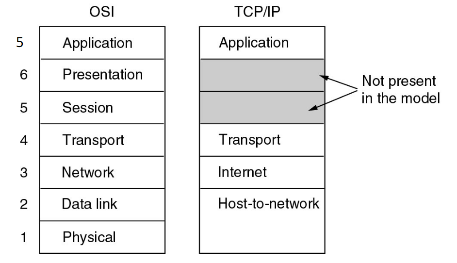

# Introduction

---

# Learning Objectives
- The student can describe the principles of layered architectures, in particular the functions and purposes of all layers for the OSI reference model (Lec)
- The student can describe the core algorithms of each layer and provide arguments why these algorithms fulfill the function of the respective layer (Lec, Self)
- The student can apply the core algorithms to toy examples (Tut, Lab)
- The student can design variants of core algorithms for a given scenario (Tut, Lab)
- The student can identify security issues of each layer and choose a suitable type of solution (Lec, Self, Tut)
- The student can exemplify the concepts of ethical hacking and responsible disclosure (Lec)

# Layers
## Protocol
> - Algorithm for communication between two or more parties
> - Defines the rules of communication 
> - Provides a service

The protocol is an algorithm, and the service is the function signature.

## Layers
Way of classifying protocols

Layers provide levels of abstraction: each layer provides services, but only to layer above.

Same layers on different machines communicate (or the look like they directly communicate),
but the lowest one does the actual communication.

### 1. Physical layer
Transfers bits over a physical medium
- LAN cable
- Router

### 2. Data link layer
Detects or corrects errors made by the physical layer  
and allows multiple parties to share a physical medium

### 3. Network layer
Realises routing data over multiple networks (internet routing)
- home network
- company network
- internet

### 4. Transport layer
Realises a reliable or unreliable datastream between two (internet) hosts

### 5. Application layer
Sends application-specific information over the network

## OSI and TCP/IP model

In OSI model, Session and Presentation layer do not have any protocols associated nowadays.

TCP/IP is another model that
- merges the physical and data link layer into one layer and
- does not have the session and presentation layer.

TCP/IP was designed based on existing protocols while OSI was designed on how protocols should be classified to properly separate the different purposes.