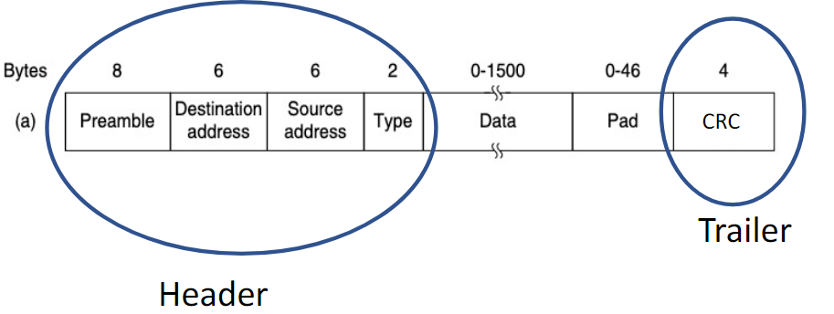
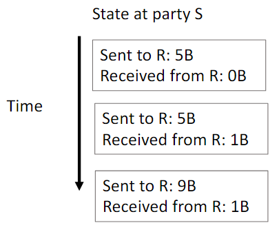
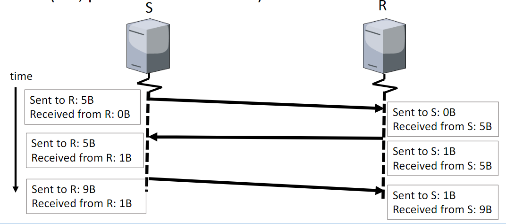
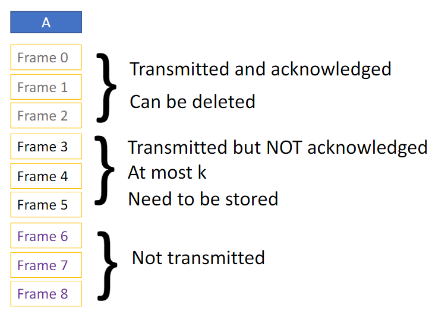
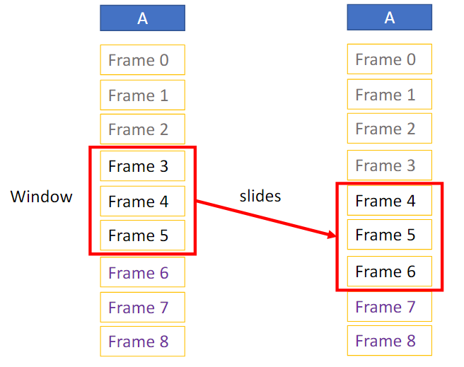
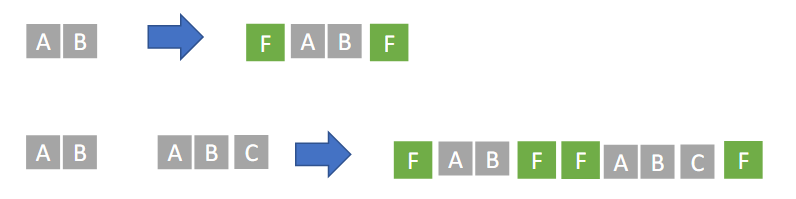
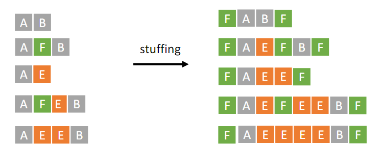
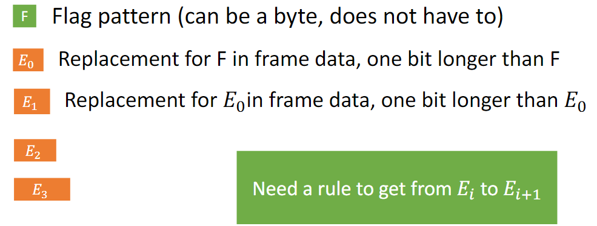
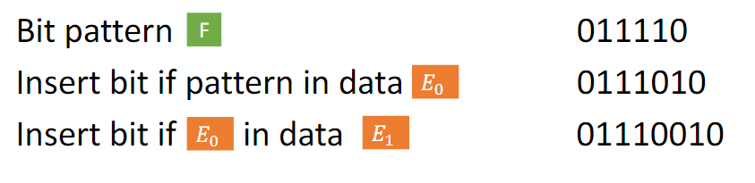

# Data Link Layer

---
> How does the data get from source to first router *reliably*?

Data link layer serves two purposes:
1. Error control: deal with bit flips and lost data
2. Channel allocation: decide how to share medium

# 0. Learning Objects
At the end of this topic, we should be able to give answers to following questions:
- How do we do the error detection and correction?
- How do we detect if frames are lost?
- How do we detect if parts of frames are lost?
- How do we know when a frame ends and the next one starts?
- What information goes into the header?

Topics:
- Terminology
- Acknowledgements (to detect data loss)
  - Sliding window protocols (to detect/handle data loss better)
- Framing (division/reassembling of data into frames)

# Terminologies
## Classifying servies and protocols
### Frames
Physical layer sends bits in groups to add information (additional bits) about reliability. 
These groups are called frames.

Frame looks as follows: 
.png)

The header and trailer have fixed length and structure, where the data can have variable length (with maximum and minimum).

As an example, the frame in Ethernet looks like below. 

### State
Information about the status of communication 
Changes over time

### Connection
Communication between two parties that is stateful (i.e., parties maintain state)

Requires:
- Agreement on initial state
- Exchange of state information (e.g., in the header)

### Connection-oriented vs. Connectionless
- Connection-oriented service/protocol:
  - Establish connection (agree on initial state)
  - Communicate (data and state)
  - Release connection (stop storing state)

- Connectionless service/protocol: just send data

## Evaluating networks and protocols
### Latency / Propagation delay
Latency from A to B: time between the moment a very short message leaves machine A until it arrives at machine B

(i.e., between A sending and B receiving)

### Round trip time (RTT)
Round trip time of A and B: time between A sending a very short message to B and getting a very short response back

Note: the processing time at B is naturally included when measuring, so can be neglected

### Transmission time/delay
Time that it takes A to transmit a message

i.e., time between first bit leaves A to when last bit leaves A

### Bandwidth
Maximum rate at which data can be sent between A and B 
Measured in data/time (bps - bits per second, MiB/s - Megabytes per second)

Throughput: actual rate of sending
Goodput: actual rate of sending payload

# 2. Protocols for lost frames

## Utopian simplex protocol
- Only relates data
- Connectionless

## Stop-and-wait (for error-free channel)
- Receiver sends message indicating that it can process another frame
- Only helps in the situation in which frames are sent too fast that the other party discards the frames received (overload)
- Cannot detect any lost frames

## Automatic Repeat ReQuest (ARQ) (for noisy channel)
ARQ adds error control:
- Receiver acks frames that are correctly delivered
- Sender sets timer and resends frame if no ack

Problem: if the ack is not delivered correctly, the sender sends the frame again but the receiver thinks that it is the next frame 
To prevent this, frames and acks must be numbered. (1 bit is sufficient)

Piggybacking Acks
- Frames can be sent in both ways (both machines can be receiver and sender)
- Receiver can append acknowledgement to own frame

Still problem: wastes bandwidth by waiting

## Sliding window protocol
Have at most k unacknowledged frames (saves bandwidth)

Each frame has to be numbered in order to confirm which frame has been acked.
This is called the sequence number.

In sliding window protocol, frames have states:

The transmitted but not acknowledged part - the window - "slides" as each frame is acked.

The size of k depends on the buffer of A (A should be able to buffer k frames).  
For maximum efficiency, k should be large enough so that the time the bandwidth is not used is minimised.

When the frames are lost, sliding window protocol has two different actions that it takes:

### Go-back-N
Discard frames with unexpected sequence numbers and retransmit all such frames 
Uses timers

- Pros
  - No need to worry about buffers
  - Simple and fast for the receiving side
- Cons
  - Correctly sent data is also discarded

### Selective repeat
Store unexpected frames and send negative ack (NAK) 
Uses timers and negative acknowledgements

We have different methods of realisation of ack:
1. Duplicate Acknowledgements
   - one way to realise negative acks
   - Can be added to existing protocol by acknowledging the last received frame again when frames are received out-of-order
   - e.g.: send another ack for frame 1 when frame 3 is received but frame 2 has not

2. Cumulative Acknowledgements
   - Acknowledgement cumulatively acknowledges all frames up to the number specified in the ack
   - e.g.: ack 4 acknowledges all frames up to 4; not necessary to send ack for retransmitted frame 2 and 3, which was received out of order
   - saves messages

Realisations of NAK
1. Only acknowledge that frame is missing (e.g., duplicate acks)
   - Do not acknowledge which subsequent frame has been received
   - Timeout for subsequent frame can still be triggered
2. Acknowledge frame is missing and that specific frame has been received
   - Stop timer and do not trigger timeout/retransmission

Case 1 is more common in internet protocols, so we will assume case 1 unless stated otherwise.

- Pros
  - Keeps correctly received data
  - Does not wait for the timer expiration
- Cons
  - Complicated
  - Needs more memory

## Summary: Protocols for lost frames
- Utopian simplex protocol: no error checks
- Stop-and-wait for error-free channel: adds confirmations but does not resend
- Stop-and-wait with ARQ 1 (no numbering): resends but cannot deal with lost acks
- Stop-and-wait with ARQ 2 (numbering): works but low throughput
- Sliding window with Go-back-N: works but unnecessary retransmission
- Sliding window with Selective Repeat: works fine

# 3. Framing
"Where does on frame end and the next one begin?"

Naive approaches
- Delay (add delay after end of frame before starting next)
  - unused bandwidth
  - requires functionality to measure time
  - multiple parties sending may hide delays
- Fixed-length (all frames should have the same length)
  - when some bits are not sent due to error, all frames have to be resent because we don't know where the error happened
- Byte count (prepend number of bytes to frame)
  - if a bit for the byte count is flipped due to error, receiver thinks the next frame starts in the wrong spot

So we have to...
- keep required functionality simple
- use an algorithm such that data loss only has consequences for the affected frames

## Byte Stuffing
Add special "flag byte" to mark beginning and end of frame

The problem is that we might want to send byte F as it is, not as the flag byte. 
To do this, we use escape byte.

This can be inefficient because escaping always adds full byte.

## Bit Stuffing
Only use one bit for escaping

Example:

# 4. Data Link Layer - Summary
Sending a frame
1. Receive data from network layer
2. Assign data to frames
3. Per frame:
   1. Write data in payload field
   2. Fill in header
   3. Compute trailer (over header + data)
   4. Execute framing protocol (e.g., byte stuffing)
   5. Send frame bit-by-bit to physical layer

Receiving a frame
1. Divide data from physical layer into frames (using framing method)
2. Per frame:
   1. Execute error detection/correction
   2. Stop if error detected
   3. Otherwise, discard trailer
   4. React to header (e.g., buffer if sequence number unexpected)
   5. Discard header
   6. Send data to network layer
   7. Send ACK to sender (if protocol has ACKs)

