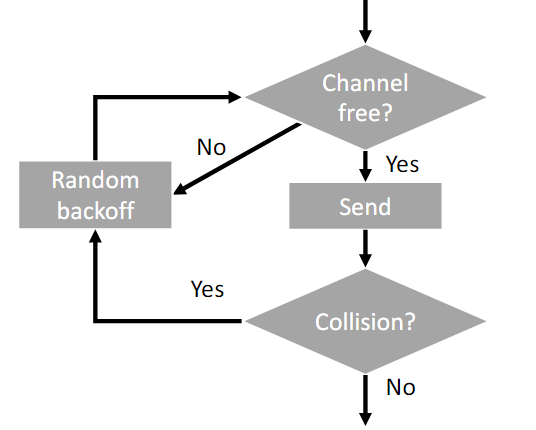
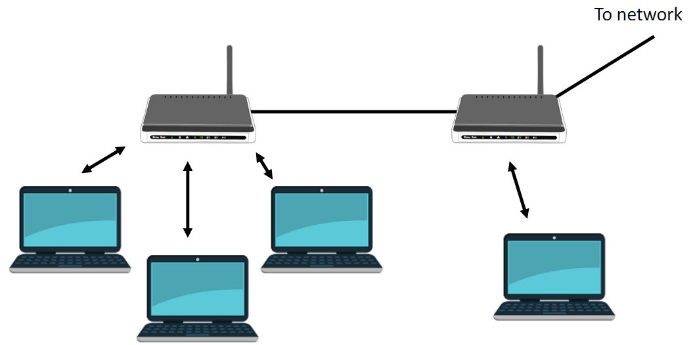
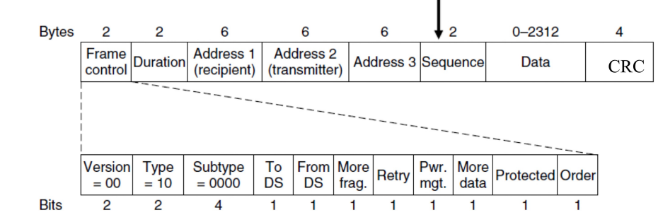

# MAC Sublayer

---

Data link layer serves two purposes:
1. Error control: deal with bit flips and lost data
2. Channel allocation: decide how to share medium

MAC sublayer is a "sub" layer of data link layer, which is responsible for the channel allocation.

### Collision
If multiple parties use medium at the same time, their transmissions interfere.
- We can detect collisions because error detection indicates error
- If there was a collision, you need to retransmit

# 0. Learning Objectives
At the end of this topic, we should be able to give answers to following questions:
- How do we reduce the amount of collisions?
- Can we completely avoid collisions and how?
- Can we detect collisions before the error detection step and how?
- How do Ethernet and wireless work?
- How do local area networks work?

Topics:
- Channel allocation protocols
- Collisions-free protocols
- Collision detection
- Ethernet
- Wireless
- Switched Networks

# 1. Channel allocation protocols
We can categorise channel allocation protocols with following standards:
- Does each party always get the same share of the medium?
  - Yes: Static (rarely applicable)
  - No: Dynamic
- Can/Does protocol sense if medium is in use?
  - Yes: With Carrier-Sense Multiple Access (CSMA)
  - No: Without CSMA

## Protocols without CSMA
### ALOHA
- Transmit whenever there is data
- If a collision occurs: retry after a random delay

### Slotted ALOHA
- The data is sent in times that are slotted
- Twice as efficient as normal ALOHA

## Protocols with CSMA
### 1-persistent
Wait for idle, then send

Random backoff: waits for random time, then check if the channel is in use again

- Cons
  - When there are several parties waiting, all channels try to send at the same time and collision occurs

### Nonpersistent CSMA
Less greedy; if the channel is occupied, it backs off

- Pros
  - Resolves 1-persistent cons
- Cons
  - High latency due to random backoff

### p-persistent CSMA
Slotted 
Keeps waiting; then sends with probability p

### Comparisons of CSMA protocols
Being greedy gives good performance under low load (1-persistent > nonpersistent > p-persistent) 
Being generous gives good performance under high load (p-persistent > nonpersistent > 1-persistent)

# 2. Collision-free protocols
Can we avoid collisions altogether?  
Yes, but only in very restrictive scenarios

## Token ring
Assumption: stations are arranged in a ring (e.g., cable connections in a ring)

Algorithm:
- Pass "token" around the ring
- Only station with token may send

- Cons
  - lacks prioritisation
  - latency can be high
  - can lose the token
  - restrictive assumption

## Bit-map protocol
Assumption: static and known stations with a common notion of slots

Algorithm:
- Setup: enumerate stations
- Contention period: each station is assigned a slot to transmit the bit 1 if they have something to send
- Transmission period: all stations that indicated they have data, send one frame
- Order: increasing order of station numbers

- Cons
  - Determining slot to send requires knowledge of the exact situation and is hard to implement
  - If there are many parties but only few wants to send, there are wasted slots
  - restrictive assumption

## Binary countdown
Assumptions:
- Static and known stations that have distinct priorities
- Collision corresponds to binary OR of bits sent at the same time

Key idea: of the stations that want to send a frame, the one with the highest priority will

Algorithm:
- Setup
  - For n stations, assign priority 0(lowest) to n-1(highest)
  - Express priority as binary numbers
- Contention period
  - If wanting to send, station sends bits of priority starting with most significant bit
  - Apply bitwise OR on the priority bits received
  - If the sender sends 0 but receives 1, station stops and waits for new round

Requires contention slots:
- for bit-map: n (number of stations)
- for binary countdown (for sending the priority bits): ceil(log n)

- Cons
  - requires a special scenario of stations with priorities

# 3. Collision detection
You can detect collisions after a frame has been received (error detection, error control) 
Depending on the medium, you might be able to detect them during transmission as well

**Stop sending if there is a collision to save time and bandwidth**

## CSMA with collision detection (CSMA/CD)
Carrier-sense is a necessary but not sufficient condition for collision detection
(due to the time it takes for the signal to travel).

There are two periods in CSMA/CD:

- Contention period: decide who sends next
- Transmission period: station who has been selected in contention period sends frame

There is no explicit transition between the periods;
transmission period starts as it is clear that there will be no collision.

### Contention slots
Contention period consists of slots.

In each slot, some stations start to send. 
If there is a collision, they stop. 
Then, they:
- wait a random number of slots
- check if the channel is free
- try sending again

### How long does it take to detect collision?
Maximum time it takes for a signal to travel between two stations sharing the medium: Δ

- A starts sending at time t
- B might start sending until t + Δ - ε
  - since B only realises that the medium is in use after Δ
- B detects collision and stops
- A only detects collision at t + 2Δ - ε => **Slots must be of duration 2Δ**

# 4. Ethernet

### MAC address
Message Authentication Code

A unique code for network interface controller of device, and is responsible for communicating via the network. 
MAC address is appended to a message to guarantee it has not been tampered with and is from the claimed sender

## Ethernet frame structure

- Ethernet DIX: original design
- IEEE 802.3: standard

- Preamble
  - Indication of the start of a new frame
  - Ethernet DIX: x7 10101010
  - IEEE 802.3: x1 10101011
- Destination address + Source address
  - MAC address
- Type vs Length
  - Type: information about the upper layer protocol
  - Length: data length
- Pad
  - Padding used if frame length below minimal length of 72B
  - Ensures that sending takes longer than CD:
    - with very small frames, sender might finish sending before collision signal
    - sender is unsure if the frame was affected by the collision
      - When collision occurs, the party sends out 48-bit noise burst to let other parties know about the collision and stop sending

## CSMA/CD in Ethernet
Ethernet uses 1-persistent CSMA/CD.

In its random backoff stage, it adapts Binary Exponential Backoff (BEP).
- Idea
  - first assume that the load is low. As there are more backoffs, realise that there are a lot of parties involved.
- Algorithm
  - Choose number of slots uniformly at random in {0,1,...,2^i-1} where i is the number of failed tries to send the frame

## Channel efficiency in Ethernet
Longer frames = Higher efficiency

- Longer frame
- = longer transmission period
- = higher fraction of time spend on actual transmission
- = higher effectiveness

However, the disadvantage is the longer average waiting time

## Errors in Ethernet
When there is an error, Ethernet retransmits.

Ethernet does not acknowledge bitflips and lost frames, and just silently discards anything for which the CRC is incorrect.

It is a connectionless protocol.

That is fine because it has few errors and the higher layers can capture those.

# 5. Wireless
## Range
Terminals (= stations for wireless networks) have a range: their transmissions are only received by parties within this range

## Wireless and carrier-sense

- A can sense if B is sending but not if C is sending
- C can sense if B is sending but not if A is sending
- B can sense if A or C are sending

### Hidden terminal (node) problem

- A is sending to B
- C does not sense it and starts sending to B as well
- Collision

### Exposed terminal (node) problem

- B is sending to A
- C could send to D but will not because medium seems in use
- C cannot receive responses from D if B is still sending

## Multiple Access with Collision Avoidance (MACA)
Mitigates the hidden node problem and exposed node problem through two extra messages
- Request-to-send (RTS):
  - Indicates terminal wants to send
  - Includes sender and receiver MAC address
- Clear-to-send (CTS):
  - Indicates terminal is free to receive in response to an RTS
  - Includes address of receiver of CTS (=terminal wanting to send)

Example scenario:
- A wants to send to B, so A sends RTS to B
- B responses with CTS if it is not receiving anything else.
  - Now C cannot send anything
- A sends frame if it has received B's CTS
- B sends ACK for frame from A
  - Now C can send something
- A backs off before sending another RTS if it does not receive CTS

Note that collisions can still happen with MACA

## Collision detection and error control in 802.11
- Terminals cannot detect collisions early because they cannot send and receive at the same time.
- Relies on ACKs to determine if collisions occurred.
  - If ACK is lost, sender assumes frame was lost and restransmits frame (stop-and-wait protocol)

## CSMA/CA in 802.11
Carrier Sense Multiple Access with Collision Avoidance (a variant of MACA)

Sender in CSMA/CA informs others of duration of transmission to deal with frames of varying sizes

Network Allocation Field (NAV) in RTS and CTS specifies duration of transmission (includes ACK)

Terminals allocate time according to NAV and do not send during this period

Thus, even if they do not sense transmission, they do not accidentally cause a collision

### Random backoffs in CSMA/CA
CSMA/CA uses binary exponential backoff

But it starts also with a random backoff after others are done sending to avoid that multiple terminals start sending at the same time.

Variant of p-persistent CSMA (skip certain number of slots instead of skipping each with probability p)

If other terminal starts sending during backoff, counting down slots is interrupted and taking up after transmission

## Modes of 802.11
### Infrastructure mode
Has dedicated access points and sends data through it

### Ad-hoc networks
Has no access points; device communicates directly to each other

- Pros
  - Faster communication
  - Able to use without infrastructure setup
  - Can spread out more
- Cons
  - Limited access to external network (need router)
  - Joining other devices and authenticating them is difficult
  - Dependent on other devices
  
## 802.11 frames

- Frame control
  - partitioned down to a certain structure
- Duration
  - manages NAV
- 3 addresses
  - When devices are connected to the same LAN, they can skip the network layer and communicate through the data link layer using MAC addresses
  - In this case, the data goes through other routers; then all the addresses must be included.
  - When original source is not the sender and/or destination is not the receiver, there needs four addresses in the worst case.

## Other wireless standards
- WiFi 802.11
  - for local area networks
- Broadband wireless 802.16
  - for metropolitan large-area networks
    - comes with inbuilt encryption
    - allows requesting different types of service (constant/variable bitrate)
- Bluetooth 802.15.1
  - for personal area networks (headsets, local file transfer)

## Protocol summary
- (Slotted) ALOHA: low throughput
- Non/p-persistent CSMA
  - CSMA/CD for Ethernet (needs early collision detection)
  - CSMA/CA for wireless (deals with partial carrier sense)
  - Aside: Collision-free protocols => impractical (Token ring, Bitmap, binary countdown)

# 6. Switched Networks
Key idea: reduce the amount of cables used

## Hub
- device connection on multiple (Ethernet) devices
- has input/output ports
  - signal at one port goes to all other ports
- Hubs are on the physical layer; they make all the cables act as one long cable

## Switch (bridge)
- use MAC addresses to forward frames between machines such that frame only delivered to intended destination
- Switches are on the data link layer

Frames have source and destination information. 
Switches determine where frames are sent by keeping a hash table that maps addresses to port numbers
- this reduces need for broadcasting

Initially, the hash table is empty, and it can be filled up by the following algorithms.

### Backwards learning

If source port is equal to the destination port, discard.

Possible problems
- Dynamics
  - devices move and ports change
  - should get rid of outdated information
    - keep track of "time last seen" - last time switch received message, discard entries which was seen a long time ago
- Redundancy
  - network should still work even if there is a hardware failure
  - send to other switches to reach destination
  - However, this solution can cause an infinite loop
    - 
    - we need a path that does not loop but reaches all the addresses
    - we can solve this by using Spanning Tree Protocol

### Spanning Tree Protocol
Only use some of the cables so that:
- graph formed by used cables has no loops
- all parties can be reached

Switch with the smallest address becomes the leader. 
Other nodes choose parent that offers the best path (shortest, lowest latency, highest bandwidth) to root

