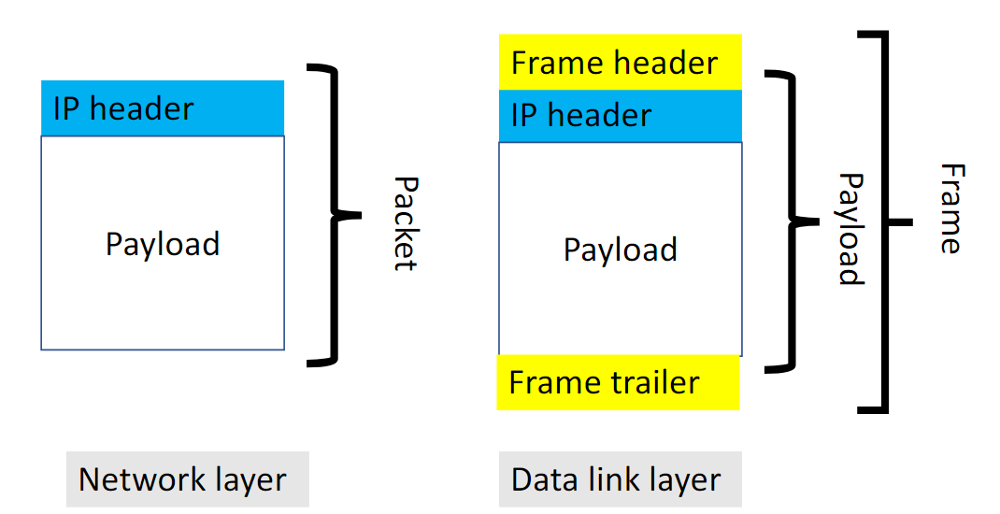
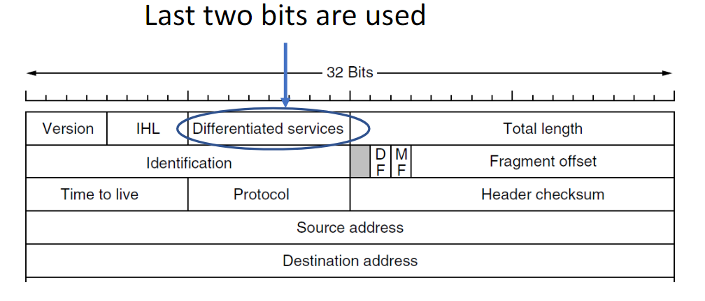
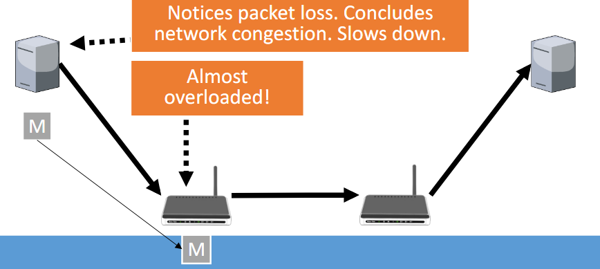

# Network Layer

---

How does the data get from source to first router reliably?

Or more generally: how does the data get forwarded along any direct link reliably?

# 0. Learning Objectives
At the end of this topic, we should be able to answer following questions:
- How does the internet look like?
- How do devices get an IP address?
- How does an IP packet look like?
- How do you route packets?
- How do we deal with congestion?
- Which protocols other than IP do we need and why?

Topics
1. Internet components and structure
2. IP addresses and DHCP
3. IPv4 and IPv6 packets
4. Routing
5. Fragmentation
6. Congestion control
7. Other internet protocols

# 1. Internet structure

There are LANs with data links. 
These LANs are connected via routers. 
Multiple LANs form an Autonomous System. 
Multiple AS' are connected with gateways. 

We could add Internet Exchange Points to the internet.
## Internet Exchange Points (IXP)
Independent entity that provides facilities for ISPs to exchange data (i.e., route between AS)

Often happens in large-scale data centers

Alternative is private peering, i.e., use gateway routers between two ISPs

Using IXP, we could have:
- Shorter paths (less cost)
- More paths (adds resilience to failures)

# 2. IP addresses and DHCP
## IP addresses
In the internet, machines are identified by their IP addresses.

MAC addresses are for machines, and the IP addresses are for the networks.

### Types of IP addresses
IPv4
- 32-bit addresses
- written as four decimal numbers between 0 and 255
- separated by a period
- example: 175.45.17.8

IPv6
- 128-bit addresses
- written as eight hex numbers between 0 and ffff
- separated by a colon
- example: 2001:db8:0:1234:0:567:ffac:1a

### IP address assignment
Internet Assigned Numbers Authority (IANA) assigns IP ranges to regional internet registries

From the assigned range, ISPs in the region are assigned set of IP addresses

ISPs assign IP addresses to new machines joining by using Dynamic Host Configuration Protocol (DHCP)

## Dynamic Host Configuration Protocol (DHCP)

The client gives its MAC address to DHCP server, and the server responds with an IP address. 
Then the client confirms that it will take the IP by sending the DHCPREQUEST, and server acks it with DHCPACK.

DHCP in general is used to give information about servers that exist in your local network.
It is able to provide information about:
- IP addresses
- Gateway router
- Network time protocol server (synchronises clocks)
- Domain name server (enables websurfing)

# 3. IP packets
## Internet Protocol (IP)
IP is a connectionless protocol to route data from a source to a destination over multiple networks.

We group data into IP packets or datagrams

Datagram:
- "A self-contained, independent entity of data carrying sufficient information to be routed from the source to the destination computer
- without reliance on earlier exchanges between this source and destination computer and the transporting network." - RFC 1594

Packets are similar to frames in Data link layer.

## IPv4 header

- Version
  - always 0100
- IHL
  - internal header length
  - can vary due to options
- Total length
  - number of bytes in packet including header
  - maximum is 2^16 - 1 = 65535
- Identification - / / - DF - MF - Fragment offset
  - the greyed part is always 0
  - fragmentation: to be discussed later
- Time to live
  - decreased by 1 whenever forwarded
  - if it reaches 0, discard
  - default: mostly 64 nowadays
- Header checksum
  - Internet checksum over other header fields
  - routers discard packets with invalid checksums
  - needs to be re-calculated whenever forwarded
- Source address & Destination address
  - IP addresses of end hosts

## IPv6 header

IPv6 has fixed header and optional extension headers

- Flow label
  - group packets
  - define rules for routers when forwarded (e.g., priority for videos)
  - default: 0
  - adds connection-oriented feature to IPv6
- Payload length
  - number of bytes of payload plus extension headers
  - unlike v4, the number of bytes of fixed headers are excluded
- Hop limit
  - same as time-to-live in IPv4

# 4. Routing
## Routing goals
Get from A to B using the most cost-effective path
- Shortest
- Fastest
- Lowest fees etc.

## Routing table
Table determined for each address which present the minimum-cost link to forward the packet

There are three possible methods to construct the routing table:
1. Distance vector routing
2. Link state routing
3. Hierarchical routing

### 1. Distance vector routing

Similar to Dijkstra's algorithm (Bellman-Ford)

Example:

Problem: count to infinity
- When one machine fails, other machines think that it can still get to the broken machine via other path
- This can be fixed by path vector routing
  - keeps not only the cost and line but also the path to the destination
  - If the address is already in the path that it receives upon update, it considers it as a loop => discard

#### Frequency of updates
When to send distance vectors:
1. Periodically
   - Pros
     - able to detect errors (because it expects periodical update)
     - easy to implement
   - Cons
     - updating too late
     - update when not necessary
2. Whenever something changes
   - Pros
     - no unnecessary update
   - Cons
     - update lost
     - might save wrong data

This applies for all protocols below too.

### 2. Link state routing
Does not suffer from the count to infinity problem, but requires maintaining knowledge of full network

1. Routers only send packets with information about their direct neighbours
2. These packets are flooded over the network
3. Routers build the graph of the network using these packets and run a shortest path algorithm (e.g., Dijkstra)

As routers tell which neighbours it is connected to,
they can build graphs to find out which path is the shortest from itself to the destination.

They determine the routing table instead of recomputing every time

### 3. Hierarchical routing
Reducing routing table sizes for large networks

- Instead of individually keeping the cost and line for all routers, divide the whole network into smaller subnetworks
- Have only one entry per sub-network in the routing table (decide this based on some policy)

## Routing Protocols
### IP Address Prefix
{ip}/x (x being a number between 0 and 32)

Indicates the IPs that have first x bits in common with {ip}

Alternatively, you can give the subnet maks, which corresponds to 32 bits such that
- First x bits are 1 (network mask)
- Other bits are 0 (host mask)

Examples: 

### Classless Inter-Domain Routing (CIDR)
Assign each router a set of IPs using ip/x

Forward to router that can find route for given IP

If there are multiple routers, take the one with smaller set (less IPs)

How can we choose the building strategy of the routing table?

#### Inter-Domain Routing
Network can decide on the routing protocol
- Common choice: Open Shortest Path First (OSPF) - link state protocol
- Hierarchical can be applied for larger networks

#### Intra-Domain Routing
- Broader Gateway Protocol (BGP) - path vector protocol
- Supports arbitrary policies put in place by ISPs, companies, or countries

# 5. Fragmentation
Splitting packets

Different protocols use different max packet size, so for some protocols packets might be too big.

Why use lower packet size at the first place?
- The maximal size is Ethernet frame size (1500B)
- Buffers of routers too small to handle big packets

So we need to split packets when routing via networks with lower MTU (maximal transmission unit of network)

We have two options for fragmentation in IP

## Fragmentation protocols
### 1. Nontransparent fragmentation
Gateway of network with smaller MTU divides packet in fragments, 
and the destination (end host) reassembles them

In **Transparent fragmentation**, the gateway does the reassembling 
However, this method is not used because
- Buffering may slow down the gateway
- Not all fragments necessarily take the same path (due to changing policy)

### 2. MTU discovery

Gateway to network with low MTU tells the sender to split packet and discards too big packet

- Pros
  - Improved security (avoid denial of service attack)
  - Reduced complexity at the router (doesn't deal with splitting)
- Cons
  - Increased latency due to sending message
  - Overhead

## Fragmentation in IPv4

- Identification
  - Identifier for fragments of a packet
- DF
  - use MTU discovery
- MF
  - more fragments to follow
- Fragment offset
  - number of 8-byte blocks sent in previous fragments

## Fragmentation in IPv6

Routers do not fragment IPv6 packets

MTU discovery can be used

Source then adds an extension header for fragmentation:

The next header in fixed header could be reference to this extension header

# 6. Congestion Control & Other Internet Protocols
Traffic overloads router, i.e., arrives faster than it can process

So a queue forms at the router. This is called congestion.

This introduces long delays and potential loss due to insufficient buffer space.

We have several approaches to congestion control:

## 1. Network provisioning
- Get more bandwidth
- So more paths and better routers
- Long-term solution and expensive

## 2. Traffic-aware routing
- Choose routes depending on traffic as well as other factors
- Include queueing delay into cost used for routing
- But make sure that you do not switch to overloading other links
- Multi-path routing, i.e., splitting traffic over multiple routes, is useful
- Exact details vary between networks if it's done at all

## 3. Admission control
- Only allow new traffic flows when it will not cause congestion
- We know that it will/won't cause by providing information about traffic in advance
- Average bandwidth use as well as burst
- Complicated, so not widely used

## 4. Traffic throttling
- Send a signal that there is too much traffic
- Classifying signals
  1. Precise vs not precise
     - Precise: give concrete rate at which they can send
     - Not precise: just signal that there is congestion without specific rate
  2. Explicit vs Implicit
     - Explicit: send a message
     - Implicit: give an indirect signal
  3. End-to-end vs Link-by-link
     - End-to-end: tell only source to slow down
     - Link-by-link: tell all previous routers and the source to slow down

### XCP: EXplicit Congestion Protocol
- Explicit, precise, and end-to-end
- Routers compute precise rate that source can send at
- Send message to source with rate, consisting of two parts:
  - Congestion control: ensure capacity used
  - Fairness control: ensure all flows get fair share
- Problem: complex router behaviour => mainly experimental

### ECN: Explicit Congestion Notification
- Explicit, not precise, and end-to-end
- Router includes that there is congestion in packet
- Destination relays information to source (transport layer)

ECN is included in the header:

ECN is not the default congestion control algorithm, so router needs to know that ECN is used.

- The sender sets one of the two bits to 1
- Router marks packet by setting the other one to 1 if there is congestion

## 5. Load shedding
### Random Early Detection (RED)
- Implicit, not precise, and end-to-end
- Router intentionally drops packet when queue becomes too long => loss is implicit signal
- Packets are selected uniformly at random

Default algorithm in the internet

# 7. Other protocols than IP
We already discussed DHCP, OSPF, BGP

## 1. Internet Congestion Message Protocol (ICMP)
If something goes wrong, routers send ICMP messages to sources

Example: MTU discovery

### ICMP and traceroute
Idea: intentionally executes behaviour that have errors

- Traceroute aims to discover the routers along the path between source and destination
- ICMP sends a message if time-to-live/hop limit expires, which includes th router information of the router that discarded the packet
- Traceroute sends packets witch ttl=1, ttl=2, ttl=3,...
- until a packet reaches destination
- For packet with ttl-i, i-th router on path revealed

Potential problem: route change (but it can be resolved)

### ICMP and IP

- ICMP packets form the payload of IP packets
- Header of IP packet specifies that payload is ICMP
- For IPv6, next header of last extension header/fixed header indicates ICMP

## 2. Address Resolution Protocol (ARP)
A data link layer protocol

In a LAN, you need the MAC address to deliver messages
- But you might only have IP address from IP packet

ARP:
- Sender broadcasts request for MAC address of device with certain IP
- All devices check their IP address
- Device with requested IP replies with their MAC address

## 3. Network Address Translation (NAT)
When there are no headers left in IP header, i.e., when all IP addresses are used, how can we make everyone go online?

- Each machine has internal (globally not unique) address
- Gateway router replaces internal address with public IP address when traffic leaves network
- Gateway maps incoming traffic back to local address by associating ports with internal party

# Protocols discussed
- DHCP: assign IP address
- IP: internet protocol
- OSPF: intra-domain routing (link state protocol)
- BGP: inter-domain routing (path vector protocol)
- Congestion control: XCP, ECN, RED
- ICMP: error messages
- ARP: match IPs to MACs
- NAT: use one IP address for multiple devices

