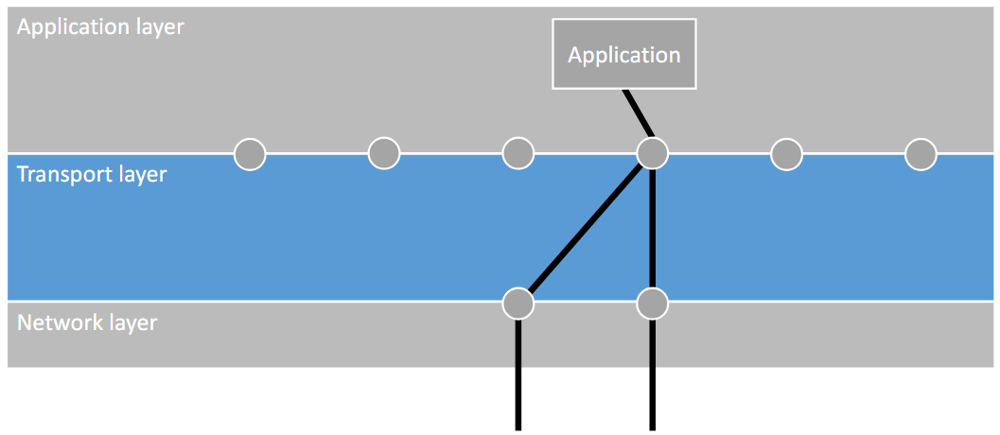
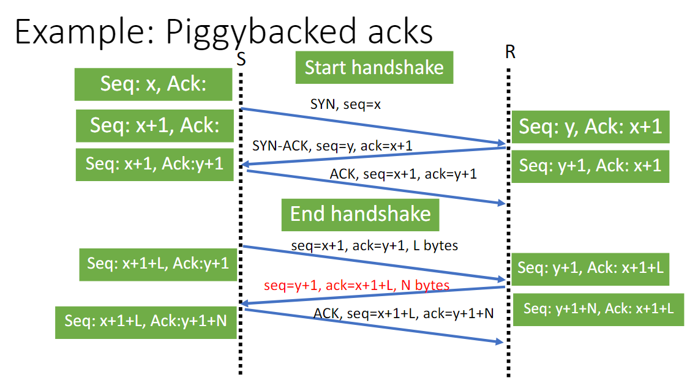

# Transport Layer

---

# 0. Introduction
At the end of this section, you should be able to answer following questions:
- How do we map network data to applications?
- How does UDP realise an unreliable transport layer?
- How does TCP realise a reliable transport layer?
  - How does it handle connection establishment and disconnect?
  - How does it handle error control (e.g., retransmission)?
  - How does it handle flow control?
  - How does it handle congestion control?
- Are there other transport layer protocols?

Topics
1. Addressing
2. UDP
   - Segment structure
   - Error detection
3. TCP
   - Segment structure
   - Error detection
   - Connection establishment and termination
   - Error control
   - Flow control
   - Congestion control
4. Other transport layer protocols

In transport layer, data is transferred in **segments**.

# 1. Addressing
The computer has one IP address, but we can use many applications on it.
How does the computer deliver the data from the network layer to the correct application?

We use addressing.

- TSAP = Transport Service Access Point
- NSAP = Network Service Access Point

Internet uses IP addresses for NSAPs and ports for TSAPs.  
Ports:
- Virtual spaces allocated by the operating system to organise network traffic.
- 65535 (virtual) ports numbered 1 to 65535
- Some of them are allocated to standard applications
- Only one application can use a port at a time,
- but multiple users can connect to the same port as long as they have different IP.

## Primitives used for addressing
1. Listen
   - wait for another process to contact us
2. Connect
   - connect to a process that is listening
3. Send
   - send data over the established connection
4. Receive
   - receive data over the established connection
5. Disconnect
   - release the connection

Listen, Connect, and Disconnect are for managing connections, 
and Send and receive are for data transmission (in segments).

## Mapping applications with correct data streams
Since there are several apps for one IP address, there must be methods to map correct apps with the corresponding data streams.

### Multiplexing
Multiple transport connections over one network data stream

Several data streams are combined to one data stream.

From the application layer, applications send data in segments to ports. Notice that a single application can send to multiple ports.

The data streams are collected in the transport layer and the combined data stream is sent to network layer.

### Inverse multiplexing
One transport connection over multiple network data streams

One data stream is split into several segments.

In inverse multiplexing, one application is running with several NSAPs. 
For this to work, we need to have the IP addresses (NSAPs) synchronised.

Inverse multiplexing has increased efficiency with more possibility to send data.

### Process servers
Applications always listening could be inefficient for the apps that are not frequently used.

In order to fix this, we could have a process server.

Process server connects to ports usually used by the app when app isn't running. Then
1. when the process sever receives data for an app,
2. it starts the app and pass the connection.

With this, we could have applications run only when necessary.

# 2. UDP
User Datagram Protocol
- Unreliable protocol (connectionless)
- Very thin layer on top of IP
- Header provides ports for connecting to remote apps
- Used for:
  - live broadcasts
  - online games
  - streaming videos

## UDP header
UDP header: 

- UDP length
  - number of bytes in body + header (always 8)
  - maximum 65535
- UDP checksum
  - internet checksum computed over the rest of the header + payload
  - more below

The UDP header does not include IP address, because it is only added in the network layer.

Transport layer header and the body combined becomes the body of the IP packet in the network layer. 
The same happens for packet to frame.

## UDP checksum
Internet checksum computed over the rest of the header and the payload

IP Internet checksum vs UDP Internet checksum
- In IP, the checksum is recomputed each forward due to the time-to-live, but UDP does not recompute it
- UDP does not trigger automatic retransmission; it only discards

# 3. TCP
Transmission Control Protocol
- Provides reliable end-to-end byte stream over unreliable network (connection-oriented)
- TCP includes:
  - error detection
  - automatic retransmission
  - flow control
  - congestion control
- Used for:
  - loading a website
  - sending an email

## TCP header

- header length
  - included because TCP header length is not fixed (because of the Options)
- TCP checksum
  - Internet checksum computed over the rest of the header and the payload
  - uses sliding window protocol that triggers a retransmission

## Connection Establishment
The purpose of the sequence numbers in TCP is:
- to detect missing segments
- to detect if segments arrive out of order
  - 
- to detect duplicates
  - 

Sequence and acknowledgement numbers are managed in the header. 
Also, the local state keeps track of these as well to:
- give information of the subsequent number
- compare local state with the incoming header to see if the numbers are as expected

Message types:
- ACK: acknowledgement
- SYN: connection establishment
- FIN: connection termination

### How Sequence and Acknowledgement numbers are managed
- Before sending SYN: choose initial seq. number
- When receiving SYN: receiver chooses own initial sequence number

Sequence number:
- initial own seq number + number of previously sent bytes
- Every data byte adds 1 to the sequence number
- SYN and FIN also add 1 to the sequence number
- ACKs do not increase sequence numbers
- Initial sequence number can be chosen in different ways
Acknowledgement number:
- initial seq number of communication partner + number of previously received bytes

If seq/ack numbers in messages do not match locally stored ones => retransmission

### Three-way handshake

Two types of ACKs:
- Direct ACK
  - sends only TCP header without the body
  - with ACK flag set to 1
- Piggybacked ACK
  - increase ACK number in next TCP segment with an actual payload
  - ACK flag in header set to 0

## Error handling
How does TCP detect errors?
- If time runs out, TCP can detect an error but this takes time by design
- Instead, use fast retransmission which detects errors with duplicate ACKs:
  - uses a variant of sliding window protocol with selective repeat
  - 3 duplicate ACKs (meaning 4 same ACKs sent in total) = NAK

TCP as a sliding window protocol
- Uses selective repeat (3 duplicate ACKs = negative ACK)
- Buffers out-of-order segments and then re-orders
- Instead of a number k of unacknowledged frames, TCP allows only for a limited amount of data to be unacknowledged
- Amount of data depends on current situation in the network and on receiver's buffer size
- TCP does not use initial sequence number 0

### Initial Sequence Number
At the beginning of connection establishment, initial sequence numbers are chosen for both parities.
- 0 is usually not chosen because it can cause confusion upon reconnection after connection loss
- Also, using the same initial sequence number upon reconnection also can cause this problem for different numbers.

As a solution, we could use Clock-Based Sequence Numbers:
- take LSB 32 bits of clock time as the initial sequence number
- However, once the sequence overflows 32 bits, we have to restart from 0 and this can cause problem
- To avoid reusing sequence numbers, adopt maximal time T so that the segments from old connection can not appear after T.

If the forbidden region is reached, perform resynchronisation which is re-establishing the initial sequence number.

However, clock-based seq numbers are predictable, and it is easy for an attacker to guess. 
Hence, modern TCP versions randomise initial seq numbers.

## Connection release
When the exchange is complete, the connection should be closed

There are two approaches to connection release:
- Asymmetric disconnect
  - Connection ended by either participant without agreement
  - 
- Symmetric disconnect
  - Participants agree to end connection
  - 
  - Uses FIN flag to communicate termination
  - However, the Two Armies problem can occur which does not have a resolution
    - Either parties can't know if the other party has received the FIN or ACK before they disconnect

## Life of a TCP connection
Three-way handshake:
- Choose and exchange sequence numbers

Maintaining connection
- Increase sequence number per sent byte
- Increase ack number per received byte
- Retransmit on expired timer or 3 duplicated ACKs

Release/close connection
- FIN-FIN-ACK or asymmetric (crash or network failure)

## Flow control

The TCP header also includes Window size

We could use this to tell the sender how much data the receiver can handle

However, due to the latency the remaining window size might not be exact

### Silly-window Syndrome
A tiny window size can cause large overhead. 
This can happen if:
- buffer size is too small for receiver
- latency is too high (takes long time for ACK)
- the bandwidth is too high (data can be sent faster)

## Congestion control
Two protocols used by the network layer to signal congestion:
- RED (Random Early Detection)
  - Signal: drop random packet
    - in TCP, 3 duplicate ACKs / missing ACK
  - Default (no additional setting needed to use it)
- ECN (Explicit Congestion Notification)
  - Signal: routers set a bit in IP header to 1
  - Receiver sends signal to source
  - Needs to be explicitly requested by source by setting another bit in IP header to 1

We are going to have a look at ECN. 
ECN is not a default algorithm, so only some support it.
How do we know if the protocol is supported in the current connection?

### ECN negotiation

- CWR = Congestion Window Reduced
- ECE = ECN-Echo

If both parties want to use ECN:
- End host sending SYN: set ECE and CWR in SYN
- Other end host: set ECE but not CWR flag in SYN-ACK

### ECN congestion signal
Router marks IP packet as discussed

After receiving a packet with congestion signal:
- Receiver sets ECE flag in next segment S
- Sender sets CWR flag in next segment after receiving S
  - to signal they received the signal and adjusted the congestion window

What is congestion window and how is its size adjusted?

### Congestion window
First, take a look at the goal of adjustment & motivated approach.
Both transport and network layers handle congestion control, and the network layer specifically controls the offered load.
Network usually behaves like this when congestion occurs:

So we want to aim to send at a maximal rate without overloading the network.

Problem: too much information is unknown, so it is not viable to achieve the above goal
- Available bandwidth
- Network topology
- Other clients

In practice, we adjust the bandwidth by trial & error

In order to perform congestion flow, sender needs to know how much the 'network' can handle.
To achieve this, TCP uses congestion window which gets tracked on by the sender and tells how many bytes can be unacknowledged
- Cumulative ACK: ACK of a segment is acknowledgement of its bytes
- Window size in TCP header != congestion window
  - The header is a feedback to the receiver, but congestion window is a feedback to the network
  - Two windows are combined by taking the minimum of the two

### Congestion Control Protocol: TCP slow start
1. Start with 1 for the congestion window
2. Increase by 1 with each acknowledged byte (double per round-trip time)

The congestion window size grows exponentially, but continuing this increase is not good as you approach maximum bandwidth.
So it is stopped if:
- threshold congestion window size is reached => switch increase by a constant value
- congestion signal

### Example protocols
TCP Tahoe
- 
- congestion signal => reset to 1
- threshold = previous congestion window / factor (usually 2)
- problem: sending rate drops all of the suggen

TCP Reno (= TCP Tahoe + fast recovery)
- 
- congestion signal => set to new threshold value
- threshold = congestion window / factor
- fast recovery not applied when there is no ACK at all
  - because it indicates a problem so data should not be sent in a fast rate
- multiplicative decrease
  - allows fair share of bandwidth because the party with the most bandwidth drops the most

Protocols widely used nowadays:
- CUBIC TCP
  - congestion signal => set to 70% of congestion window
  - congestion window is cubic function since last congestion signal
  - used in Linux/MACOS
- Compound TCP
  - combines TCP Reno with delay measurements to estimate queuing delay on routers
  - reduces sending rate if delays are high
  - used in windows

# 4. Other Transport Layer Protocols
## TCP Drawbacks
- Silly-window syndrome
- Handshake may cause long waiting before sending data
- Head-of-Line Blocking
  - TCP buffers out-of order segments
    - Missing segment in one stream slows down other streams as well
  - assumption: all segments dependent, but
  - applications can have different (independent) streams of data

## QUIC
Quick UDP Internet Connections
- UDP + Error control + Flow/congestion control
- QUIC has connections and streams
- A connection can have multiple streams, identified by a stream identifier
- In-order delivery is guaranteed per stream
  - solves head-of-line blocking

Other QUIC features
- Three-way handshake
- Optional 0 Round Trip Time connection resumption:
  - No handshake needed when previous connection existed
  - Congestion control: default CUBIC, other possible
  - Flow control: same window principle as TCP but both on a connection and stream level
