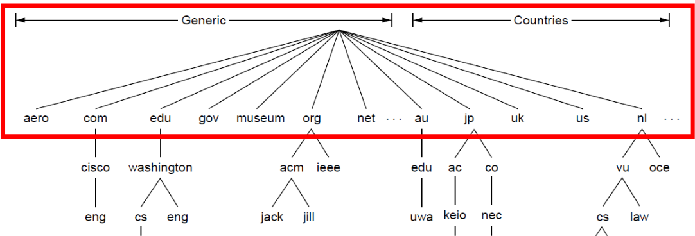
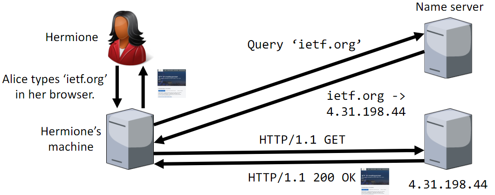
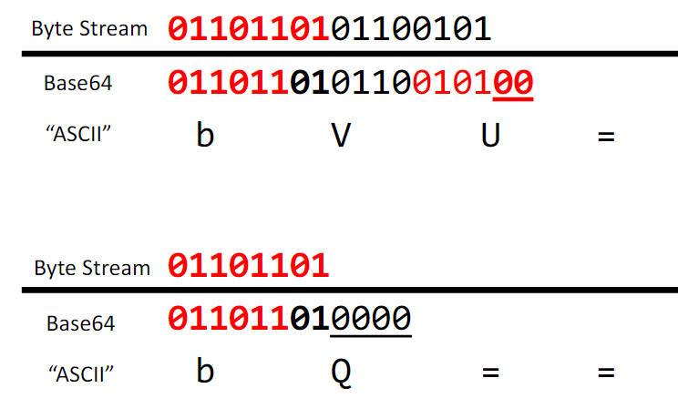

# Application Layer

---

# Domain Name System
Machines on the Internet are identified by IP addresses, but they are
- hard to remember
- changable

So DNS translates IP addresses into human redable names.

## DNS name space
DNS name space is in a hierarchical structure

- The top level domains inside the red box are controlled by Internet Corporation for Assigned Names and Numbers (ICANN)
  - .edu and .gov are generic domains usually used by organisations in the US
  - organisations can request second-level domains (like cisco - eng) from registars
  - countries have their own first-level domains (like au, jp, etc)

If you control a domain, you can specify arbitrary subdomains.

## Name servers
To translate a domain name to an IP address, you ask a name server which is configured by DHCP

## DNS and transport layer
DNS uses UDP because TCP would be very slow
- Handshake with each of the involved name servers creates a lot over overhead for only one packet
- Leads to security and privacy issues

# Base64 Encoding
A binary-to-text encoding scheme that is commonly used to encode data, 
especially when that data needs to be sent over media that are designed to handle text.

This encoding helps to ensure that the data remains intact without modification during transport.
It is also used in cases where you need to store binary dat in text fields in databases.

Base64 encodes binary data into a string consisting of [A-Za-z0-9+/].

1. The input data is divided into groups of three bytes
2. Each 24-bit group is then split into four 6-bit numbers
3. Each 6-bit number is mapped to a character in the base64 alphabet, resulting in a four-character string
4. If the total number of input bytes is not a multiple of three, the output is padded with one or two pairs zeros
   - A pair of 0's are represented as '=' sign when encoded

