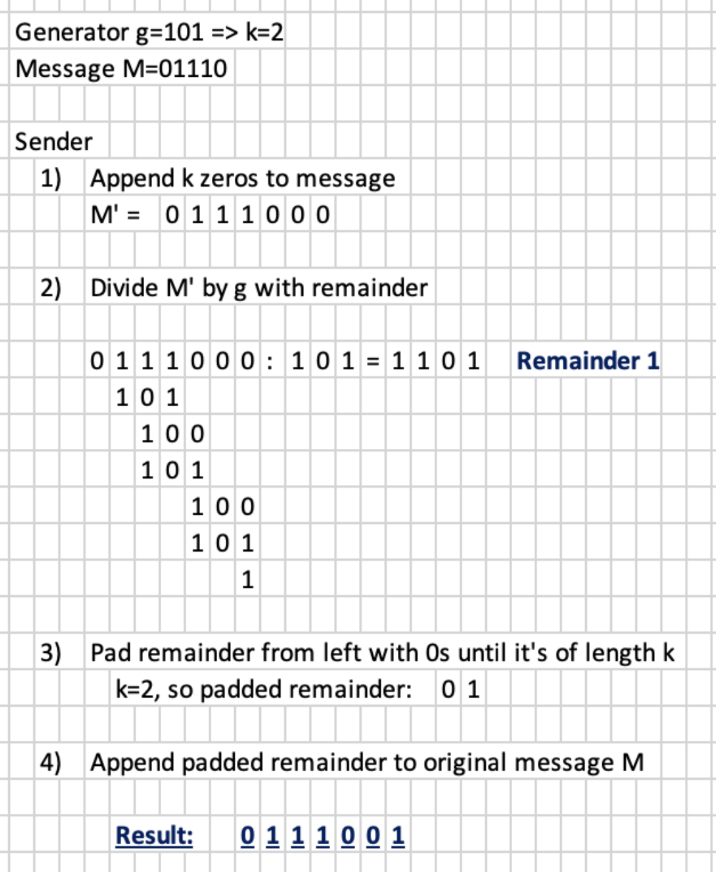
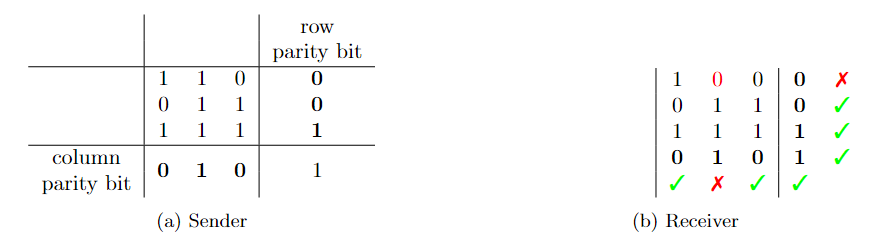
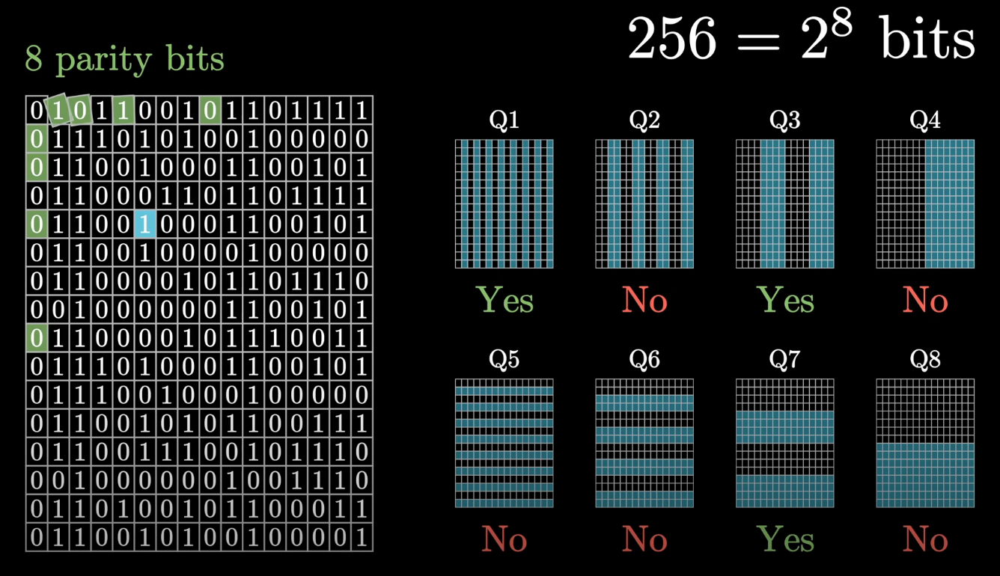

# Error Detection and Correction Algorithms

---

Flipping bits is a common error in the physical layer. 
In the data link layer, error detection or correction is applied to fix the error.
Such errors can also happen in the network layer, and the transport layer takes care of it.

# Error Detection vs Error Correction
> Error detection - receiver can identify that an error has happened, but does not know where it occurred.  
> Error correction - receiver is able to detect the error and identify the exact bit/bits flipped

### Redundancy
No algorithm can detect or correct all possible errors; so these algorithms add additional bits,
creating redundancy that allows the receiver to detect or correct errors.

9 additional bits to every 100 bits => the amount of redundancy is 9%.

### Which algorithm to choose?
The higher the amount of redundancy is, the more errors can be detected.
However, a higher amount of redundancy means that more data needs to be transmitted, which can cause longer delays or overload the network.

- Error probability
  - Error detection has lower error probability
  - Error correction has higher error probability
- Latency
  - Error detection has higher latency (need for retransmission)
  - Error correction has lower latency (no need for retransmission)

# Error Detection Algorithms
## Parity Bits
A bit is appended at the end to indicate whether the number of bits in the message is even or odd.

1. Agree on even or odd parity. (n = number of 1's)
   - Even parity: b = 0 if n is even
   - Odd parity: b = 1 if n is even
2. Sender sends the message with a bit attached indicating whether n is even or odd
3. Receiver checks if the appended bit is correct

Analysis
- Amount of redundancy = 1 bit per message of m bits => lowest possible redundancy for messages of size m
- Unable to detect even number of bit flips
- Only suitable when more than 1 bit flip is highly unlikely

## Parity Words
Sender divides the message into blocks of the same length
and computes the bitwise XOR of all blocks and append that to the message, potentially flipping bits.

## Internet Checksum
Variant of parity words which uses binary addition with carries instead of bitwise XOR. 
Implemented in IP and TCP

1. Agree on block length k, and possibly an algorithm for padding messages if its length is not divisible by k
2. **Sender** divides the message into blocks of length k. All blocks are put into a table with each block corresponding to a row
   - Parity words
     - bitwise XOR is computed for each column
     - If odd parity -> bits flipped
   - Internet checksum
     - binary addition with carries computed for each column
     - If the result is longer than k bits, divide the result into blocks length k and the rest
     - Add the two blocks together. Usually, checksum uses 1's complement, so flip the bits
3. **Receiver** divides the received message into blocks of length k including the checksum.
Put them in a table and compute the bitwise XOR or addition. If:
   - even parity - result is all 0's
   - odd parity / 1's complement - result is all 1's

1's complement is normally used for Internet Checksum because:
1. if memory loss causes data to be replaced with all 0's internet checksum with 1's complement can detect it
2. CPUs can implement 1's complement more easily

Analysis
- Amount of redundancy = k bits per message of m bits
- Cannot detect an even number of flips that happen in the same column (although it can detect it if the bits flip in the same direction)
- For fixed m, the higher the k is, the better the error detection, but the higher the redundancy (and bandwidth use)
- Designed to work well for burst errors (bit flip that happen in rows)

## Cyclic Redundancy Checks (CRCs)
Sender and receiver agrees on a divisor g, and sender appends bits to the message so that it becomes divisible by g.
Receiver checks for divisibility by g.

1. Agree on generator g, a binary number length k+1 and starting with 1.
2. Sender follows these steps:
   1. Append k zeros to message M (the new message is denoted as M`)
   2. Compute the division M` / g with the following rules
      - addition/subtraction/bitwise XOR are all treated the same way
      - no carries
      - no total order
   3. Obtain the remainder. Put 0's at the left to make its length k bits.
   4. Append the padded remainder to the message
3. Receiver checks if the message is divisible by g. If not, trigger retransmission

Analysis
- Amount of redundancy = k+1 bits per message
- Number of bit flips detected depends on the choice of g
- Unlike Parity Bits, Parity Words, and Internet Checksum, it guarantees detection of more than two bits flipped, regardless of their position in the message.

# Error Correction Algorithm
## Parity Blocks
Decide on:
- number of rows (r)
- number of columns (c)

Number of bits in the message should be r * c, and put each bit to the corresponding cell of a table of size r x c.

Compute one parity bit per row/column, and the location of the error can be detected based on the row & column the error occurred

1. Agree on even/odd parity.
   - If odd -> r & c must be both even/odd.
   - Agree on r and c.
2. Sender divides the message into r blocks of length c.
   - Each block corresponds to a row
   - Put all bits in the corresponding cell in table r x c.
   - Compute parity bit for each row/column
3. Receiver determines the row & column with an unexpected parity
   - if all parities are as expected, message is considered correct
   - if exactly one row and one column is not as expected, flip the corresponding bit
   - if more mistakes are present, it is not possible to detect the location of the error so trigger retransmission.

Analysis
- amount of redundancy = r + c + 1 bits per m-bit message, bounded by O(sqrt(m))
- can correct one bit flip
- may not be able to correct two bit flips if they occur in the same row/column, but it can be detected
- useful for detecting burst errors

## Hamming Codes
Enumerate through the message and adds new bits at positions of the form 2^i.
Looks for the position of the error by checking which powers of 2 were affected.

1. Agree on even/odd parity
2. Sender determines the number k of parity bits that should be inserted by the following property 2^k-1 < m+k < 2^k.
   - It creates a message of length m + k
   - First fill out the bits of message leaving positions 2^i empty
   - Then, compute the parity bits of all the positions whose binary expansion contains the corresponding 2^i.
3. Receiver computes error syndrome
   - determine the 2^i with unexpected parity bits
   - add all the affected positions and flip the corresponding bit

Analysis
- amount of redundancy = number of parity bits needed = O(log(m)) (considerably lower than parity blocks)
- able to correct one bit flip
- If two bit flips occur, the receiver should ask for retransmission. These bit flips cannot always be detected
- Hamming code originally is not suitable for burst error detection or correction.
  - It can be modified to divide the message into rows and columns and apply Hamming code algorithm to each column.
  - Then send the data row-by-row
