# Cryptography

---

# Introduction
Achieving security entails achieving the following properties in the presence of malicious parties:
- Confidentiality
  - Ensure that only authorised parties can access information
  - Example: hiding the content of a message
- Integrity
  - Ensure that users can verify that they have the correct information
  - Example: false message that the content has not been changed during transmission
- Availability
  - Ensure that information and services are available when needed
  - Example: resilience from fake requests
  - Often the hardest to achieve (impossible to give universal guarantees)

Other terms:
- Authentication
  - ensuring that a party is who they claim to be
  - falls under integrity (ensures that information regarding a party's identity is correct)
- Privacy
  - an individual's ability to remain in control over their personal information
  - closely related to all three goals

## Disclosing Security Vulnerabilities
When identifying security problems in a software, we try to discover the security vulnerabilities and try to disclose them.

There are four approaches to disclosure:
- Non-disclosure
  - Not disclosing a security vulnerability
  - Usually no legal consequences
- Full disclosure
  - The investigator announces the vulnerability publicly
  - The users are informed of the vulnerability as fast as possible
  - Malicious parties could misuse this
- Responsible disclosure
  - The investigator first informs the developer only and sets the deadline
  - If the developer doesn't fix the vulnerability by the deadline, the investigator reveals it
- Coordinated disclosure
  - Variant of responsible disclosure
  - The investigator and the developer set the deadline together

## Attacker model
An attacker or adversary model denotes a description of the goals and capabilities of malicious parties

The following terminology is typically used to characterise adversaries.
1. Positioning of the attacker in a network:
   - Internal
     - controls participants in a system
     - ex) a corrupt server
   - External
     - observes the system from the outside
     - ex) a malicious party listening on the wire
   - Global
     - can observe or control the complete system
     - ex) ISP can observe all the links and routers within its AS
   - Local
     - can observe or control only a part of the system
     - ex) ISP can observe parts of the complete internet
2. Adversarial behaviours:
   - Passive
     - does not manipulate the protocol
     - ex) a malicious service provider who follows the protocol but tries to gain additional information
   - Active
     - manipulates information
     - ex) replacing a message on the wire with a modified message
   - Static
     - does not change its behaviour over time
   - Adaptive
     - changes behaviour dynamically based on its observations
3. Computational powers of the attacker:
   - Computationally unbounded
     - the attacker has unlimited computational power at their disposal
     - cryptographic algorithms that protect against computationally unbounded adversaries provide *information-theoretic security*
   - Polynomially bounded
     - can only compute algorithms that have polynomial complexity
     - cryptographic algorithms that protect against polynomially bounded adversaries provide *computational security*

# Cryptography
Ensuring that intentional changes to information can be detected

- Cryptosystem: a set of algorithms with guaranteed security properties
- Cryptographic keys: determines which concrete algorithms from the set to use
- Kerckhoff's principle
  - states that the security of a cryptosystem should not depend on the secrecy of the algorithms
  - only the keys should remain secret
  - because if the algorithm is revealed, a whole new algorithm must be invented.

We will first look at who to achieve confidentiality using cryptography (symmetric and asymmetric encryption algorithms),
and then look at how to achieve integrity (MAC, Digital Signatures, and Public Key Infrastructure).

## Encryption: Setting and Terminology
A cryptosystem used for encryption is called a cipher. 
Ciphers make use of three algorithms:
- KeyGen (key generation algorithm)
- Enc (encryption algorithm)
- Dec (decryption algorithm)

Encryption:
- Takes a key K1 and the message M, called the plaintext, as input
- Enc(K1, M) denotes the encryption of M using K1
- The encrypted text is called the ciphertext

Decryption:
- Takes a key K2 and a ciphertext C as input
- computes the corresponding plaintext
- denoted by Dec(K2, C)

Encryption assumes a passive adversary Eve who aims to break confidentiality.

The two main approaches to encryption are symmetric-key encryption, which uses K1 = K2,
and asymmetric-key encryption, which uses K1 != K2.

## Symmetric-key Encryption
There are two ways of classifying the type of symmetric-key cipher algorithms:
- How to process plaintexts
  - Stream ciphers
  - Block ciphers
- How to modify plaintexts
  - Substitution ciphers
  - Transposition (or Permutation) ciphers

### Stream Ciphers
A stream cipher acts on each character individually. Typically, the characters are bits.

#### One-Time Pad (OTP)
1. Create random bit string as key (=one-time pad)
2. Convert message to bit string
3. XOR both strings to obtain cipher

This is secure because
- The prior and posterior distribution is the same (length of the message)

Disadvantages
- We cannot use a same key to encrypt two different messages
  - C1 XOR C2 = M1 XOR M2
  - One can gain some information about the messages from the XOR

#### Modified OTP (using PRNG)
Uses pseudo-random number generator (PRNG).

Given a short input S called seed, PRNG(S) outputs a bit stream of arbitrary length. 
A computationally bounded attacker cannot
- know that the output of PRNG is deterministic
- derive S to get the output from the PRNG

1. Sender chooses a random nonce n of the same length as the key
   - nonce is a random number or character string used only once for randomisation
   - nonce ensures that the same keystream is not used twice even if the same key is used multiple times
2. Sender computes S = K XOR n as the seed for PRNG
3. Sender uses S to obtain KS from PRNG, and computes C = M XOR KS. Sender sends C and n to receiver
4. Receiver computes S = K XOR n
5. Receiver computes KS using PRNG, and computes M = C XOR KS

### Block Ciphers
Operates on blocks of a fixed length l (possibly with padding).

Block ciphers consists of two main components:
- the encryption/decryption algorithm (B-Enc/B-Dec)
- and the mode of operation (determines how blocks are combined)

We will have a look at modes of operation first.
All of them requires the sender and the receiver to have a common key.

#### Mode of operation 1: Electronic Code Book
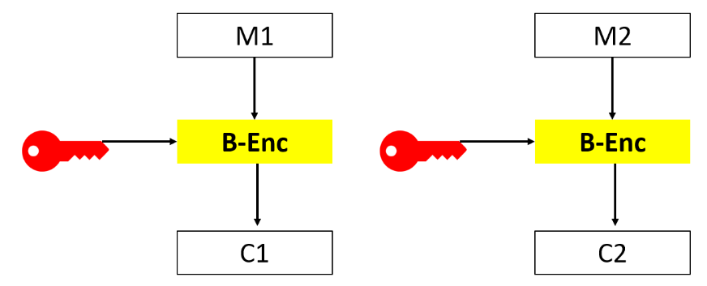
1. Divide the message into blocks
2. Encrypt each block Mi to Ci by computing B-Enc(K,Mi)
3. Concatenate all and send
4. Receiver decrypts by computing Mi = B-Dec(K,Ci)

Problem: same blocks have the same ciphertext (reveals pattern)

#### Mode of operation 2: Cipherblock Chaining
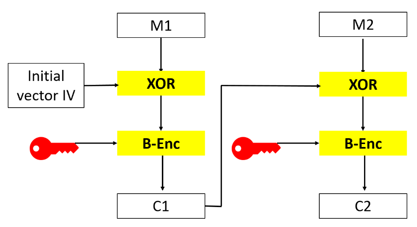
1. Pick initial random vector IV of length l
2. Compute C1 by performing B-Enc(K, M1 XOR IV)
3. Use C1 as IV for M2 and so on
4. Concatenate all and send both C and IV
5. Decryption is done in reverse

Problem: cannot be parallelised

#### Mode of operation 3: Counter
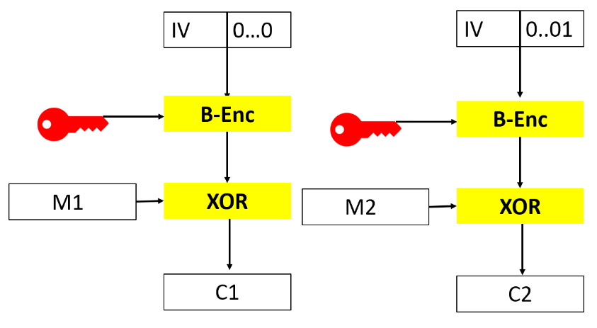

Assumes that block length l is even
1. Get initial value IV of length l/2
2. Compute Ci by performing Mi XOR B-Enc(K, IV||b), where b is the l/2 bit binary representation of i-1.
3. Concatenate all and send both C and IV
4. Receiver decrypts by computing Mi = Ci XOR B-Enc(K, IV||b)

   
Now let's have a look at the encryption/decryption algorithm. B-Enc and B-Dec is actually
a combination of what is called the P-box and S-box.

#### P-box
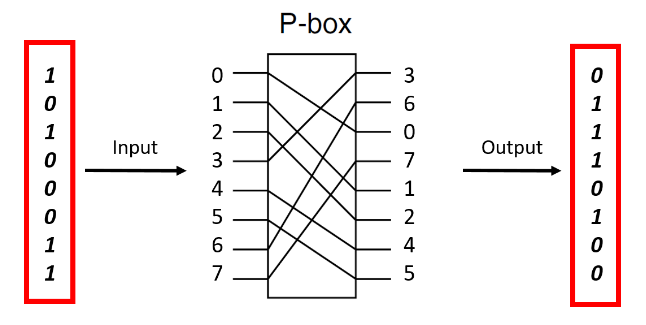

Takes a bit string as an input and gives the permutation of it as output.
Decryption is done by reversing the process

#### S-box
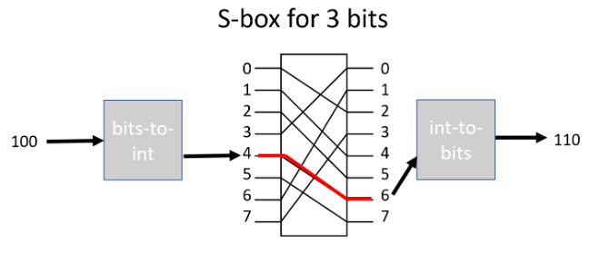

The binary input is first encoded as an integer r between 0 and 2^l - 1.
S-box takes r and maps it to another integer q.
Decryption is done by reversing the process.

## Asymmetric-key Encryption
Uses Kpub, a public key, for encryption, and Kpri, a private or secret key, for decryption

When a receiver wants to receive encrypted messages,
he first generates a key pair consisting of a public key Kpub and a corresponding private key Kpri. 
The receiver publishes Kpub such that others can find it.

If a sender wants to send an encrypted message to a receiver, she first looks up the receiver's public key. 
She then encrypts M with Kpub to get the ciphertext C = Enc(Kpub,M). 

Below we will look at the most common asymmetric-key encryption algorithm called RSA, 
and also look at two examples of using asymmetric-key encryption for exchanging a shared secret key.

### RSA
Follows Euler's theorem:
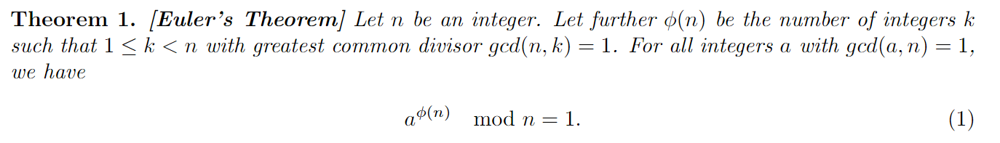

RSA uses this for a number n = p * q, where p and q are prime numbers.
- Then gcd(n,k) = 1 for all k that are not multiples of either p or q.
- The total number of integers k with 1 <= k < n is n-1.
- Of these n-1 numbers, q-1 are multiples of p and p-1 are multiples of q.
- Hence, φ(n) = n-1 - (q-1) - (p-1) = p*q - (q+p) + 1 = (p-1)(q-1).

When the receiver generates a key pair,
- he chooses p and q, typically of length at least 1024 (nowadays 2048)
- he computes n and φ(n)
- he chooses an integer d with gcd(φ(n),d) = 1
- and computes integer e which satisfies
  - 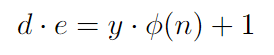
  - for an integer y
- Now Kpub = (e,n) and Kpri = (d,p,q)

Encryption:
1. Convert plaintext M as a sequence of numbers i1, i2, ..., im with ij ε {1,...,n}
2. For all j = 1,...,m, compute xj = ij ^ e mod n
   - 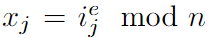
3. Send x1,...,xm

Decryption:
1. Compute xj ^ d mod n, which is equal to the original ij
   - 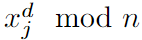

RSA is secure under the assumption that it is computationally unfeasible to:
- factorise n
- find the e-th root of an arbitrary number mod n (i.e., derive ij from ij ^ e mod n)

Problems with RSA:
- Quantum computers could break the assumptions above
- Requires long keys
- Computationally expensive (exponentiation)

So many algorithms use RSA only for key exchange and use symmetric encryption for the actual plaintext.

### Hybrid encryption
Combines an asymmetric-key encryption algorithm with a symmetric-key algorithm

Notation:
- EncA/DecA = keys for the asymmetric-key encryption
- EncS/DecS = keys for the symmetric-key encryption

If A wants to send to B, she
1. looks up B's public key Kpub
2. chooses a key K for the symmetric-key encryption
3. encrypts K with B's public key
   - 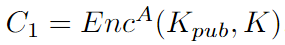
4. encrypts the message M with K
   - 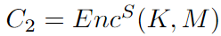
5. sends C = (C1,C2) to B

Knowing C, B can now
1. decrypt K using Kpri
   - 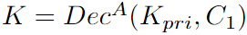
2. decrypt M using K
   - 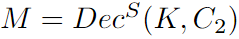

A and B can benefit from the security of asymmetric-key encryption
while also having the benefit from the efficiency of symmetric-key cipher.

### Diffie-Hellman Key Exchange
An interactive method for exchanging keys. Requires both parties to be online.

DH key exchange method relies on the assumption that given only n, g, g^a mod n, g^b mod n,
it is computationally unfeasible to derive g^(ab) mod n.

Say A wants to send to B. They agree on a key K
1. integers n and g are publicly known
2. A starts the key exchange by choosing **a** (a positive integer) and sending **KA = g^a mod n** to B
3. B chooses **b** and sends **KB = g^b mod n** to A
4. A now computes **K = KB^a mod n = g^(ba) mod n** and B computes the same K as **K = KA^b mod n = g^(ab) mod n**
5. now A and B have a shared key

## Message Authentication Codes
A message authentication code (MAC), sometimes also called a message integrity code (MIC), appends a tag to a message.
The tag provides the following properties:
- Message integrity
  - If A sends a message to B, B can detect any modification made to the message by a third party
- Authentication
  - If A sends a message to B, B can be sure that A has sent the message
- Repudiation
  - Nobody, including A and B, can prove that A sent a message to B to a third party

MAC rely on symmetric-key or secret-key cryptography. Formally, it consists of a key generation algorithm KeyGen
and an algorithm MAC that takes a key and a message as input.

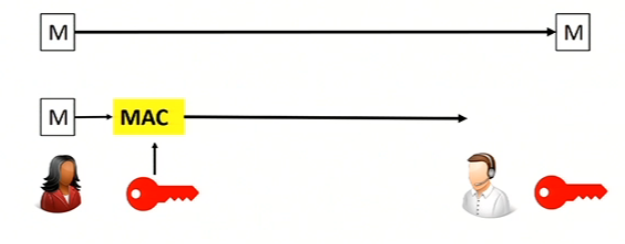
1. A and B agree upon a secret key K using a secure channel
2. when A wants to send a message M, she computes the tag MAC(K,M)
3. A then sends both M and MAC(K,M) to B
4. B computes MAC(K,M) himself and then checks if his result is identical to the received tag

Repudiation comes from the fact that only A and B knows the secret key K, and no one else does.

MAC internally uses cryptographic hash functions to achieve integrity. 
Like a hash function, a cryptographic hash function maps inputs of arbitrary length to fixed-length outputs. 
In addition, a cryptographic hash function h has the following three properties:
- Collision resistance
  - infeasible to find x != y with h(x)  = h(y)
- Preimage resistance
  - given z, it is computationally infeasible to find x with h(x) = z
- Second preimage resistance
  - give x, z = h(x), it is computationally infeasible to find y != x with h(y) = z

## Digital Signatures
Similar to MACs, digital signatures append tags to messages.
They provide the following properties:
- Message integrity
- Authentication
- Non-repudiation
  - Based on a message and the corresponding tag by A, everyone can prove that A sent the message

Digital Signatures rely on three algorithms:
- KeyGen
  - generates keys
- Sign
  - takes a key and a message as input
  - outputs a tag
- Verify
  - takes a key, a message, and a tag as input
  - outputs a binary value

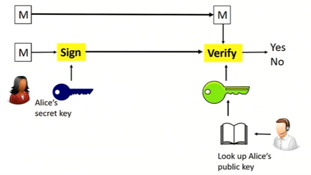
1. A creates a key pair consisting of a public verification key Kpub and a private signature key Kpri
2. when A sends a signed message to B, she computes the signature s = Sign(Kpri, M) for M
3. A sends M and s to B
4. B (and everyone else) can compute Verify(Kpub, M, s)

We can use RSA to make sure that the algorithm guarantees that it is computationally infeasible to compute a signature without knowing Kpri.

### Hash-then-sign
Digital signatures are slow, so the sender can sign h(M) instead of M, where h is the cryptographic hash function.

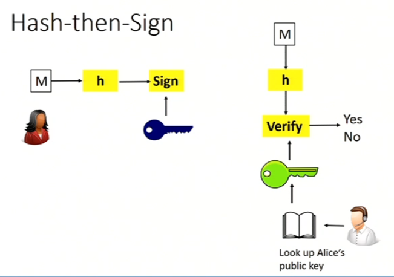

   
However, both MAC and Digital Signatures fail to answer the following question: 
How does B (or anyone else) know that they have the correct public key for A?
What if Malory replaces A's key with their own?

## Public Key Infrastructure
A public key infrastructure (PKI) ensures that adversarial parties cannot easily replace the keys of other users with their own.

### Hierarchical PKIs
PKI typically use certificate authorities. These certificate authorities follow a hierarchical structure.

Root authorities act as trusted parties. There can be one or several root authorities. 
Each root authority has a public key pair consisting of a public verification key and a private signature key.

### Web-of-Trust

