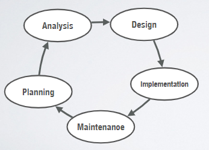

# Software Architecture

Recall the SDLC:  
 
in the last chapter we focused on the analysis part. 
In this chapter, we focus on the design part

## Software Design
> The process of defining the architecture components, interfaces, and other characteristics of a system or component

Software Design is about handling complexity. The larger the program, the more difficult it is to manage complexity.
Simpler design allow us to build large and more powerful systems before complexity gets out of hand.

Approaches to software design:
1. Top-down design
2. Bottom-up design
3. View-based design
4. Iterative and incremental design
5. *Domain Driven Design (DDD)*
6. Model-driven design

## Software Architecture
> Software architecture is how the components of a software system are organised and assembled,
> how they communicate with each other, and the constraints that rule the whole system.

Software architecture has three main parts:
1. Architectural patterns (how components are organised)
2. Messages + API (how components interact with one another)
3. Quality Attributes (constraints and non-functional req)

UML

### Architectural patterns
> An architectural pattern is a general, reusable solution to a commonly occurring problem in software architecture within a given context.  
> Architectural patterns describe the overall structure of the system.

- Client-server
  - Server hosts most of the services and datas
  - Multiple clients 
- Layered architecture
  - Each layer does different job
  - Example: network layer, operating system
- Model-view-controller
  - Example: login.html(view) <-> LoginController(controller) <-> Database(model)
- Multi-tier pattern
  - Each tier is a physical unit, which can have layers
- Pipe-and-filter
  - For systems that produce a stream of data
  - Example: machine learning pipeline, unix shell commands
- Ports and adapters pattern
  - Isolates core business logic from the services that it uses
  - port: an API (service) that can be "plugged in"
  - adapter: the code that interacts with external data sources or components that layer can use
- Microservices
  - Rearranges an application as a collections of loosely coupled services
  - Each microservice can be implemented in different programming languages, databases, hw/sw environment etc.
- Publish-subscribe
  - publisher: any component that publishes an event.
  - subscriber: any component that subscribes to an event
  - event bus: where the events are delivered from publisher to subscribers
  - publishers and subscribers are independent and unaware of each other.
- Event-driven pattern
  - Consists of event emitters (agents), event consumers (sinks), and event channels
  - Events are inputs to the EDA and trigger transitions from one state to another state in the system.