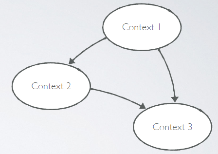
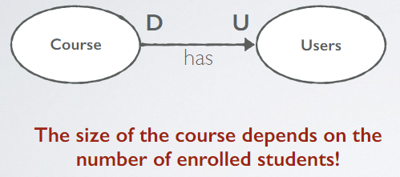
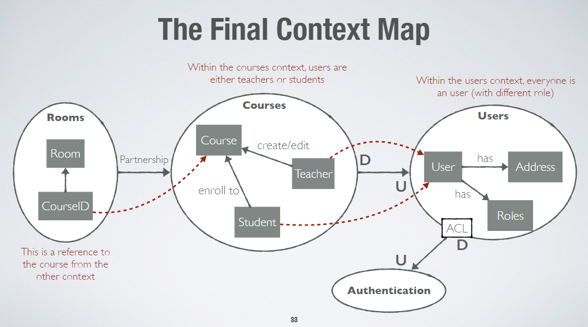

# Domain Driven Design (DDD)

Extending from the software design methods that was seen previously, this note specifically addresses Domain Driven Design.

Domain Driven Design is an approach to software development that centers the design around processes and rules of a domain.

DDD is about designing software based on models of the underlying domain.

## Applying DDD
### Step 1. Bounded contexts
Bounded contexts are the sub-concepts within the whole domain.

Different bounded contexts have both unrelated concepts but also related concepts. 
The goal is to divide a large domain into smaller ones that are properly defined and has specific boundaries to encapsulate.

Different types of domains:
- Core domain: most important part of the system
- Generic domains: the core depends on these
- Supporting domains: additional, not critical

### Step 2. Context maps
A context map illustrates how the contexts (or boundaries) are defined and their integration points and the flow of data between bounded contexts.

Different types of relationships:
- Upstream: an upstream context influence the downstream counterpart
- Downstream: influenced by upstream context

Organisational Patterns
- Once we know what our contexts are and how they are related, we have to decide how to integrate them.
  - how will the contexts communicate?
  - how can we protect a context against unwanted or problematic changes from upstream contexts?
  - how can we avoid causing trouble for downstream contexts?

Different types of Organisational patterns
- Partnership: upstream and downstream contexts are aligned and have dependent set of goals
- Conformism: downstream conforms to the upstream data
- Anti-corruption Layer (ACL): a "translation" layer between two contexts that do not share the same semantics
- Shared kernel: U and D contexts share a common code base, which is the kernel (e.g., data encryption library)
- Customer-Supplier: U is required to take into account the needs of D
- Open-host Service: access to a context is open to any other context through a protocol
- Published Language: U and D follows an established documented language (e.g., using XML or JSON formats)
- Separate ways: no integration

### Step 3. Detail the Bounded Contexts
Now we can detail the main concepts of each bounded context

