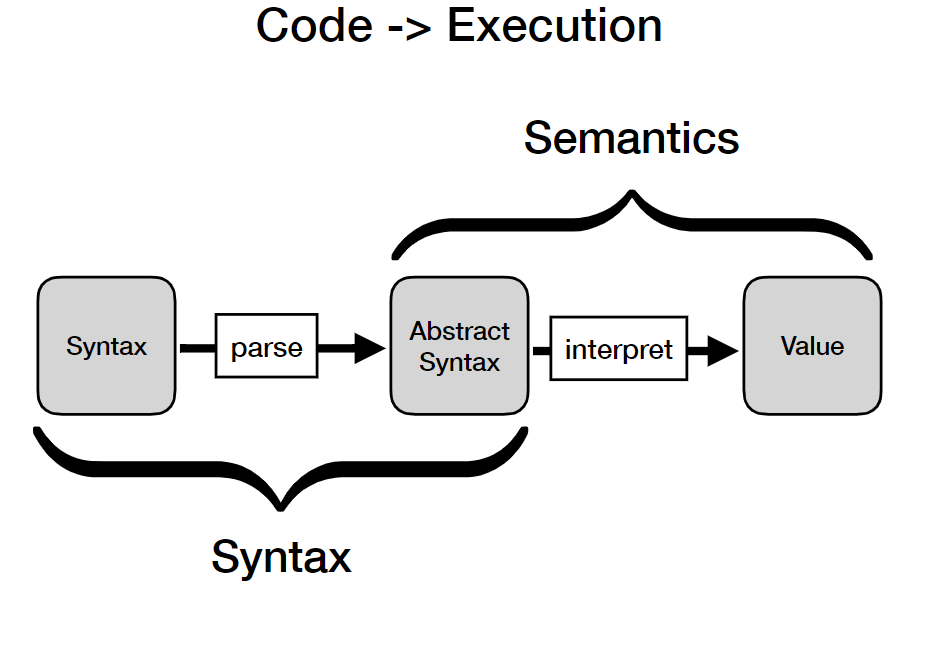
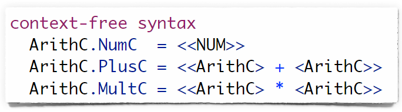
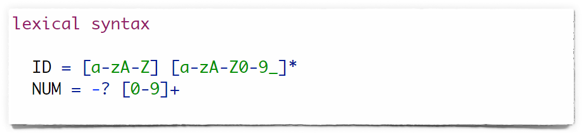
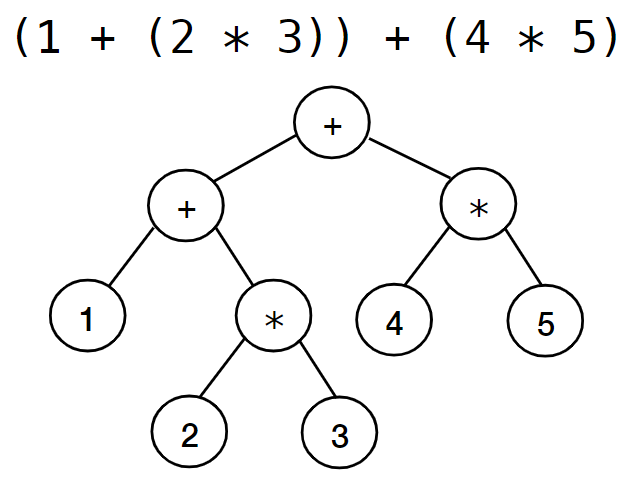
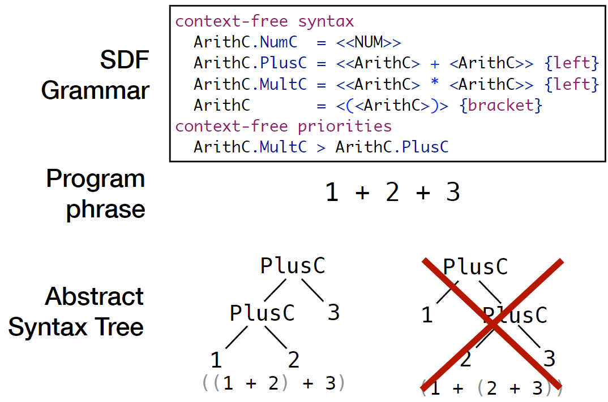

# 230213_ Syntax & Parsing

---

# 0. Overview
- Learning Objectives
  - Write simple parsers
  - Know different approaches to parsing
  - Create abstract syntax tree from programs given a grammar
  - Know what s-expressions are
- Overview
  - Syntax & Grammars
  - Concrete Syntax
  - Lexical Syntax
  - Abstract Syntax (Trees)
  - Ambiguities / Disambiguation
  - Parsing
  - S-Expressions

# 1. Syntax
> The structure of program phrases in a language 
> A grammar describes the syntax of a language

## BNF Grammar
Backus-Naur form
- Metasyntax notation for context-free grammars
- used to describe the syntax of languages used in computing, such as computer programming languages, document formats, instruction sets, etc

E ::= n
- E is the symbol, which is to be replaced by the expression n.
- n is the expression which is a (set of) symbols or other expressions.
- Different types of expressions are listed with | sign.
- Constants are expressed with "" sign.

Terminals and Non-terminals
- Symbols that never appear on the left side are terminals. (they cannot be expressed with other symbols)
- Symbols that appear on a left side are non-terminals.
- Example: hexadecimal with BNF
  - \<digit> ::= "0" | "1" | "2" | "3" | "4" | "5" | "6" | "7" | "8" | "9"
  - \<letter> ::= "A" | "B" | "C" | "D" | "E" | "F"
  - \<number> ::= \<digit> | \<letter>
  - \<integer> ::= \<number> | \<number>\<integer>

## Concrete Syntax (SDF)
The recipe for parsing and disambiguation 

## Lexical syntax
The shape of the lexemes/words/tokens of a language 

# 2. Abstract Syntax
> The abstract syntax of a program represents its structure and abstracts from irrelevant syntactic details

## Abstract Syntax Tree
An example of the abstract syntax tree: 

## Disambiguation
- Priorities
  - example) multiplication over addition
- Associativity (left, right, neither)
  - example) 1-(2-3) vs (1-2)-3
- By language design
  - example) brackets
- By grammar construction

An example of the process: 

