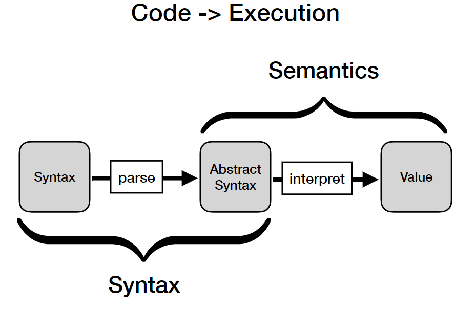
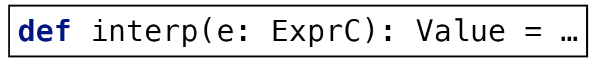
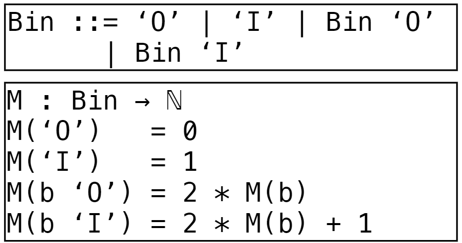
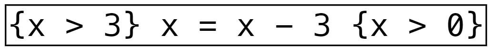
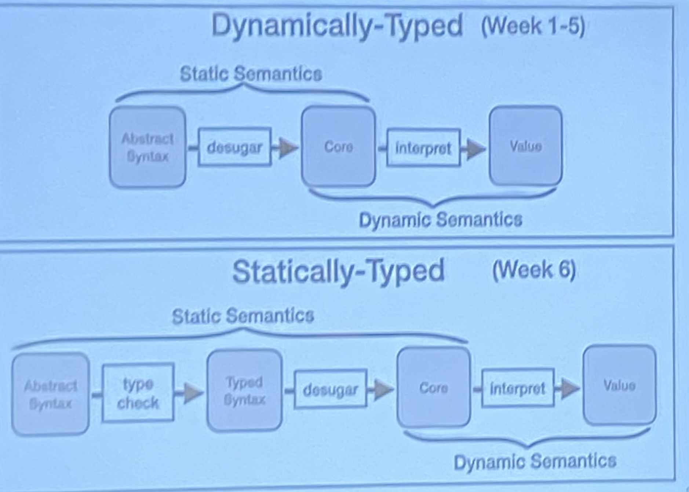
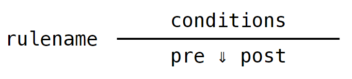
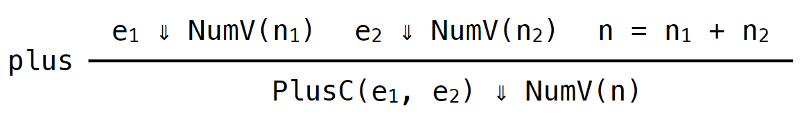

# 230216_ Semantics and Transformations (1)

---
(See 1_1 for contents that continue from last lecture)
# 0. Overview

Learning Objectives
- Write interpreters for simple languages
- Explain differences, advantages and disadvantages between compilers and interpreters
- Know which different types of semantics exist

# 1. Semantics
> the meaning of program phases

## Different types of Semantics
- Dynamic Semantics
  - Operational Semantics **
    - the meaning of a phrase is given by an algorithm for reducing the phrase to a value
    - 
  - Denotational Semantics
    - the meaning of a phrase is this translation to an underlying mathematical domain
    - 
  - Axiomatic Semantics
    - the meaning of a phrase is this set of axioms defining how it affects assertions about the program state
    - 

- Static vs Dynamic Semantics
  - Static: restriction of the set of valid program phrases; e.g. type systems
  - Dynamic: run-time behaviour of a program

## Why use semantics?
- Validation
  - experimenting linguistic abstractions and validating their usefulness
- Documentation
  - documenting the meaning of the language
- Verification
  - proving that the (program of) language satisfies a property

# 2. Interpretation
## Interpretation vs Compilation
- Interpreter
  - Directly performs the actions in the high level program
  - Faster in development
  - runtime errors directly mapped to the source code
  - in the domain of the language
- Compiler
  - Converts program to something executable by the platform
  - Faster in execution
  - runtime errors need to be translated back to the corresponding code (bad reporting)
  - different per target platform

Examples of interpreted/compiled languages
- Interpreted
  - Python
  - JavaScript
  - Ruby
- Compiler
  - C, C++, C#
  - Rust
  - Java / Scala / Kotlin

## Semantics Interpretation
### Big Step Semantics
 

