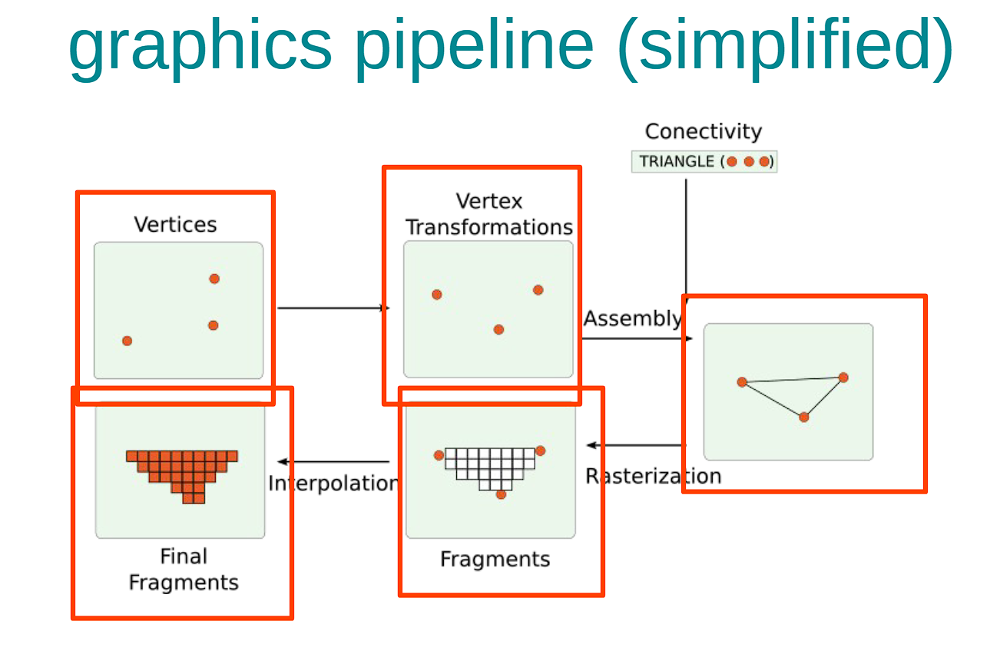

OpenGL Pipelines
===
---
## OpenGL
OpenGL, Open Graphics Library, is a rendering API that draws primitives on the screen. OpenGL basically projects your vertices and triangles on the screen.

### Basic idea
The basic idea is transforming triangles to pixels and rasterizing them to make them seen as how we want.

### OpenGL graphics pipeline
 
1. We input some vertices of the model we try to create
2. Vertices are transformed to create the model
3. The model is viewed on the screen as fragments
4. The fragments are coloured by rasterization
5. The colours and other features are interpolated to give the final result 

We are going to look at the whole procedure in 3 separate levels:
1. Vertices and triangles
   - corresponds to step 1
2. Coordinate systems
    - corresponds to step 2 and 3
3. Rasterization and Interpolation
    - corresponds to step 4 and 5 respectively