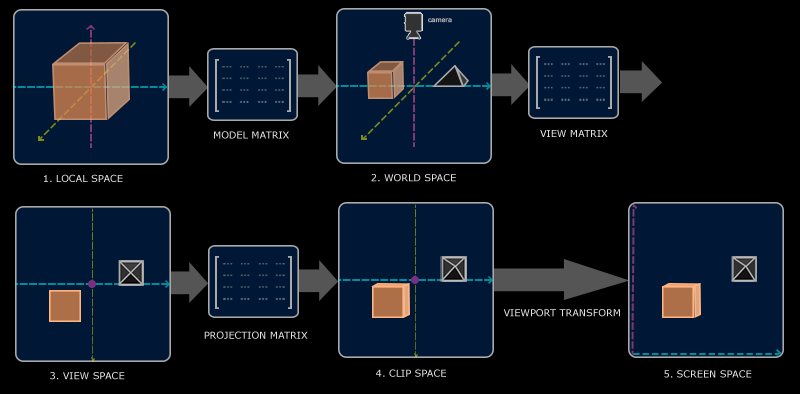
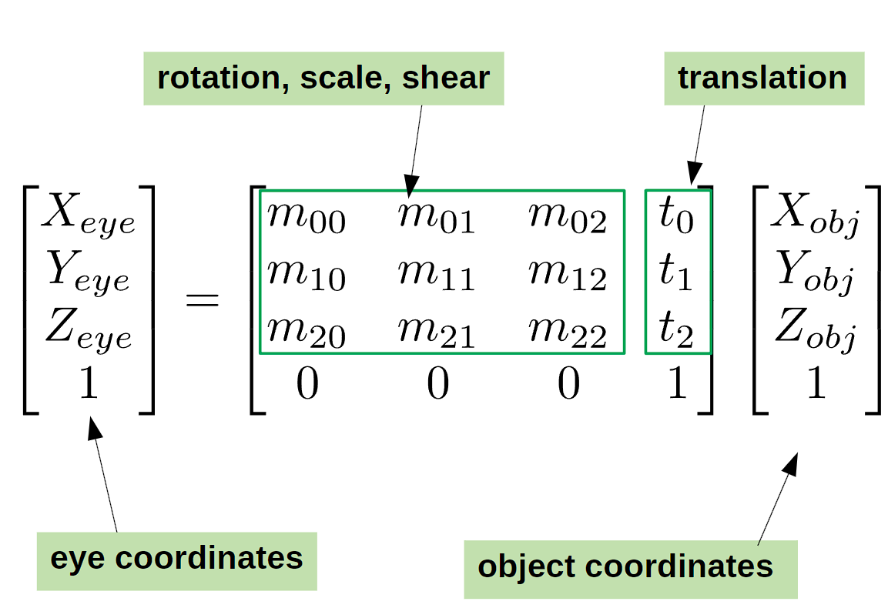
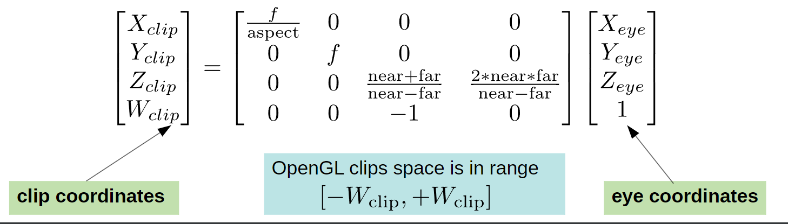
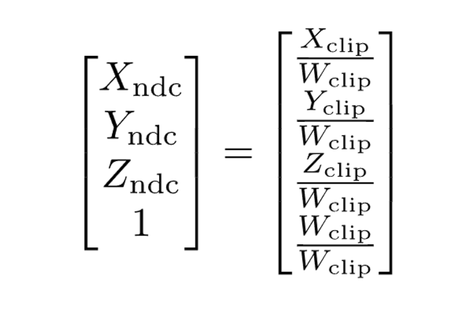
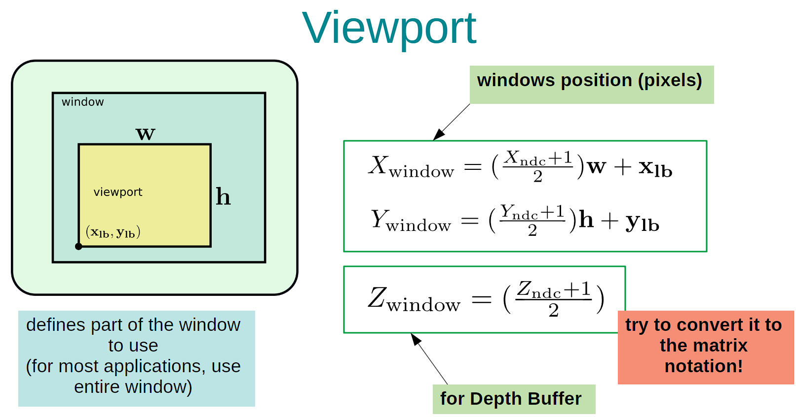
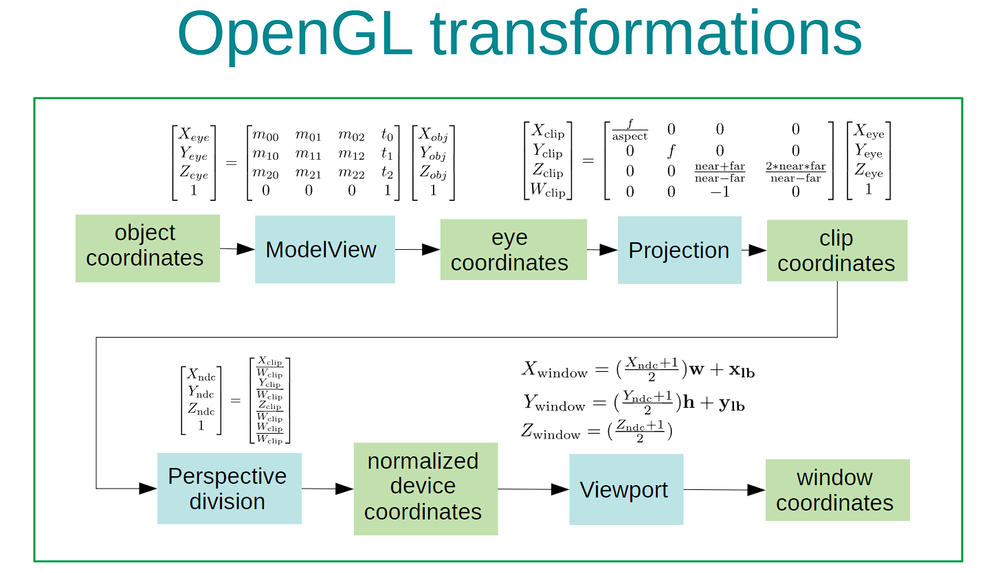

# 2. Coordinate Systems

---------------
OpenGL expects all the vertices to be in normalized device coordinates after each vertex shader run.
That is, the x, y, and z coordinates of each vertex should be between [-1.0, 1.0] ; coordinates outside this range will not be visible. 
What we usually do, is specify the coordinates in a range (or space) we determine ourselves and in the vertex shader transform these coordinates to normalized device coordinates(NDC). These NDC are then given to the rasterizer to transform them to 2D coordinates/pixels on your screen. 
 
Transforming coordinates to NDC is usually accomplished in a step-by-step fashion. The advantage of this is that some operations/calculations are easier in certain coordinate systems. 
There are total of 5 different coordinate systems that are important to us:
- Object space (or Local space)
- World space
- Eye space (or View space)
- Clip space
- Screen space

Those are all a different state at which our vertices will be transformed in before finally ending up as fragments.

Let's first look at the global picture for the overview.

## 0. The global picture
 
The picture above shows the transformation from the object space to the screen space in following steps:
1. Object coordinates are the coordinates of your object relative to its local origin; they're the coordinates your object begins in.
2. The next step is to transform everything relative to the world origin.
3. Next we transform the world coordinates to view-space coordinates in such a way that each coordinate is as seen from the camera's viewpoint.
4. We then project them to clip coordinates which decides what will be viewed on the screen. Projection to clip-space coordinates can add perspective if using perspective division.
5. Lastly we transform the clip coordinates to screen coordinates in a process we call viewport transform that transforms the coordinates from -1.0 and 1.0 to the coordinate range defined by the viewport matrix.

## 1. Object space
Object space is the coordinate space that is local to your object. All the objects that you've created would initially begin at (0,0,0). 
All the vertices of your model are therefore in object space or *local* space: they are local to your object.

## 2. World space
We now move these objects to where they should be in the world. If we don't do this, all the objects will be clustered together at the origin.
We do this by multiplying the modelview matrix. 
 

## 3. Eye space
The eye space or the view space is referred to as the camera of OpenGL. It is sometimes called camera space as well.
The eye space is the result of transforming your world coordinates to coordinates that are in front of the user's view.
The eye space is thus the space as seen from the camera's point of view. This is achieved by multiplying the projection matrix. 
 
*f* is the focal length: the distance between the camera and the image plane. 
*aspect* is the aspect ratio of the screen (4:3, 16:9 etc). We only scale X by this ratio because it is *ratio* 
*near* and *far* is the near and far plane of the projective space: the clipping range. 

## 4. Clip space
At the end of each vertex shader run, OpenGL expects the coordinates to be within a specific range and any coordinate that falls outside this range is clipped. Coordinates that are clipped are discarded. 
OpenGL clips in range [-Wclip, +Wclip]. The coordinates are then normalized by dividing Wclip to be in the range of [-1,1]. 
We do clipping before we normalize because then we do not have to perform the unnecessary operations where we normalize the coordinates that wouldn't be on the screen. 
 
### Perspective division
Perspective division is the operation where we divide the x,y, and z components of the position vectors by the vector's homogeneous w component; perspective division is what transforms the 4D clip space into 3D normalized device components. 
 
Each component of the vertex coordinates are divided by its w component giving smaller vertex coordinates the further away a vertex is from the viewer. This is another reason why the w component is important, since it helps us with perspective projection. 
w component being 1 means that there is no perspective division.

## 5. Screen space
Now we map everything that has been normalized to the screen coordinates to map our projection into pixels. 
 
### Depth buffer (Z-buffer)
OpenGL stores all its depth information in a z-buffer. The depth is stored within each fragment and whenever the fragment wants to output its colour, OpenGL compares its depth values with the z-buffer. This process is called depth testing.

## Summary
 
The fragments that are viewed on the screen is now coloured with rasterization.
