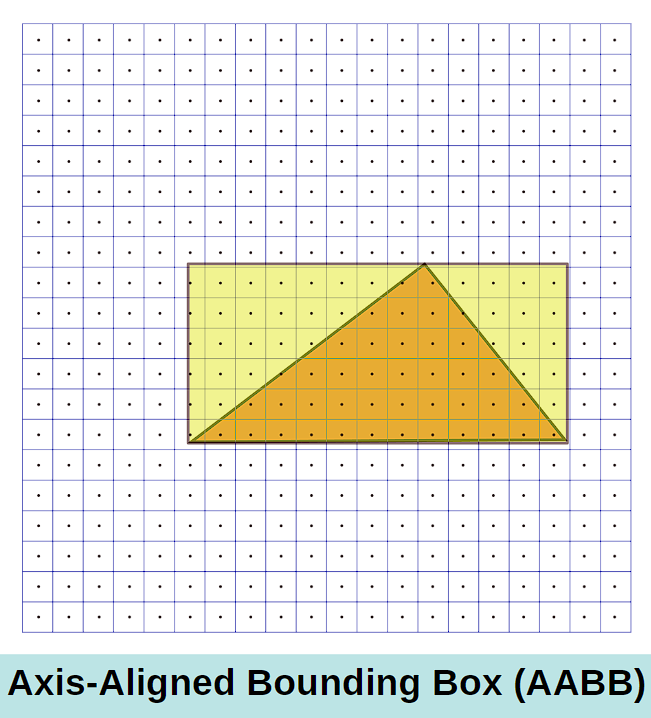
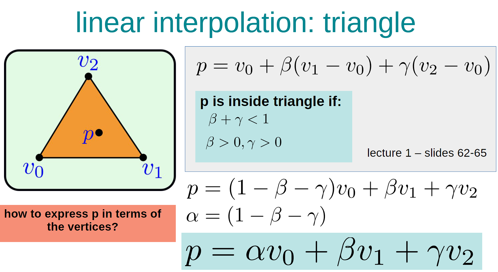
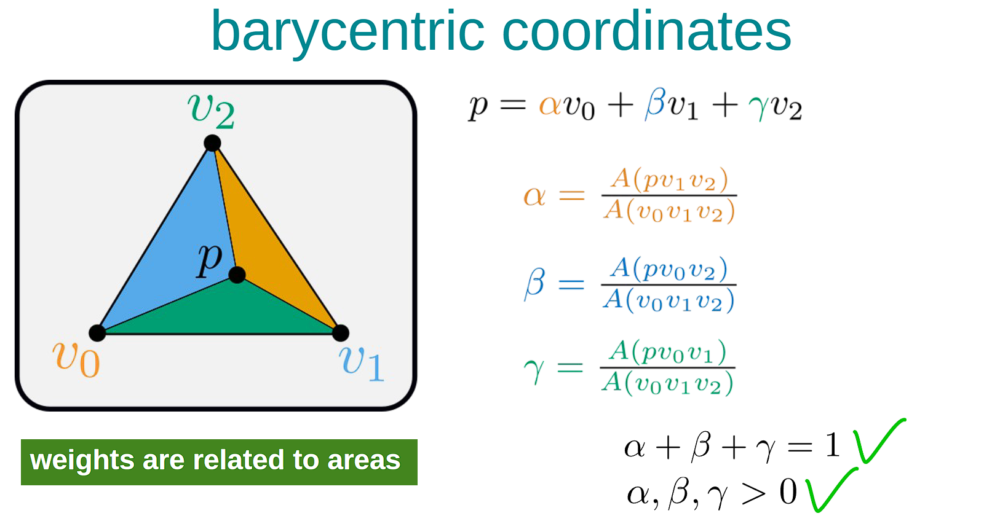
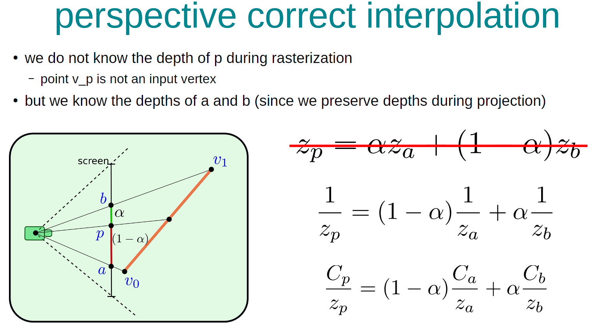

# 3. Rasterization and Interpolation

---
## 1. Rasterization
Given the model on the screen(fragments), we need to colour the pixels. But how do we decide which pixel to fill? 
We can colour the pixels if the pixel centre is within the triangle. However, checking for all pixels is very expensive. 
We can use Axis-Aligned Bounding Box(AABB) and check for only the pixels that are inside the box. 
 
We can define the coordinates of the box by looking at the maximum and minimum x and y values. The coordinate of the box would be: 
(Xmin, Ymin), (Xmax, Ymin), (Xmin, Ymax), (Xmax, Ymax)

## 2. Interpolation
In our triangles, only the vertices have colours: we need to define colours(and other features) of any pixels that are inside the triangle too. We use interpolation for this. 
 
 
Area of the triangle using 3 vertices can be calculated as following: 
A(a,b,c) = (ax(by-cy) + bx(cy-ay) + cx(ay-by))/2

### Perspective correct interpolation
Models in 3D have an issue; even if a point p on a line lies in the middle, when viewed on 2D it might not be. 
The problem is that we do not know the depth of p during rasterization because p is not an input vertex. However, what we do know is the depth of the given vertices. 
 