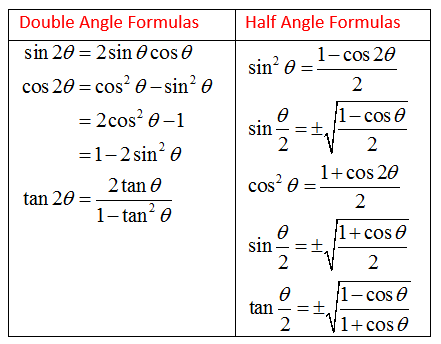

Exam notes
===========
---

## Raytracing and rasterization

### Rasterization
*Advantages*
1. Fast (for primary effects)
2. easily parallelizable
3. scales well with resolution

*Disadvantages*
1. difficult to produce effects (depth of field, shadows etc)
2. standard version scales badly with geometry

### Raytracing
*Advantages*
1. very flexible
2. can be made physically correct (unbiased)
3. easy to incorporate secondary effects
4. scales better with geometry

*Disadvantages*
1. usually slow for medium-scale scenes
2. overhead for dynamic scenes
3. complicated structures that can be difficult to implement

## Homogeneous coordinates
- Normals always have 0 as their last entry: it avoids translating the normal

## Projection matrix
- If w != -1 but w = constant, there is no perspective division.
  The matrix projects objects flat onto the image plane.
- No scaling also means resulting homogeneous coordinates are linear to the original coordinates

## Shading - Phong
- **D = Kd Id (L * N)**
- **S = Ks Is (R * V)**
    
- L = light position - vertex position
- V = view position - vertex position
- R = L - 2*(L*N)N 
    - in this case the direction is towards the camera
    - everything should be normalized

## Texture filtering
method used to determine the texture colour for a texure mapped pixel, using the colours of nearby texels
- Mipmapping
- Nearest-neighbour
    - simply uses the colour of the texel closest to the pixel center for the pixel colour
    - simplest and crudest
    - results in a large number of artifacts
- Linear mipmap filtering
    - nearest neighbour sampling from individual mipmaps whilst linearly interpolating the two nearest mipmaps relelvant to the sample
- Bilinear filtering
    - four nearest texels to the pixel center are sampled, and their colours are combined by weighted average according to distance
    - removes blockiness, smoothens the colour change from one texel to next
    - creates an abrupt jump as the pixel centre crosses the texel boundary
- Trilinear filtering
    - solves problems of bilinear filtering by doing a texture lookup and bilinear filtering oj the two closest mipmap levels, and then linearly interpolating the results
- Anisotropic filtering

## MipMaps
- Mipmap is used to fix undersampling of texture
- Mipmap is an image pyramid containing filtered versions of a texture
- Each level averages 4 neighbouring pixels
- During rendering, levels with pixels closest in size to the projection of the screen pixel are chosen
  for an approximately correct flitering inside the screen pixel.

## Shadow map
- If depth on the shadow map is higher than given depth, light
- If shadow map is lower, shadow
- Shadow map with offset: if *depth from viewpoint <= depth in shadow map + offset* pixel is lit
    - P' = P + ε(L-P)/|L-P| (L-P is basically the light vector)
    - Choosing ε: use the orientation of the surface at P
        - The smaller the angle between light vector and normal vector, the greater the distance between P' and surface for the same ε.
        - Hence, for larger angles, ε should be increased, or vice versa
- Solving staircase artifact: increase the shadow map resolution
- Mipmaps in shadow map
    - Usually not useful because filtering depths lead to "blockers" floating in the air
    - Use PCF (compare neighbouring texels and take neighbour)

## Trigonometry
