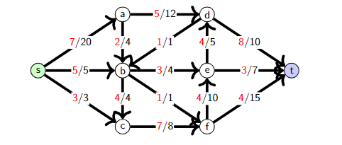
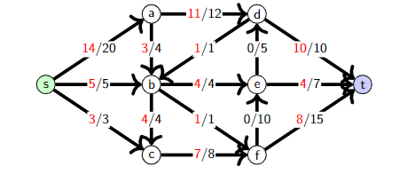
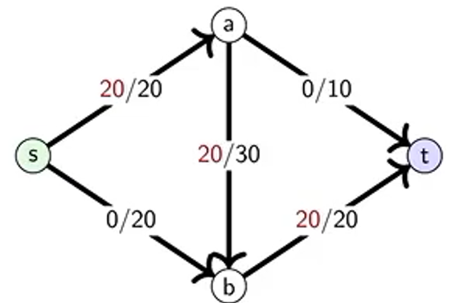
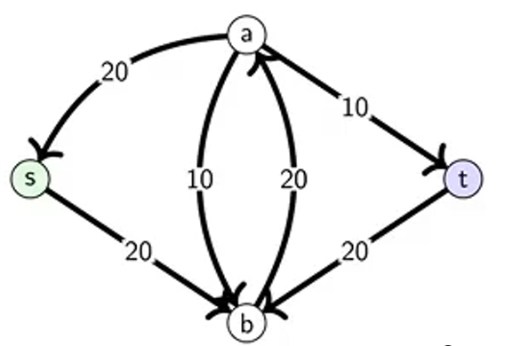

# NF lecture 1

---

## Components of Network flow
- source
- sink

- origin
- destination
- capacity
- flow

## Requirements of valid flow
- flow <= capacity
- incoming flow = outgoing flow

## Maximum flow
- 
- 
- Algorithm to do this will be on Friday

## (Minimum) cut
- (s,t)-cut: partitioning of V into two sets A and B
  - A intersection B = none
  - A union B = V
  - s is in A and t is in B
- Capacity of cut (A,B) -> sum of capacity from A to B
- Minimum cut: cut with sets that have minimum capacity (leaving from set A)
- Net Flow of cut (A,B) -> sum of flow leaving A - sum of flow into A 
- The net flow across the minimum cut is never more than the capacity of the cut

# Residual Graph
- Original edge e = (u,v)
- Residual edge e^R = (v,u)
- Residual capacity function:
  - cf(e) = c(e) - f(e)  if e is in E
  - cf(e) = f(e^R)       if e^R is in E

- Example
  - For this graph, 
  - this is the residual graph 