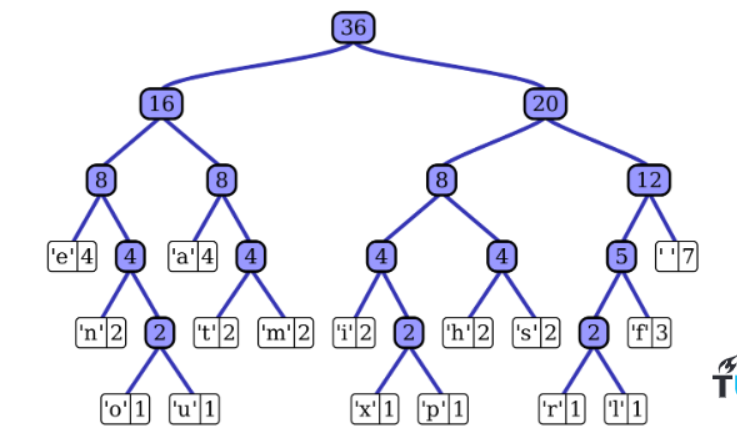
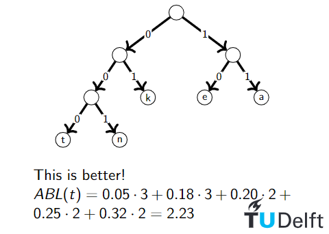
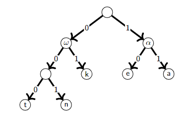

# Lecture 4. Huffman codes



Given a text, we have to encode the text in binary as efficiently as possible, so that the encoding is non-ambiguous.

A Huffman encoding is the optimal encoding when encoding each symbol separately.<BR>
It is a prefix coding.


## Prefix codes
> A prefix code for a set S is a function c : S -> {0,1}+ so that for all x and y in S (x != y), c(x) is not a prefix of c(y).

For example, for S = {a, b, d}, and c(a) = 01, c(b) = 010, c(d) = 1, this is not a prefix code because c(a) is a prefix of c(b).

Another example:<BR>
c(a) = 000, c(e) = 01, c(k) = 11, c(n) = 10, c(t) = 001<BR>
1001000001 means "neat" (10/01/000/001)

### How to make optimal encoding
Good encoding have low average encoding length.

An optimal prefix encoding is a prefix code with minimal average length, so the average amount of bits per letter is as small as possible.

## Encoding and binary tree
A binary tree represents a code where:
- children are uniquely identified by an edge label (0 or 1)
- leaves are labeled with symbol x iff the path from the root is labeled with the encoding c(x).
- so |c(x)| is the depth of the node in the tree.

The binary tree corresponding to the optimal prefix code is full.<BR>
(A binary tree is full iff every node has either 2 or 0 children.)

Proof. (by contradiction)
- Suppose for the sake of contradiction that T is a non-full binary tree of an optimal prefix code.
- There must then be a node u with one child v. u does not have a label (because it is not a leaf)
- Now there are two options:
  - u is the root. Now create T' where we delete u and use v as the root.
  - u is not the root. Create T' where we delete u and let v be the child of w where w is the parent of u.
- In both cases the number of bits needed to encode any leaf in the subtree of v is decreased and the rest of the tree remains the same.
- Thus the ABL of T' is smaller than T, which contradicts our assumption that T is optimal.

### Creating an optimal encoding tree
Create the tree top-down, with letters with the highest frequency on the top.<BR>
Split S into sets S1 and S2 with (almost) equal frequencies, then recursively build the tree for S1 and S2.

Example:<BR>
f_a = 0.32, f_e = 0.25, f_k = 0.2, f_n = 0.18, f_t = 0.05



Claim
- If u and v are leaves in T* and depth_T*(u) < depth_T*(v) then f_u >= f_v.

Proof. (by exchange argument)
- By the claim, the lowest frequency letter is assigned to the lowest level.
- This leaf has a sibling (for n>1).
- The order in which items appear in a level does not matter
- Siblings claim: there is an optimal prefix code T* where the two lowest-frequency items are assigned to leaves that are siblings in T*.

Idea: create tree bottom-up. Make two leaves for two lowest frequency letters y and z. Recursively build tree for the rest using a meta-letter for yz.<br>
Example: f_z = 0.32, f_e = 0.25, f_k = 0.2, f_n = 0.18, f_t = 0.05
1. take n and t (lowest frequencies) and make them into ω (f_ω = 0.23)
   - f_z = 0.32, f_e = 0.25, f_k = 0.2, f_ω = 0.23
2. take k and ω and make them into a new ω (f_ω = 0.43)
   - f_z = 0.32, f_e = 0.25, f_ω = 0.43
3. take z and e and make them into α (f_α = 0.57)
   - f_α = 0.57, f_ω = 0.43
4. complete the tree by connecting them with a root node.




### Implementation
```
function Huffman(S)
    if |S| = 2 then
        return tree with root and 2 leaves
    else 
        let y and z be the lowest frequency letters in S
        S' <- S - {y,z} U {ω}, so that f_ω = f_y + f_z
        T' <- Huffman(S')
        T <- add two children y and z to leaf ω in T'
        return T
```
We can use a priority queue for S (O(nlogn) time)

Claim
- Huffman code for S achieves the minimal ABL of any prefix code.

Proof by induction
- Base case (n=2): there is no shorter code than a root and two leaves.
- Inductive Hypothesis: The Huffman tree T' of S' of size n-1 with ω instead of y and z is optimal.
- Induction step (by contradiction):
  - Suppose, for the sake of contradiction, there is a tree Z with ABL(Z) < ABL(T).
  - Using the siblings claim we may assume that the lowest frequency items y and z are siblings
  - Let Z' and T' be trees created by replacing y and z by ω
  - We know that ABL(Z') = ABL(Z) - f_ω and ABL(T') = ABL(T) - f_ω.
  - But also ABL(Z) < ABL(T).
  - Then ABL(Z') < ABL(T') which contradicts the IH.


## Exam questions
Dr. Huffman is given the following letters to encode using an optimal prefix code: {p, e, a, r, l} with the following frequencies:<br>
fp = 0.2, fe = 0.35, fa = 0.08, fr = 0.12, fl = 0.25.<br>
Which of the following statements about the optimal prefix code is true?
1. The encodings for p, e, and l are all of the same length.
2. The encodings for p, r, and a are all of the same length.
3. The shortest encoding is of length 1 and is for the letter e.
4. There is one letter with an encoding of length 4, which is for the letter a.

Start by taking a and r as ω => f_ω = 0.2
- fp = 0.2, fe = 0.35, fω = 0.2, fl = 0.25

Take p and ω
- fω = 0.4, fe = 0.35, fl = 0.25

Take e and l as α
- fω = 0.4, fα = 0.6

Lengths:
- a, r = 3
- p, e, l = 2

Therefore the answer is 1.