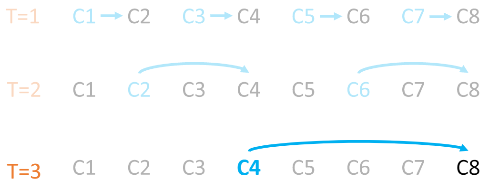
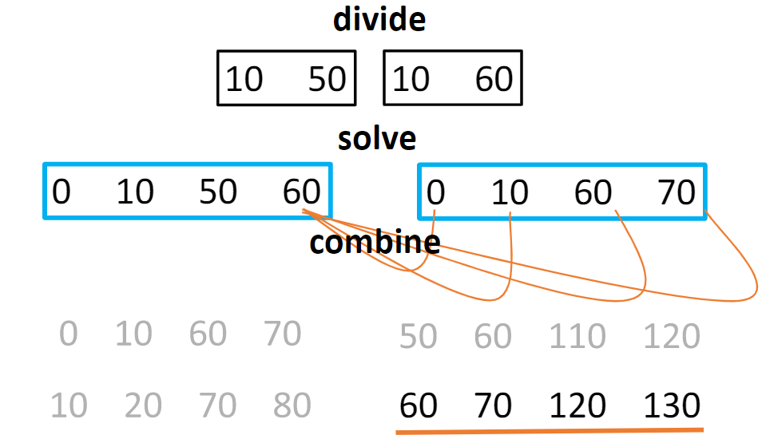

# Lecture 4. Divide and Conquer - part 1

---

## Divide and conquer
1. Divide into small parts
2. Solve small parts
3. Combine small parts

An example of divide and conquer algorithm is mergesort.
1. Divide
2. Sort each part
3. Merge

### Exponentiation
Another example is exponentiation.
- An example function: E(x,a) = x^a
- First approach:
  - ```
    e = 1
    for i in [1...a]:
        e = e * a
    ```
  - This is O(a)
- Second approach:
  - ```
    return E(x,a/2) * E(x,a/2)
    ```
  - This is still O(a)
- Third approach:
  - ```
    k = E(x,a/2);
    return k*k;
    ```
  - This is O(log(a))

1. Divide
2. Solve one part, the other is identical
3. Multiply


### Distributed information sharing
Say there are n computers, and each computer stores a unique integer.
<br> What is the fastest way to compute and broadcast the sum to each computer?

- A single pass (computer A to B, then B to C, so on) takes O(n) time
- Multiple passes at the same time
  - 
  - This does O(n) operations but takes O(logn) time


### Compute all subset sums
We are given a set of numbers, and we have to compute all the possible numbers that can be made by adding any numbers in this set.



1. Divide
2. Compute subset sums for each part
3. Cross product of two parts