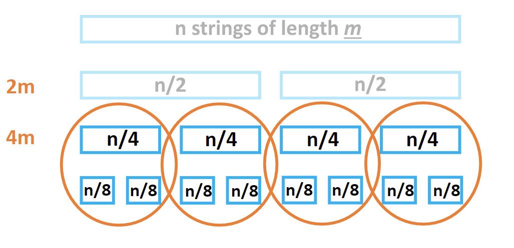
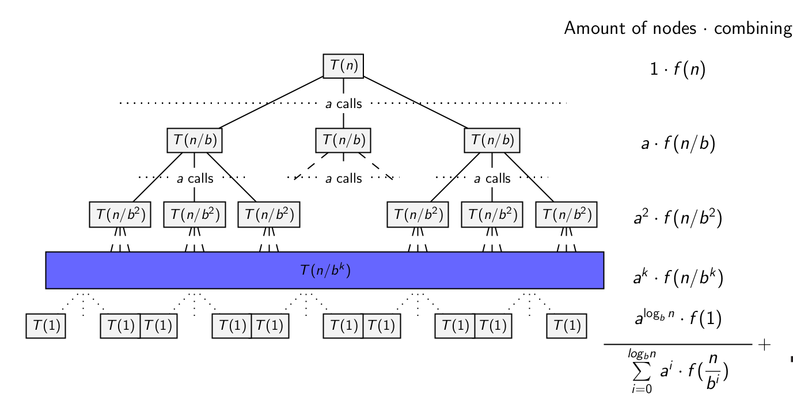

# Lecture 5 - Divide and Conquer, part 2

---

## Longest Common String Prefix
Let's say we have a set of words, for example {monkey, money, monster}.  
The longest common prefix is "mon".  
Adding the word "moe" will change the prefix to "mo".  
How can we compute this using divide and conquer?

0. Define input and output
   - Input: array of strings
   - Output: string, the common prefix
1. Divide
   - {monkey, money, monster, moe} -> {monkey, money} {monster, moe}
2. Solve
   - {monkey, money} => "mon"
   - {monster, moe} => "mo"
3. Combine
   - "mo"

The time complexity
- we have n strings of m length
- 
- m -> 2m -> 4m -> 8m...
- we have log(n) levels
- O(m*n)

## Maximum Subarray
Suppose we have an array: {-2, 1, -3, 4, -1, 2, 1, -5}. 
The maximum subarray is {4, -1, 2, 1}, as the sum of this subarray yields 6.

How can we compute this using divide and conquer?

0. Define input and output
   - Input: array of integers
   - Output: a single integer: the maximum subarray value
1. Divide
   - {-2, 1, -3, 4, -1, 2, 1, -5} => {-2, 1, -3, 4} {-1, 2, 1, -5}
2. Solve
   - {-2, 1, -3, (4)}
   - {-1, (2, 1), -5}
3. Combine
   - We have three cases: the maximum subarray starts and ends in:
     - Left (4)
     - Right (3)
     - Starts left, ends right (6)
       - find maximum start on the left (4)
       - find maximum end on the right (1)
       - combine left and right (4, -1, 2, 1)
   - Take the maximum among the three cases.

## Master Method
A Master Method can be used in cases where there are many dividing steps and it is hard to calculate the total time complexity.

Some note on the notations:
- a is the number of calls (splits)
- b is the factor of the size of the input (how n changes)

The master method is good for situations where for a >= 1 and b >= 2, T(n) = :
- Θ(1) if n = 1
- aT(n/b) + f(n) else

This will make a calls, and in the kth layer you have T(n/b^k) calls and in the end you will have a layer with T(1). 
There are a^(logb n) leaves, which means that we get Θ(a^(logb n)) = Θ(n^(logb a)) time complexity for the leaves.

Note that in divide and conquer algorithms, we have two parts of work:
- Computations (in the leaves)
- Combining

In the master method example, we have:
- Computation of Θ(n^(logb a))
- Combining of Σ(i=0, logi n)(a^i * f(n/b^i))

What makes master method useful is the fact that either one of these two can dominate another. 
We have three cases:
1. Dominated by the leaves
   - computation time is larger than combining time (i.e., f(n) = O(n^(logb a-ε)))
   - T(n) is Θ(n^(logb a)) for some ε > 0
2. Dominated by the root
   - computation time is smaller than combining time (i.e., f(n) is Ω(n^(logb a+ε)))
   - T(n) is Θ(f(n)) for some ε < 0
     - This requires that af(n/b) <= cf(n) for some c < 1 (the root is the one that does the most combining)
3. Evenly distributed throughout the tree
   - if f(n) is Θ(n^(logb a))
   - T(n) is Θ(n^(logb a) logn)

So the master method will be:
- Identify a, b, f(n) from a given recurrence equation
- Determine n^(logb a)
- Compare n^(logb a) and f(n)
- Determine the right case from the master method and apply

### Example 1. Mergesort
Recurrence equation: T(n) = T(n/2) + Θ(n)
- a = 2
- b = 2
- f(n) = Θ(n)
- n^(loga b) = n

Thus f(n) is Θ(n^(loga b)), which means that the work is evenly distributed.

So T(n) is Θ(n^(log2 2) * logn) = Θ(nlogn)

### Example 2. Closest pair of points
Recurrence equation: T(n) = 2T(n/2) + O(nlogn)
- a = 2
- b = 2
- f(n) = O(n)
- n^(loga b) = n

- f(n) is Θ(nlogn)
- f(n) is not O(n^1-ε) (not leaf dominance)
- f(n) is not Ω(n^1+ε) (not root dominance)
- f(n) is not Θ(n) (not evenly distributed)

So we cannot use the master method. Instead, we can try to prove by induction.
