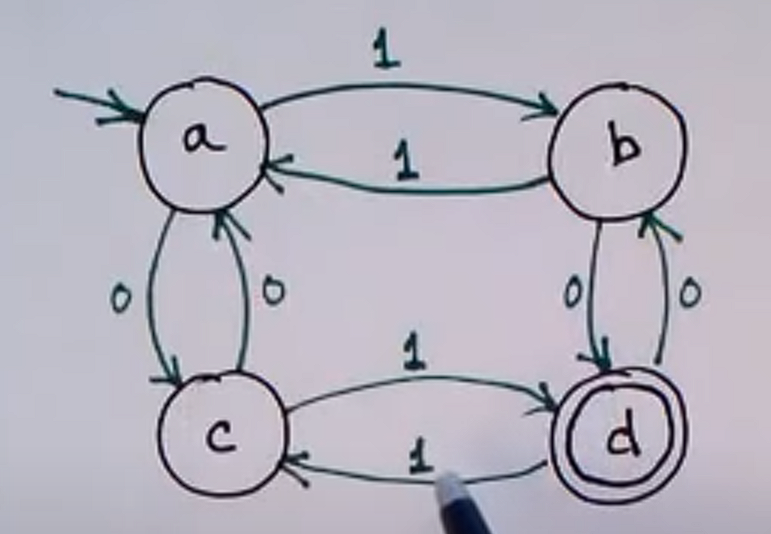
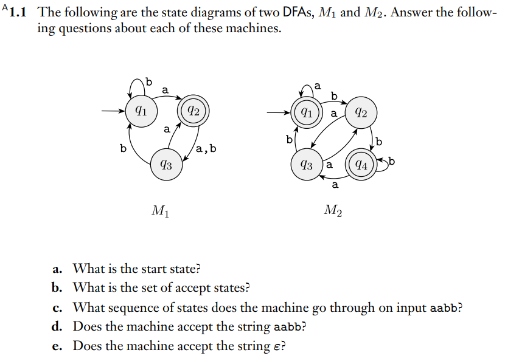
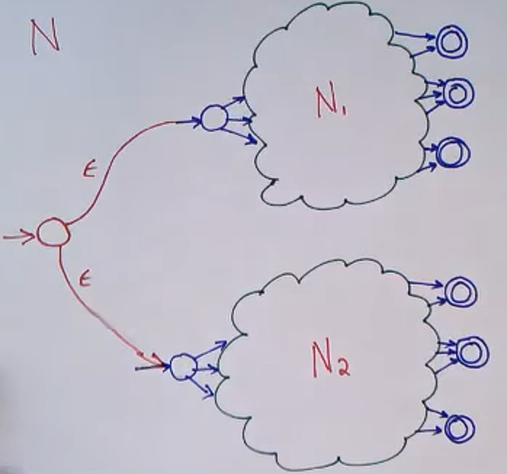
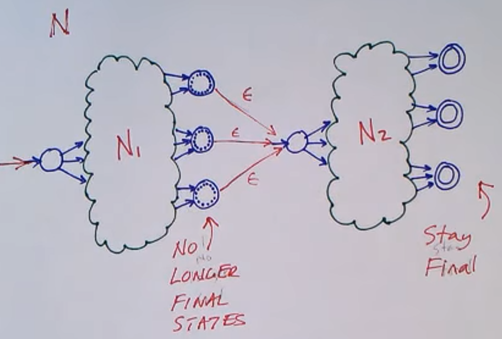
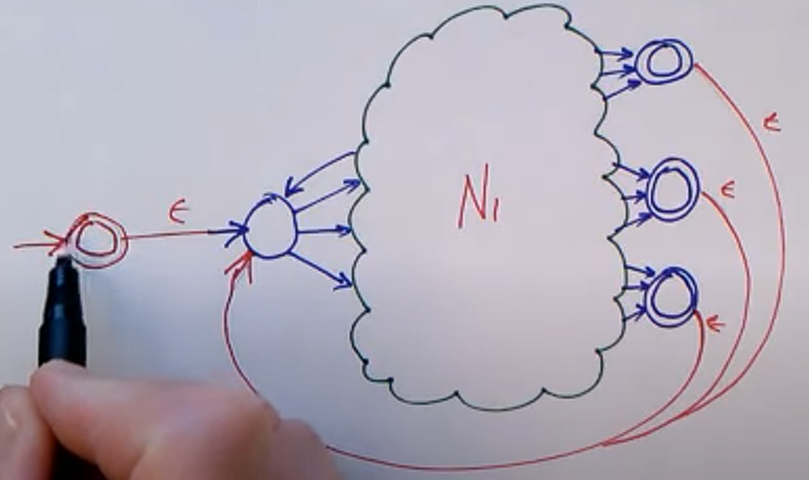

# Regular Languages

---

# 0. Languages

## Regular Operations on Languages
- UNION
  - A U B = {x | xεA OR xεB}
- CONCATENATION
  - A • B = {xy | xεA AND yεB}
- STAR
  - A* = {x1x2...xk| k>=0 AND xiεA}

## Closure Property
> The class of Regular Languages is closed under union.
>  The class of Regular Languages is closed under concatenation

i.e., if L1 and L2 are regular languages, then so is L1 U L2 and L1 • L2

# 1. DFA
Deterministic finite state machine

## Finite State Machine
a.k.a Finite Automaton, FSM

- The simplest model of computation
- Small computer or controller
  - Limited memory
  - Finite and usually quite small

Example of FSM: 

- Nodes = States (with starting and accepting, or final, states)
- Edges = Transitions (with labels)

Example questions about FSM: 

1. q1 for both M1 and M2
2. {q2}, {q1,q4}
3. M1: {q1, q2, q3, q1, q1}, M2: {q1, q1, q1, q2, q4}
4. M1: no, M2: yes
5. M1: no, M2: yes

### Usage of FSN
1. Generating Strings
    - Start at starting state
    - take transitions at random
    - finish up only in an accepting state
2. Accepting(Recognising) Strings
    - Start in starting state
    - start at first symbol in the string
    - follow transitions as determined by the symbols in the string
    - process all symbols in string
    - check if the string ends with the accepting state

## Formal Definition of DFAs
> M = (Q, Σ, δ, q0, F)

- Q = Set of states (finite number of states)
- Σ = Alphabet (finite set of symbols)
- δ = The transition function (δ = Q x Σ -> Q (given a state and a symbol, go to another state))
- q0 = The starting state (q0 ε Q)
- F = The set of accepting states (F ⊆ Q)

Let's have a look at the example from before. 
 
- Q = {a, b, c, d}
- Σ = {0, 1}
- q0 = a
- F = {d}
- δ
  - δ(a, 0) = c
  - δ(a, 1) = b
  - δ(b, 0) = d
  - δ(b, 1) = a
  - etc

Notice that the above state machine only accepts strings with odd number of both 0's and 1's.

## Designing DFAs
### Notations/Terminology
  - The language that M accepts is A
    - The language of M
    - M recognises A
    - M accepts A
  - ε = the empty string
    - accepted by FSMs that has starting state as one of its accepting states
  - ∅ = {} = the empty language
    - for FSMs that have no path between the starting state and any of the accepting states
    - if a state machine accepts no strings at all, then it accepts the empty language
    - note that ε != ∅, {ε} != ∅
  - L(M1)
    - The language that M1 recognises
    - The set of strings in Σ* that M1 accepts

### Designing a FSM that does not include string x
1. Design FSM that accepts strings that include x (call this M1)
2. Negate all the states (if it is accepting, then make it not accepting and vice versa) (call this M2)
3. Note that L(M1) and L(M2) are complements

### Dead states
- Sometimes simplified by having no edges from current state
- (In our course we always have to draw the dead state)

### Formal definition of computation
> A language is called a regular language if some finite automaton recognises it.

### Designing finite automata
- FSM that recognises strings with odd number of a certain symbol
- FSM that recognises strings with a certain substring
- read the book 1.1

## Closure properties
look at closure properties for 0. Languages

# 2. NFA
Nondeterministic finite state machine
## Non-determinism
- Determinism
  - Given the current state, we know what the next state will be.
    - Only one unique next state
    - No choices
    - No randomness (Perfect repeatability)
    - No errors or malfunctions

- Nondeterminism
  - Given the current state, there may be multiple next states.
    - The next state is chosen at random, or
    - All next states are chosen in parallel

### Non-deterministic finite state machine
We are now allowing
- Multiple edges with same labels
- Epsilon edges (optional)

**If there is any way to run the machine that ends with ACCEPT, then the NFA accepts.**

Then which one do we try?
- try them all, or
- make the "right" choice at each point (based on other information) (both are equivalent)

### Why are NFAs useful?
- Every NFA can be converted into an equivalent DFA (shown later)
  - constructing NFAs is sometimes easier than directly constructing DFAs
- Nondeterminism in finite automata is a good introduction of nondeterminism for other more powerful computational models.

## Formal Definition of NFA
- Powerset: the set of all subsets
  - P({a,b,c}) = {Ø, {a}, {b}, {c}, {a,b}, {a,c}, {b,c}, {a,b,c}}
  - size of the powerset = 2^(number of elements in the set)

> M = (Q, Σ, δ, q0, F)

- Q = states
- Σ = alphabets
- q0 = start state
- F = accept states
- δ = Transition function (δ: Q x Σε -> P(Q)) (Σε = Σ U {ε})

Note that the definition is very similar to that of DFA but with a slight difference in δ. 
NFAs consider subsets of states rather than just one state (like DFA does).

If N = number of states in NFA, the worst case number of states in the equivalent DFA is 2^N.

## Equivalence of Determinism and Nondeterminism for FSM
> Every NFA has an equivalent DFA

Proof by construction
- Let NFA M = (Q, Σ, δ, q0, F)
- Construct DFA M' = (Q', Σ, δ', q'0, F')
    - Q' = P(Q)
        - Assume M has K states. Then M' will have 2^k states.
    - q'0 = E({q0}) (see epsilon-closure below)
    - F' = {R ε Q' | R contains an accept state from M}
        - For example, if there are three states A, B, and C, and B and C are accepting states, then
        - the accepting states for M' are B, C, AB, AC, BC, and ABC
    - δ'(R a) = {q | q ε Q and q ε E(δ(r, a))} for some r ε R
        - a = input alphabet
        - R = a state in M'
        - Epsilon-closure E(R)
            - E(R) = {q ε Q | q can be reached from a state in R by following zero or more ε-edges}
              - E(R) always includes R itself.

## Closure of Regular Operations revisited
"Closure" of a language
- Take an element from a language and perform an operation.
- If the result is still in that language, then the language is closed under that operation.

### Union
> The class of regular languages is "closed" under union.

Proof:
- Assume A1 are A2 are regular languages
- Assume NFAs N1 recognises A1, and N2 recognises A2
- Combine N1 and N2 to build NFA N to recognise A1 U A2
- 
- Formally:
  - Let N1 = (Q1, Σ, δ1, q1, F1)
  - Let N2 = (Q2, Σ, δ2, q2, F2)
  - Construct N = (Q, Σ, δ, q0, F)
    - Q = Q1 U Q2 U {q0}
      - q0 is a new starting state
    - F = F1 U F2
    - δ(q,a) = 
      - δ1(q,a) if q ε Q1
      - δ2(q,a) if q ε Q2
      - {q1, q2} if q = q0 and a = ε
      - {} if q = q0 and a != ε

### Concatenation
> The class of regular languages is "closed" under concatenation.

Recall:
w ε A1•A2 if w = xy and x ε A1 and y ε A2

Proof:
- Same approach
- Assume A1 are A2 are regular languages
- Assume NFAs N1 recognises A1, and N2 recognises A2
- Combine N1 and N2 to build NFA N to recognise A1 • A2
- 
- Formally:
  - Let N1 = (Q1, Σ, δ1, q1, F1)
  - Let N2 = (Q2, Σ, δ2, q2, F2)
  - Construct N = (Q, Σ, δ, q0, F)
    - Q = Q1 U Q2
    - q0 = q1
    - F = F2
    - δ(q,a) =
      - δ1(q,a) if q ε Q1
      - δ2(q,a) if q ε Q2
      - δ1(q,a) U {q2} if q ε F1 and a = ε
      - δ1(q,a) if q ε F1 and a != ε

### Star
> The class of regular languages is "closed" under concatenation.

Proof:
- Same idea
- 
- Formally:
  - Let N1 = (Q1, Σ, δ1, q1, F1)
  - Construct N = (Q, Σ, δ, q0, F)
    - Q = Q1 U {q0}
    - q0 is a new starting state
    - F = F1 U {q0}
    - δ(q,a) =
      - δ1(q,a) if q ε Q1
      - δ1(q,a) U {q1} if q ε F1 and a = ε
      - δ1(q,a) if q ε F1 and a != ε
      - q1 if q = q0 and a = ε
      - {} if q = q0 and a != ε

# 3. Regular Expressions
> Recursive definition of Regular Expression follows:
> - a is a regex (where a ε Σ)
> - R1 U R2 is a regex (where R1 and R2 are regex's) (Equivalent: R1|R2)
> - R1 • R2 is a regex (Equivalent: R1R2)
> - R1* is a regex
> - ε is a regex
> - Ø is a regex
> - (R1) is a regex

Some rules:
- Star binds tightest
  - ab* = a(b*) != (ab)*
- Concatenation binds tighter than union
  - abUc = (ab) U c != a(b U C)
- Brackets and Unions
  - ab|c = (ab)|c != a(b|c)
- Star(closure)
  - a* = {a} = {a}*
- One or more
  - a+ = aa* = {a}+
- Optional
  - [a] = a|ε = (a U ε) = a?

## Formal definition
Regular expressions describe regular languages:
- L(a) = {a}
- L(R1|R2) = L(R1) U L(R2)
- L(R1R2) = L(R1) • L(R2)
- L(R1*) = L(R1)*
- L(ε) = {ε}
- L(Ø) = {}
- L((R1)) = L(R1)

## GNFA
Generalised nondeterministic finite automata

GNFA is like an NFA, except:
- edges are labeled with regex's
- only one accept state
- there is exactly one edge from every state to every other state (including an edge to itself)
  - no edges going to the start state
  - no edges out of the accept state

We use GNFA to prove the following:
> Regular languages = Regular Expression  
> A language is regular iff some regular expression describes it.

We are going to prove this in two ways, using lemma 1 and 2.

### Lemma 1
> If a language is described by a regular expression, then it is regular

All regular expressions have smaller regular expressions that builds it
- Proof 1: use the closure of union, concatenation, and star
- Proof 2: from a regular expression, build an NFA to recognise it

If we have an NFA that represents the regex, then we know that the language described by the regex is regular.

### Lemma 2
> If a language is regular, then it can be described by a regular expression

Proof approach:
1. Start with a DFA that recognises it
2. Build a GNFA (generalised NFA)
3. Reduce it
4. This yields a regular expression

1. Start with building DFA
2. Convert from DFA to GNFA
   1. Add a start state
      - Connect it to the old starting state with epsilon edge
   2. Add a new accept state
      - Connect all the old accepting states to this state with epsilon edges
   3. Eliminate multiple edges with union
      - a,b,c -> a|b|c
   4. Add missing edges (with Ø) for full connectivity
3. Reduce it
   1. Choose a state
   2. Remove it
      - Remove the state
      - Remove all edges from it
      - Remove all edges to it
   3. Modify the machine so it still accepts the same language
      - Do the following for all the remaining edges
      - Consider:
        - qi and qj, which are just some arbitrary states
        - qr, which is the state that is being removed
        - δ(qi, R1) = qr
        - δ(qr, R2) = qr
        - δ(qr, R3) = qj
        - δ(qi, R4) = qj
      - Now the edge from qi to qj has label: R4|R1R2\*R3; i.e. δ(qi, R4|R1R2\*R3) = qj
      - Some simplifications:
        - εR = Rε = R
        - ØR = RØ = Ø
        - Ø|R = R
4. Repeat until there are only 2 states left
5. We have now converted our DFA into an equivalent regex

# 4. Irregularity
## Pumping Lemma
Proving that a language is not regular

### 1. Cycles in FSM
Consider an FSM that generates a long string. 
This FSM has 5 states. 
We can create long strings by taking cycles. 
The maximum length of the string that can be created without taking any cycles is 4. 
This also means that any string that has length longer than 4 has to take a cycle.

Now comes the key idea:
- If you can go around a cycle once, then you can go around it multiple times.
- **A string created by taking a cycle must also be in that language.**
- You can also skip the cycle, and that string must also be in that language.

Let's consider an FSM which contains a cycle. We define:
- X as the set of symbols encountered before the cycle
- Y as the set of cycling symbols
- Z as the set of symbols after.
- String s = XYZ.

We can say that all strings of form s = X Y^i Z are in a language A, for i >= 0.

### 2. Pumping Length
If A is a regular language, and it contains a string s which is sufficiently long, 
then s can be divided up to three parts X, Y, and Z, such that 
X Y^i Z is in the language for i >= 0, and that |y| > 0, and that |xy| <= P (see below).

But how do we define "sufficiently long"? 
Specify the PUMPING LENGTH P: |s| >= P.  
P depends on the language; it is the length that is long enough for the FSM to have a cycle. 

Some notes on the pumping length:
- Every regular language has P.
- P depends on the language, not of any specific FSM.

### 3. Pumping Lemma
> If A is a regular language then A has a pumping length P 
> such that any string s may be divided into 3 pieces s = XYZ 
> such that all these conditions hold:
> - XY^iZ ε A for every i >= 0
> - |y| > 0
> - |xy| <= P

## Proving Irregularity
Use the pumping lemma to prove a language A is not regular

Proof by contradiction:
1. Assume A is regular
2. A has a pumping length P
3. Find a string s in A such that |s| >= P
4. Divide s into XYZ (consider all cases of division)
5. Show that XY^iZ is not in A for some i
6. Show that none of these can satisfy all the pumping conditions
7. s cannot be pumped => contradiction, QED.

### Example 1:
Let B = {0^n 1^n | n>=0}. Prove B is not regular.

1. Assume B is regular
2. B has a pumping length P
3. Let s = 0^P 1^P
4. Divide s into XYZ and consider all the ways:
   1. Y in the zeros part (0^5 1^5 = 00[00]011111)
      - So XY^iZ must be in B
      - XY^2Z = 00\[00\][00]011111)
      - This will not be in B, because number of zeros != number of ones
   2. Y in the ones part (0^5 1^5 = 000001[11]11)
      - Likewise, this will not be in B
      - Also, this case does not satisfy |XY| <= P.
   3. y has zeros and ones (0^5 1^5 = 0000[01]1111)
      - XY^2Z = 0000\[01\][01]1111
      - This will not be in B, because it is not in the form O^n 1^n.
      - Also, this case does not satisfy |XY| <= P.
5. s is not pumpable for all cases, and this creates contradiction with the fact that B is regular. Therefore B is irregular (QED)

### Example 2:
Let F = {ww | w ε {0,1}*}. Prove F is not regular

1. Assume F is regular
2. F has pumping length P
3. Let s = 0^P 1 O^P 1
4. Divide s
   - Because |y| > 0 and |xy| <= P, y must be in the first O^P parts
   - However, this is not in F because the second w does not equal the first w.
5. s is not pumpable(for all cases) and this creates contradiction......