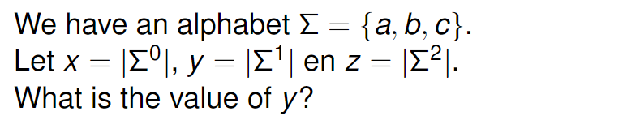
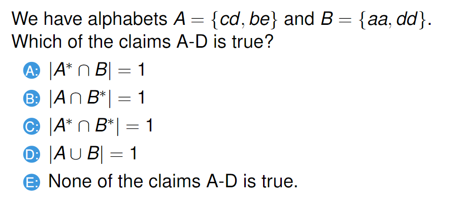
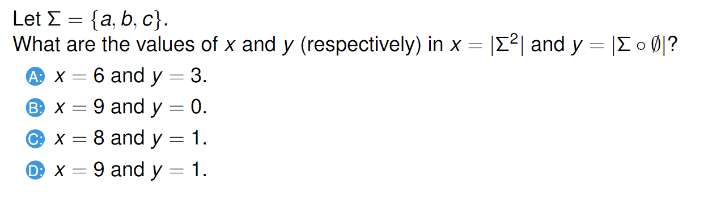
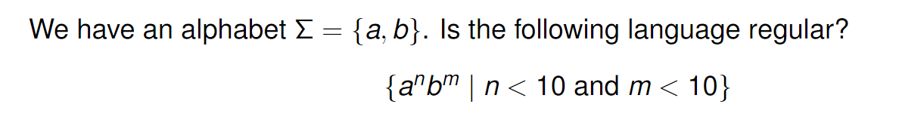
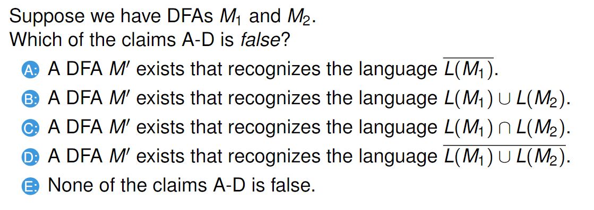
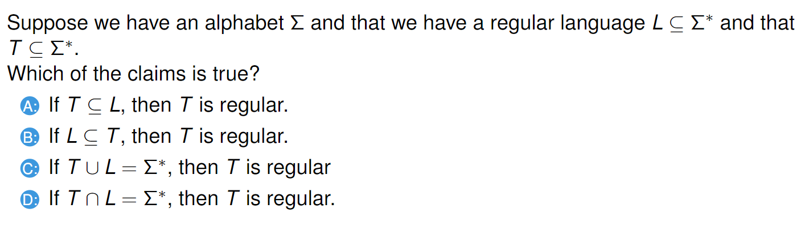

# 230214_ 

---

## 1. Alphabets and Languages
### Alphabets(2)

Σ superscript n denotes the set of alphabets constructed with n symbols.
- x = 1
- y = 3
- z = 9

### Alphabets (4)

Σ* always includes the empty string ε.
- Answer: C

### Exam 2012 MCQ 1

Anything concatenated by the empty set results in the empty set.
- x = 9
- y = 0

### Languages (2)

w^R means any rearrangement of the alphabets in w.
- A = false because cabca is in L
- B = true because bcab is in L and therefore not in L-
- C = false because acac has prefix a
- D = false because cabcabca is in L

## 2. DFA
## 3. Regular Languages
### Regular languages (2)

A finite language is always regular, i.e. there will be a DFA that recognises it.

### Regular languages (3)

We can have a DFA that accepts a language with infinite number of known alphabet.

### Complementary properties - language theorem (2)

Regular languages are closed under complement, union, and intersection.
- Answer: E

### Exam 2012 MCQ 6

If Σ is regular, then Σ* is also regular. 
If T intersection L = Σ*, then T = L = Σ* because T and L are proper subsets.
- Answer: D