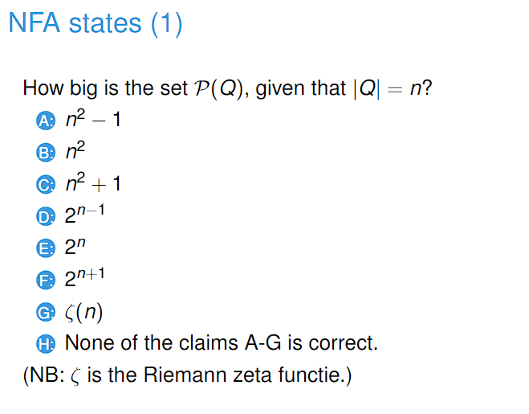
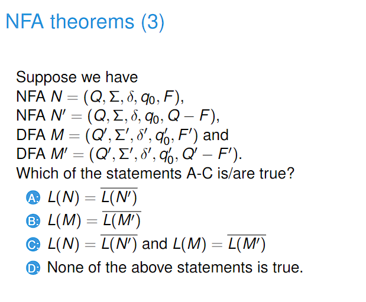

# 230220_ NFA

---

# 1. Revision

# 2. NFA

- Answer: E

# 3. Properties of NFA

- Answer: B
- If we change all accepting states to rejecting states and vice versa for DFA, it becomes the complement.
- For NFA, this is not true.
  - Consider a string. This string can exist in two states, one accepting and one rejecting.
  - This means that this string is accepted by this NFA.
  - If we flip all the accepting and rejecting states, this string would still be accepted.

# 4. Regular Expressions