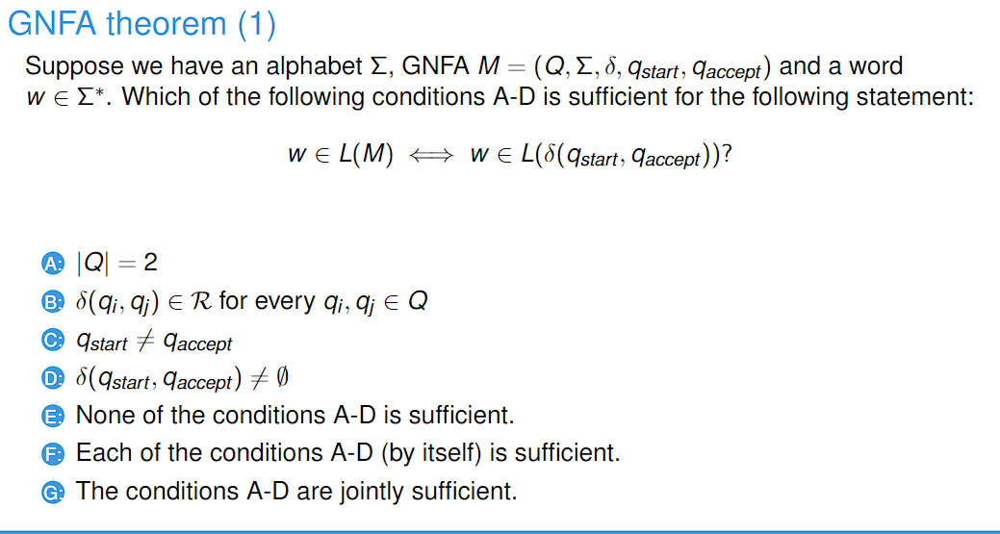
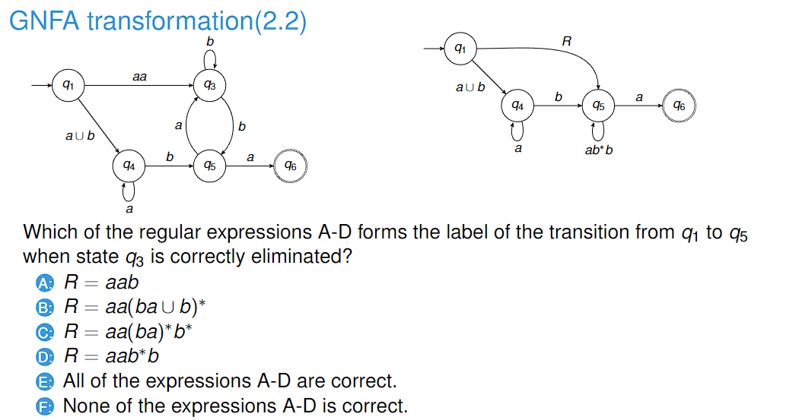
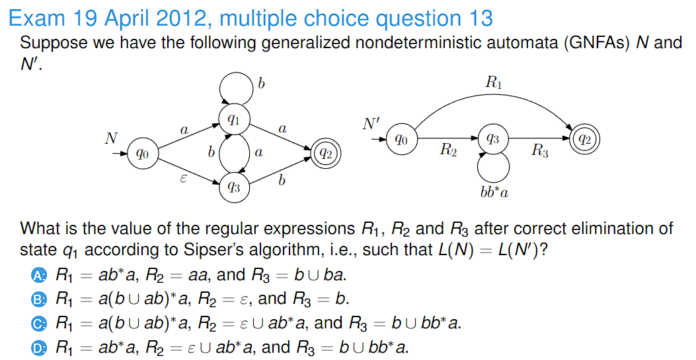
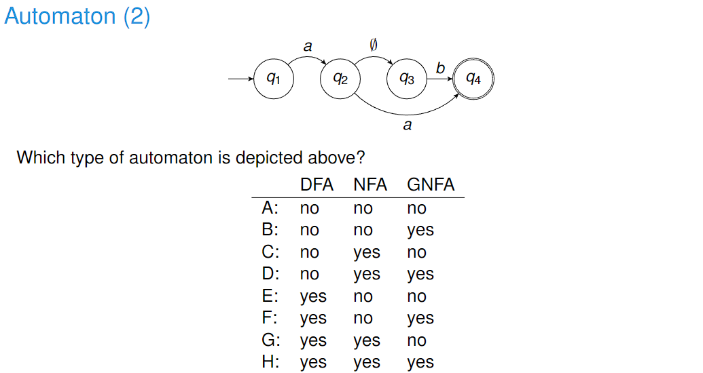
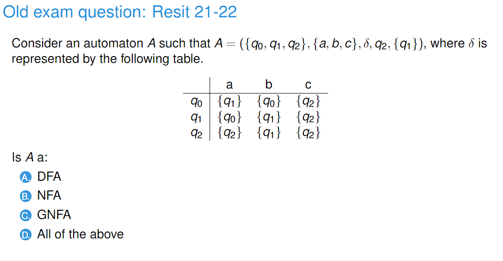
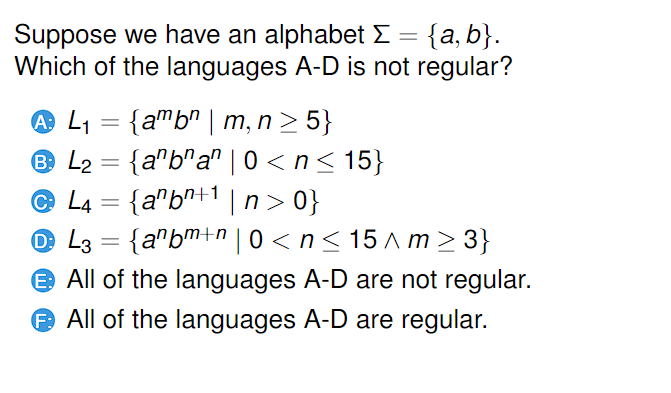

# 230222_ Regex and GNFA

---

## 0. Overview
- Regex
- GNFA transformations
- Recognising automata
- Not regular languages

## 1. Regular expressions
## 2. GNFA transformations
### GNFA theorem (1)

- Answer: A

### GNFA transformation (2.2)

- Answer: D

### Exam 2012 MCQ 13

- Answer: D

## 3. Recognising automata
### Automaton (2)

In DFA, NFA, or GNFA, all states need to have a path that connects from the starting state to itself.
- Answer: A

### Resit 21-22

The result of the transition cannot be a set of states in DFA and NFA.
- Answer: B

## 4. Not regular languages
### Nonregular languages(1)

- Answer: C
- A does not have to remember what m or n was, it just needs to know if they are larger than 5
- B is the same
- C has to remember what n was in order to check if b occurs n+1 times.
- D also does not have to remember because m can be any number larger than 3.