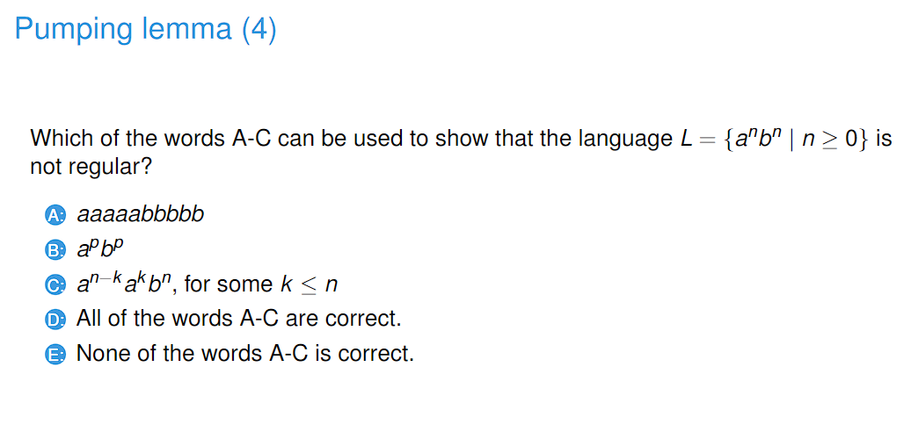

# 230227_ Nonregular languages

---

# 1. Non-regular languages

- Answer: B
- For A there are only finite number of options possible
- For B there are infinitely many number of options and we have to remember n_a, which the FSM cannot do.
- For C there are only finite number of options possible
- For D is also the same

- Answer: B

# 2. Pumping Lemma

- Answer: E
- In pumping lemma, we assume that a language L is regular. Regular languages should be "pumpable".
- If L cannot be pumped, the L is not a regular language.
- Therefore, we show that if the pumping lemma does not hold then L is not a regular language

- Answer: B
- In order to use the pumping lemma, we have to use a word that is longer than the pumping length p.

- Answer: B

