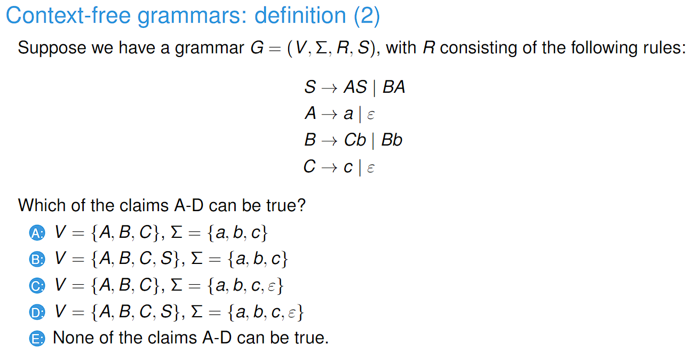
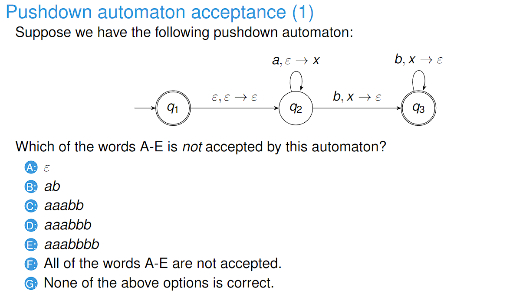
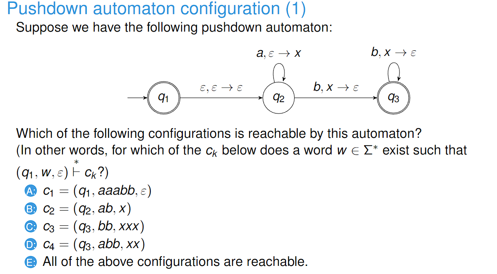
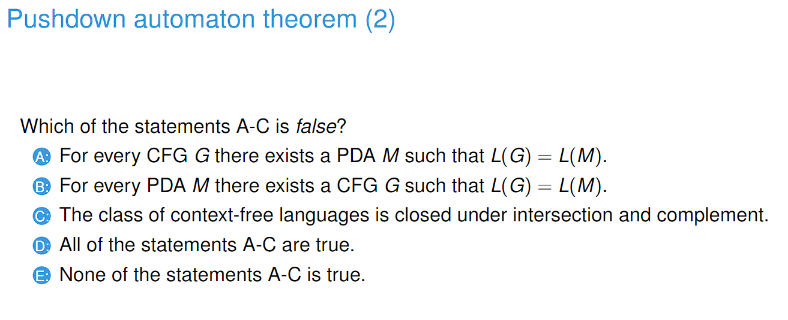

## 230301_ CFG and PDA

---

# CFG

- The empty string cannot be in the alphabets of a CFG.
- Answer: B

# Derivations

# PDA

- Answer: E
- For the last b, we have b, ε which we don't have any edge for it. Therefore, it is rejected.

- Answer: E
- For a configuration (qi, s, w), qi means the current state, s is the input string that is left to be processed, and w is the current stack.

- Answer: C
- CFG is closed under concatenation and union, but not under intersection and complement.
