# 230306_ Turing Machines

---

# Turing Machine Definition
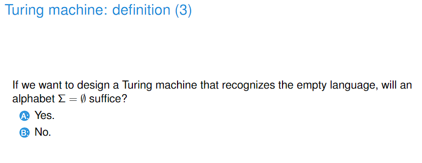

- Answer: Yes
- We do not need ε in the input alphabet

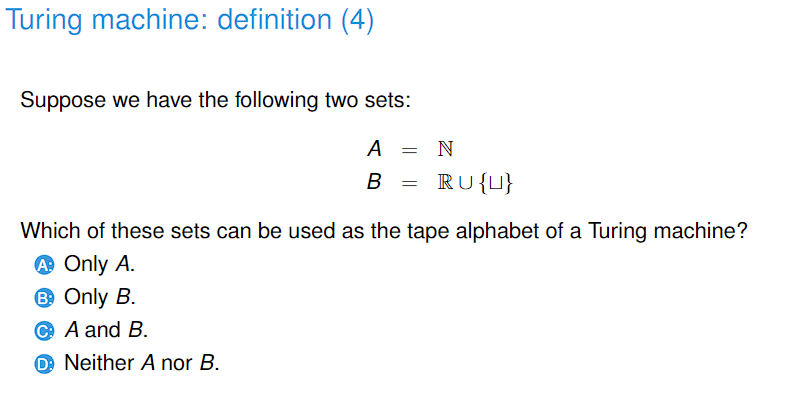

- Answer: D
- The size of the tape alphabet cannot be infinite

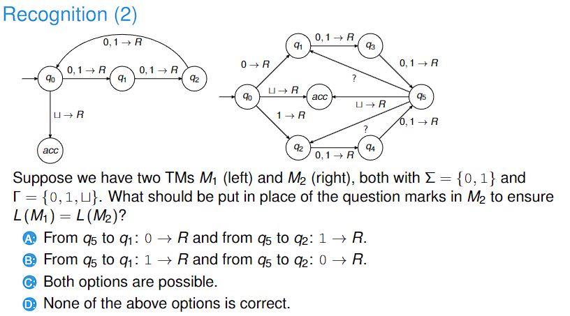

- Answer: C
- Note that x -> y, R means read and pop x, and push y, and move to R
- and x, y -> R means read x OR y and do nothing, and move to R

# Recognising Languages
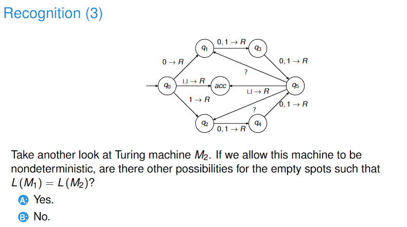

- Answer: Yes
- The main difference between Deterministic TM and Non-deterministic TM is that for a same tape alphabet in a single state, we can have multiple options.
- So for this example, we can have 0,1 -> R for both edges (this is nondeterministic because at q5 with alphabet 0/1, we have two options).

# Recognising and deciding
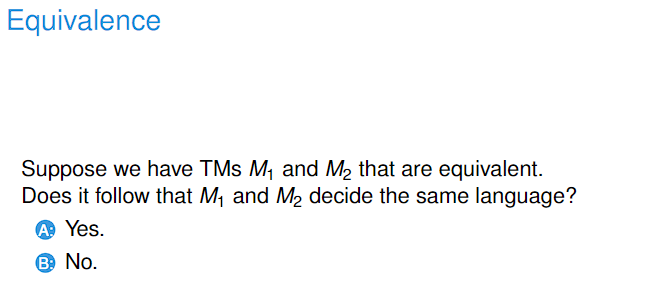

- Answer: No
- Equivalence means recognising the same language, not deciding the same language

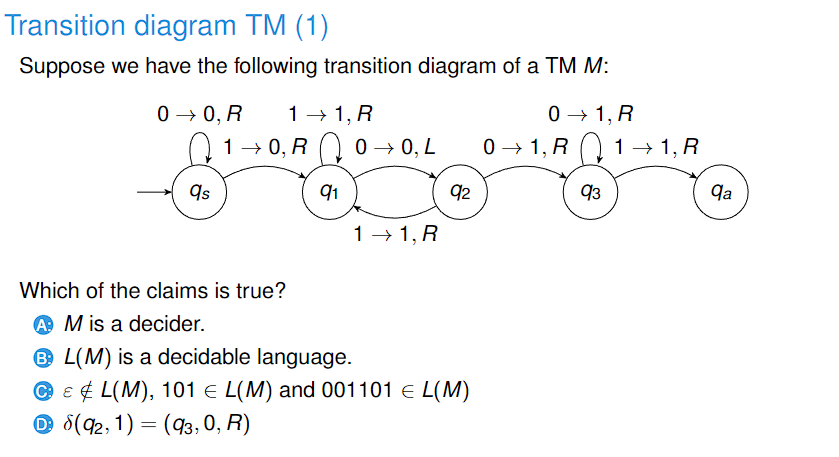

- Answer: B
- Decider means that the TM halts on all inputs

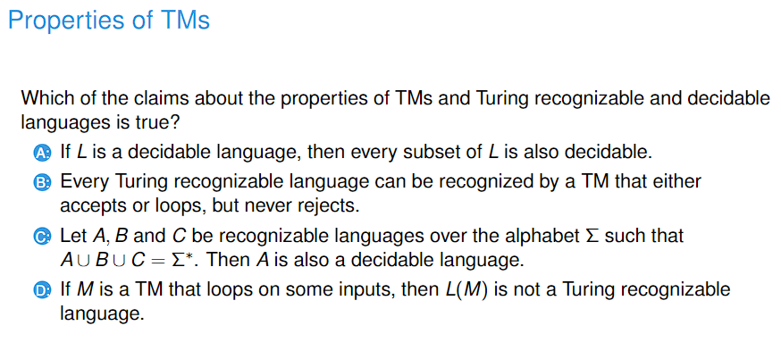

- Answer: B
- A: false because we have to create new rules for the subset of the language, and this might not be always possible.
- B: true because for a TM M, we can create M' that accepts every input that M accepts and loops on every input that M rejects or loops.
- C: A can loop on some inputs, so A can be recognisable but not decidable.
- D: L(M) is recognisable because it literally means the language that TM M recognises.

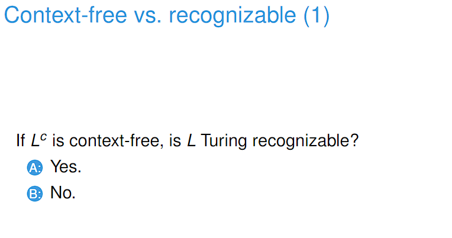

- Answer: Yes
- If L^c is context free, then L^c is decidable
- Decidable languages are closed under complement, so L is decidable
- All decidable languages are recognisable

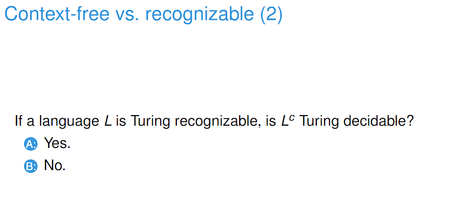

- Answer: No
- The complement of a recognisable language is the rejecting or looping strings
- Looping strings are not decidable

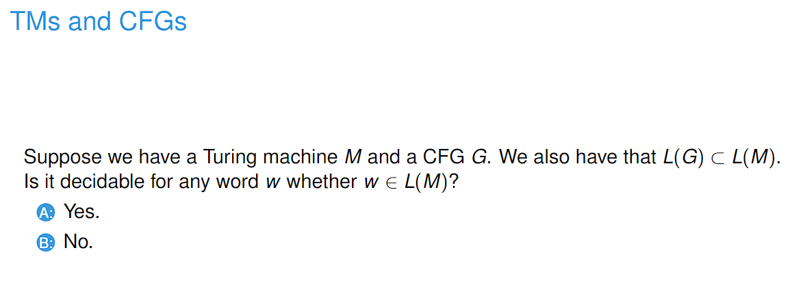

- Answer: No
- A CFG can be an infinite set
- Checking the membership of an infinite set can never be decidable.

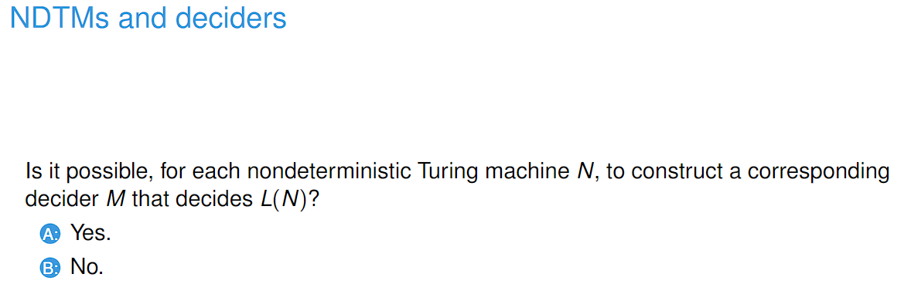

- Answer: No
- Consider a TM A that recognises all finite strings. To decide L(A), we need to check if the string is finite. If it is, then accept, and if it isn't reject.
- But how can we decide if a string is infinite? We can't because it will go on forever. So it is never decided.

