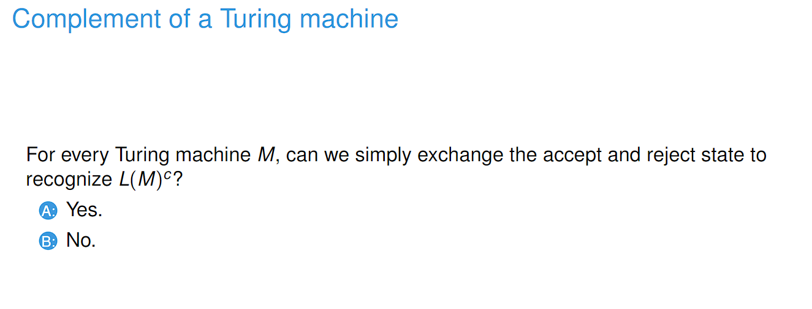
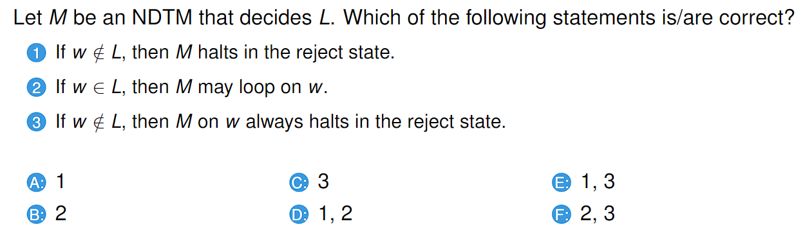
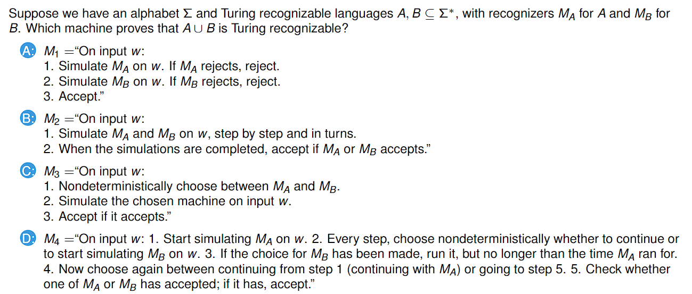

# 230308_ Variants of Turing Machines

---

# Recognising and deciding

- Answer: No
- TM has three states: accept, reject, and loop.
- Looping = rejection

# Multi-tape TMs

# Nondeterministic TMs

- Answer: 1,3
- An NDTM M accepts if some branch halts on accept
- M rejects if all branches halt on reject
- If no branches give accept and some branch never halts, then the machine loops
- In the question, M is a decider and therefore always halts.

# Exam questions

- Answer: C
- A is not true because if either one accepts, we accept.
- B is not true because we don't have to wait until the simulations are finished
- C means run both concurrently (nondeterministic)
- D is not true

# Higher-level Turing Machines

