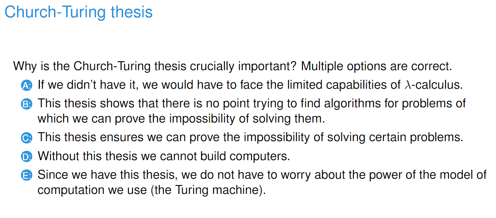
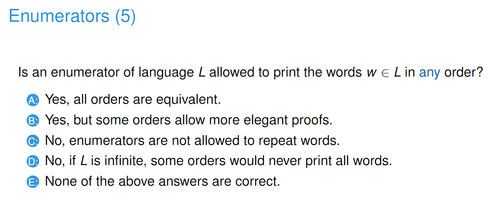
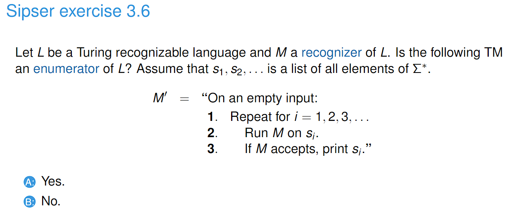
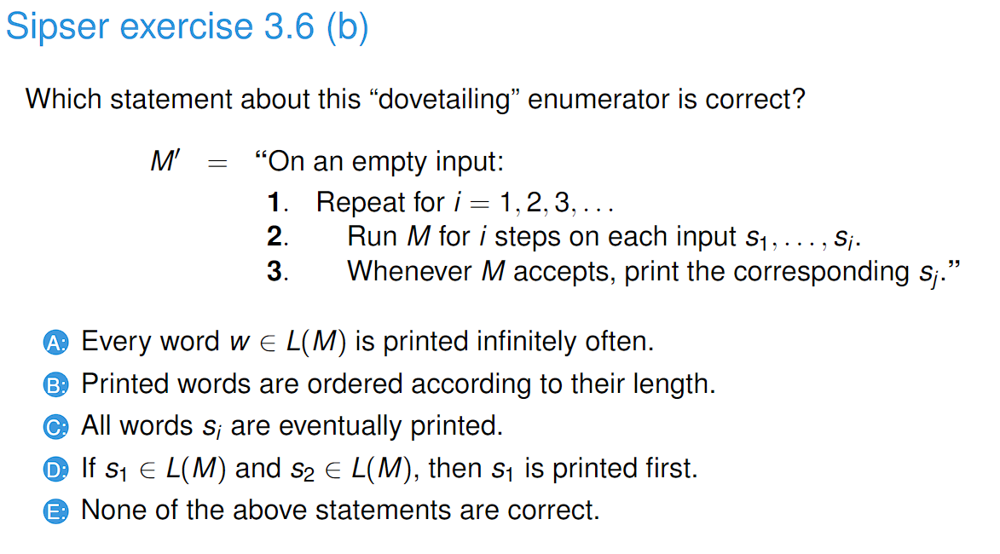
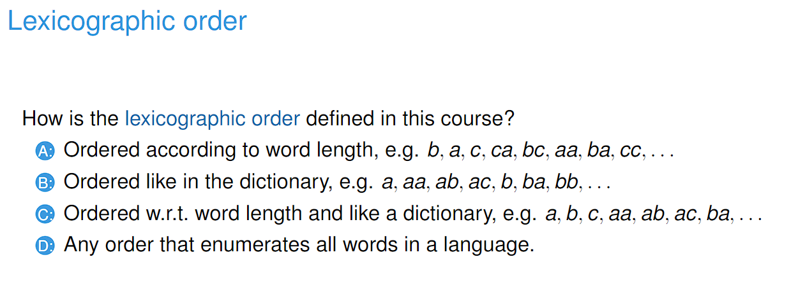
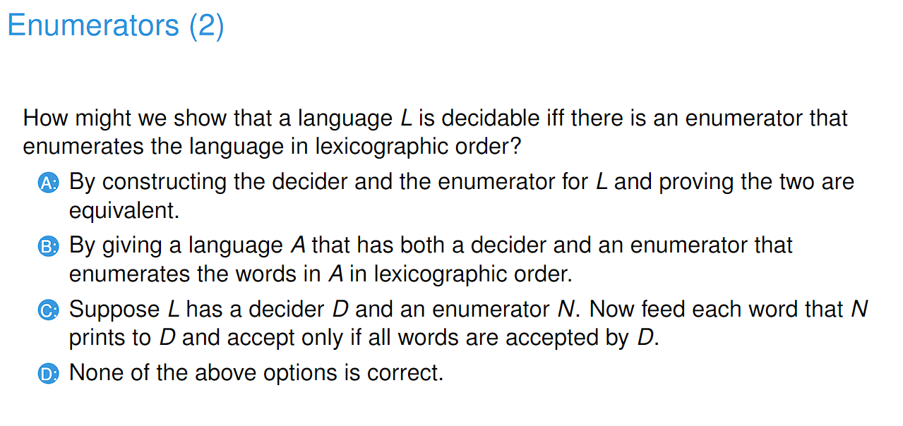
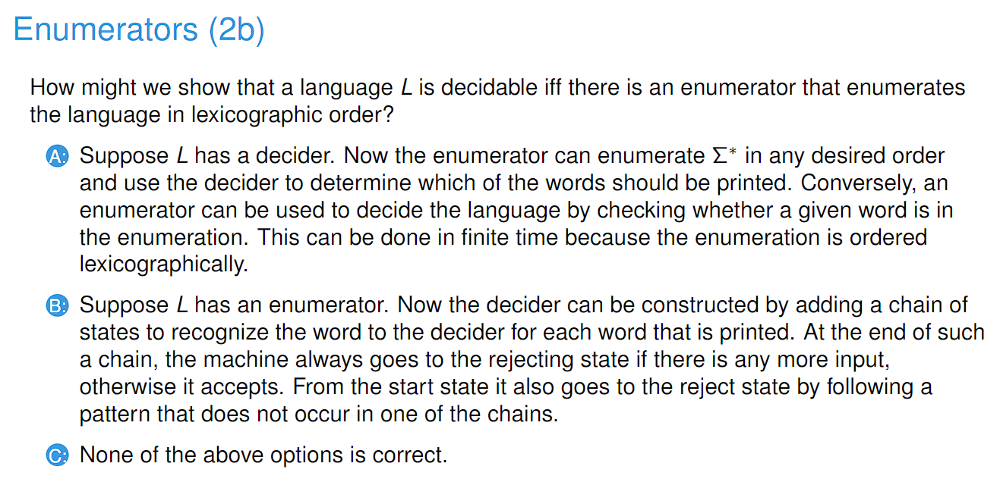
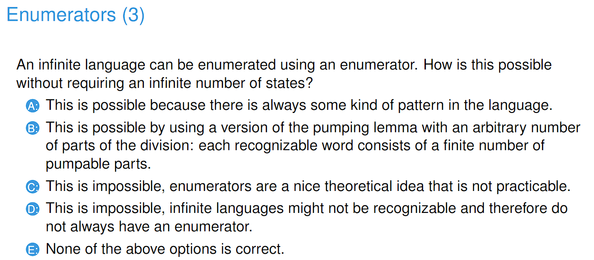

# 2303013_ Enumerator and Decidable Languages

---

# Enumerators

- Answer: B, C, E
- The Church-Turing Thesis states that any algorithm or function that can be computed by any means can be computed by some Turing Machine

- Answer: D
- For example, the interval [0,1] for rational numbers contains infinitely many numbers 0 <= x <= 1, where x is a rational number.
- Ordering them from 0 to 1 would never reach 1.

- Answer: B
- change:
  - \2. Run M on si for i steps
  - \3. Whenever M accepts, print the corresponding sj

- Answer: A
- A is correct because once a word is accepted, it is always printed whenever it is evaluated.
- B is not correct because longer words might be accepted before shorter words
- C is not correct because some words might loop
- D is not correct because s2 might be accepted before s1

- Answer: C
- If B was correct, we could go on forever for a, aa, aaa, aaaa, ... and never reach ab

- Answer: D
- See the question below

- Answer: A

- Answer: A

# Encoding problem

# Decidable languages

