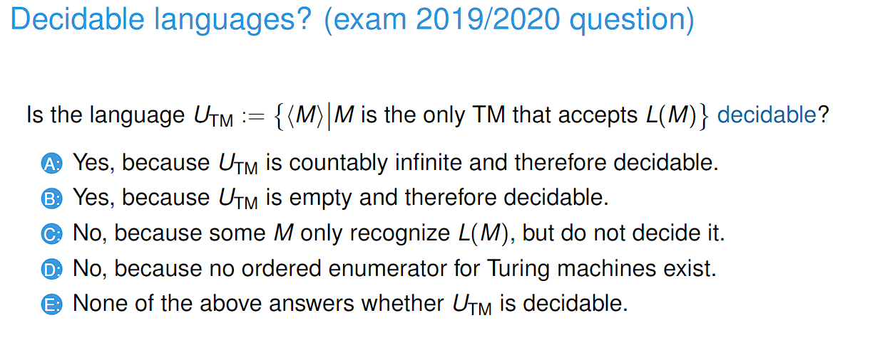

# 230315_ Decidability

---

# Decidable languages

- Answer: C
- A is not true because E_CFG is the empty set
- B is not true because the equivalence problem is undecidable for CFGs
- C is true because bbbb is accepted by D1
- D is not true because A_CFG takes in <G,w> where G is a CFG and w is a word
- E is not true because G is not a DFA

# Proving decidability

- Answer: B
- U_TM is empty; there is no Turing machine that accepts a language that is only accepted by itself
- Consider a TM A which accepts on all inputs. This means that the language that is recognised by all other TMs are recognised by A.
- Therefore we know that U_TM is empty. Since this is empty, we can create a TM that always rejects; hence being decidable.