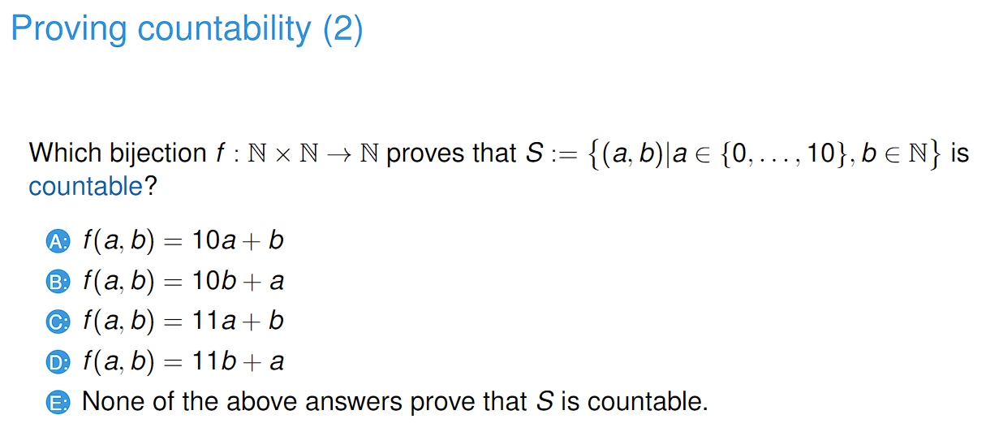
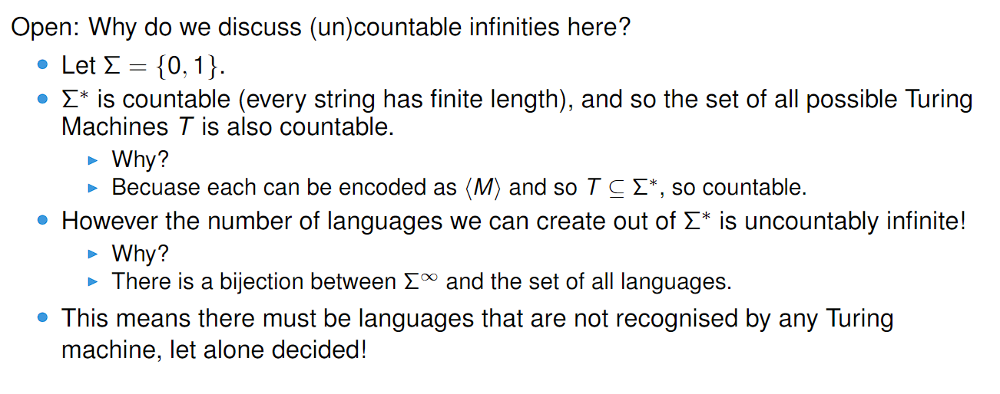
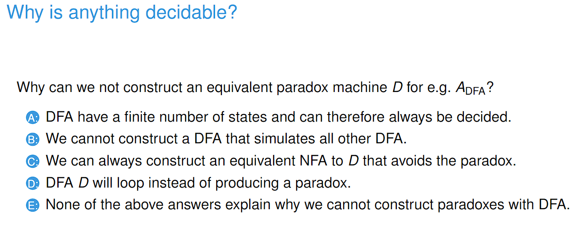
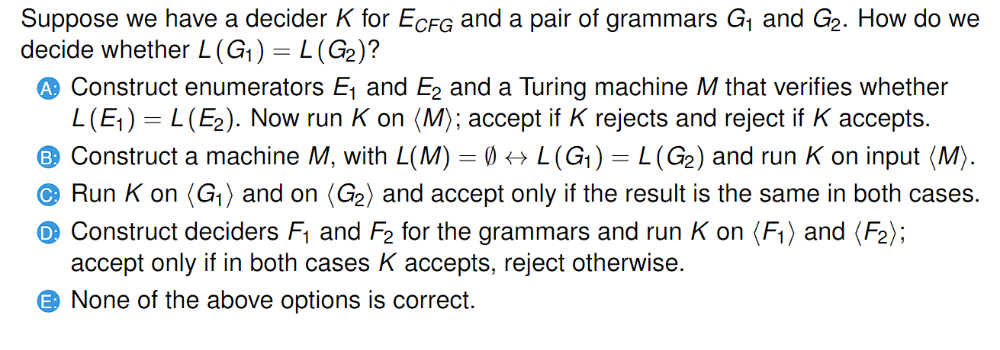
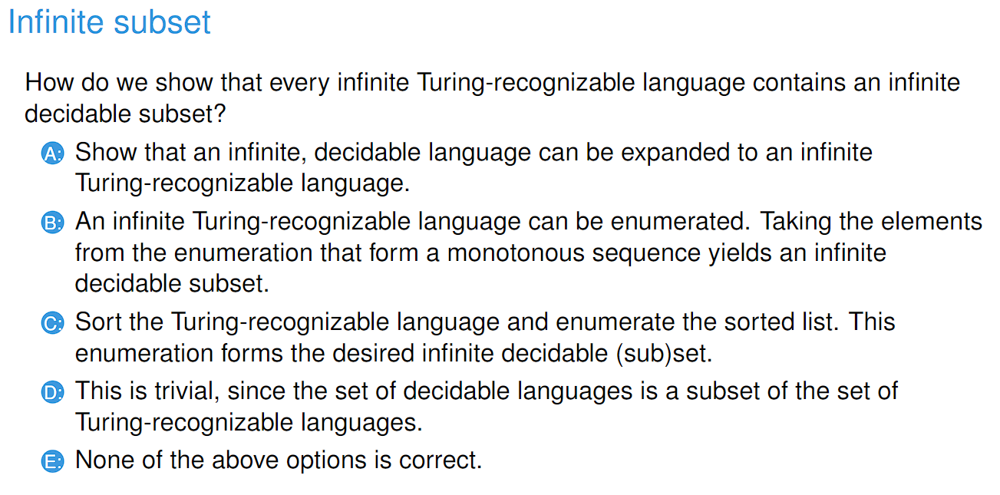

# 230320_ Countability and Undecidability

---

# Countability

- Answer: D
- Since a is only bound between 0 and 10, it can go on the ones
- Now we are only left with options B and D. Take B. (10, 0) and (0, 1) yield the same answer.
- However, for D, no pairs have the same answer, making it surjective and thus bijective

# Undecidability

- Answer: B
- When proving A_DFA is decidable, we simulate the DFA on input w in a Turing Machine.
- Because TM has greater computation power than DFA, this is possible.

- Answer: D
- The Emptiness problem for CFG is decidable, but the Equivalence problem isn't.

- Answer: B
- 