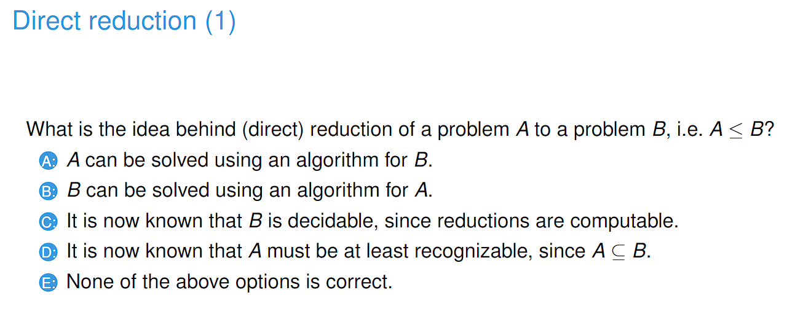
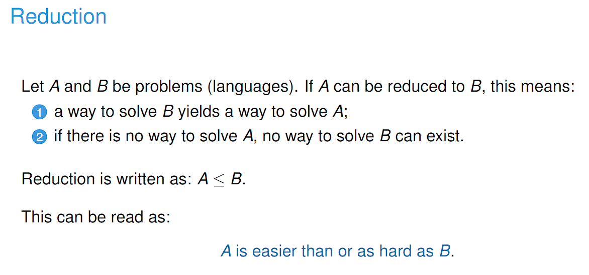
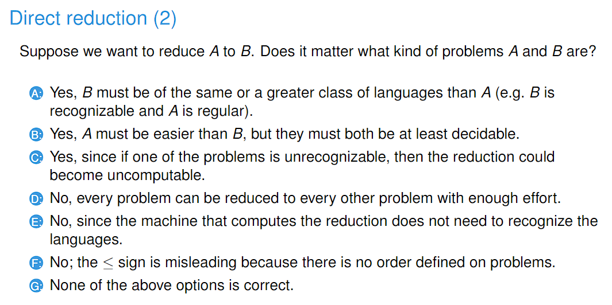

# 230322_ Reductions

---

# Direct reductions

- Answer: A
- If A is directly reducible to B, then it means that we can use the algorithm to solve B to solve A.
- 

- Answer: G
- A is not correct because the class of languages does not decide the hardness of a problem
- B is not correct because decidability does not matter for reducibility
- C is not correct because uncomputability does not have any correspondence with unrecognisability
- D is not true because in order to reduce A to B it has to hold that x ε A iff f(x) ε B
- E is not true because although it is true that the reduction algorithm does not have to recognise the problems, the answer is Yes.
- F is not true because <= means A is easier or as hard as B

# Mapping Reductions