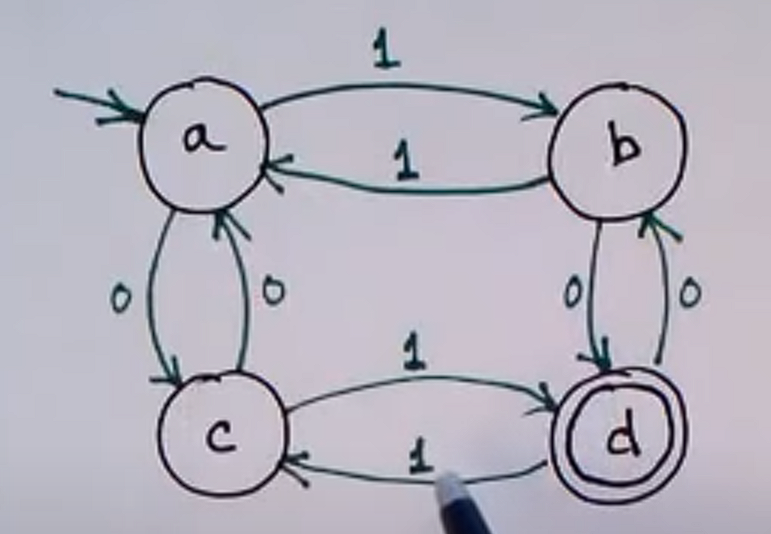
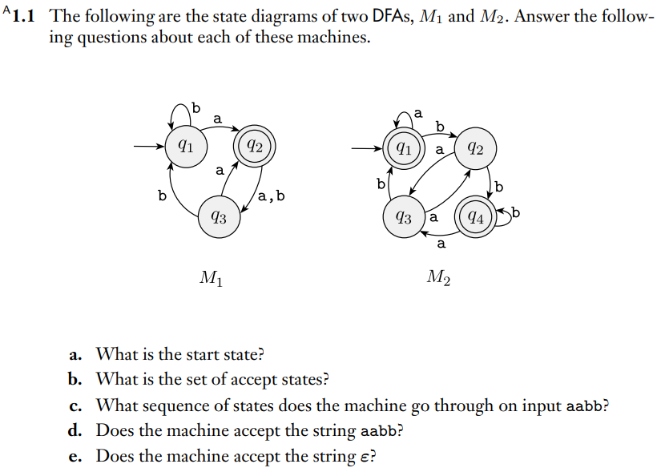
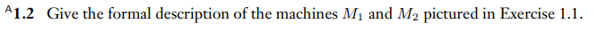
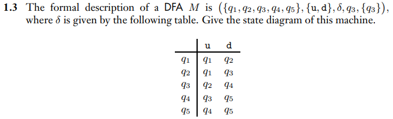
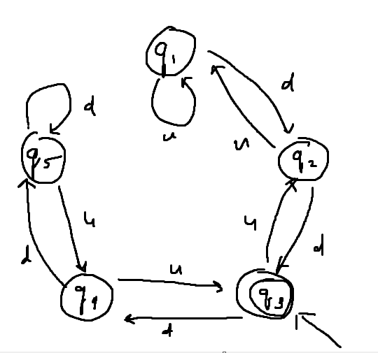

# Regular Languages

---

# 0. Languages

## Regular Operations on Languages
- UNION
  - A U B = {x | xεA OR xεB}
- CONCATENATION
  - A • B = {xy | xεA AND yεB}
- STAR
  - A* = {x1x2...xk| k>=0 AND xiεA}

## Closure Property
> The class of Regular Languages is closed under union.
>  The class of Regular Languages is closed under concatenation

i.e., if L1 and L2 are regular languages, then so is L1 U L2 and L1 • L2

# 1. DFA

## Finite State Machine
a.k.a Finite Automaton, FSM

- The simplest model of computation
- Small computer or controller
  - Limited memory
  - Finite and usually quite small

Example of FSM: 

- Nodes = States (with starting and accepting, or final, states)
- Edges = Transitions (with labels)

Example questions about FSM: 

1. q1 for both M1 and M2
2. {q2}, {q1,q4}
3. M1: {q1, q2, q3, q1, q1}, M2: {q1, q1, q1, q2, q4}
4. M1: no, M2: yes
5. M1: no, M2: yes

### Usage of FSN
1. Generating Strings
    - Start at starting state
    - take transitions at random
    - finish up only in an accepting state
2. Accepting(Recognising) Strings
    - Start in starting state
    - start at first symbol in the string
    - follow transitions as determined by the symbols in the string
    - process all symbols in string
    - check if the string ends with the accepting state

## Formal Definition of DFAs
> M = (Q, Σ, δ, q0, F)

- Q = Set of states (finite number of states)
- Σ = Alphabet (finite set of symbols)
- δ = The transition function (δ = Q x Σ -> Q (given a state and a symbol, go to another state))
- q0 = The starting state (q0 ε Q)
- F = The set of accepting states (F ⊆ Q)

Let's have a look at the example from before. 
 
- Q = {a, b, c, d}
- Σ = {0, 1}
- q0 = a
- F = {d}
- δ
  - δ(a, 0) = c
  - δ(a, 1) = b
  - δ(b, 0) = d
  - δ(b, 1) = a
  - etc

Notice that the above state machine only accepts strings with odd number of both 0's and 1's.

 
- M1: ({q1, q2, q3}, {a, b}, δ(skipped), q1, {q2})
- M2: ({q1, q2, q3, q4}, {a, b}, δ(skipped), q1, {q1, q4})

 
 

## Designing DFAs
### Notations/Terminology
  - The language that M accepts is A
    - The language of M
    - M recognises A
    - M accepts A
  - ε = the empty string
    - accepted by FSMs that has starting state as one of its accepting states
  - ∅ = {} = the empty language
    - for FSMs that have no path between the starting state and any of the accepting states
    - if a state machine accepts no strings at all, then it accepts the empty language
    - note that ε != ∅, {ε} != ∅
  - L(M1)
    - The language that M1 recognises
    - The set of strings in Σ* that M1 accepts

### Designing a FSM that does not include string x
1. Design FSM that accepts strings that include x (call this M1)
2. Negate all the states (if it is accepting, then make it not accepting and vice versa) (call this M2)
3. Note that L(M1) and L(M2) are complements

### Dead states
- Sometimes simplified by having no edges from current state
- (In our course we always have to draw the dead state)

### Formal definition of computation
> A language is called a regular language if some finite automaton recognises it.

### Designing finite automata
- FSM that recognises strings with odd number of a certain symbol
- FSM that recognises strings with a certain substring
- read the book 1.1

## Closure properties
look at closure properties for 0. Languages

