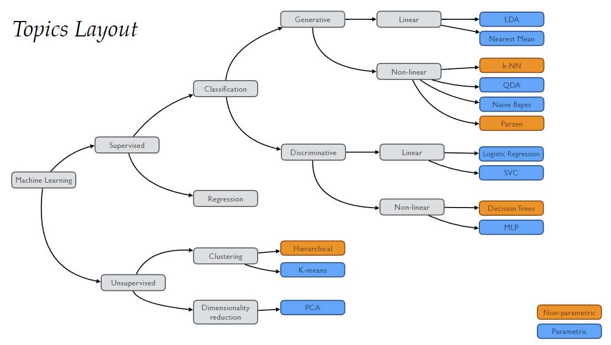
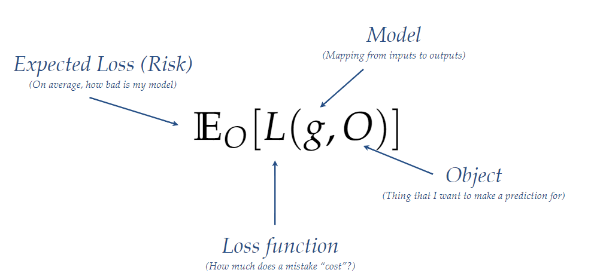

# Introduction to Machine Learning

---
## 1. What is Machine Learning?
> Machine learning tries to identify regularities in the world, by **learning** from examples ("data").<br>
> These regularities should **generalise**: work beyond the specific examples the model has seen before.

### Two types of machine learning
- Supervised learning: the dataset has labels
- Unsupervised learning: the system itself learns features about the data by itself

### Methods of machine learning


## 2. The Machine Learning Pipeline
### The Goal of Machine Learning

We want to create a model(g) that takes in an input and creates an output. We then calculate the loss of the model by using the loss function L with the original object O. <br>
Then we take the average risk; the expected loss to evaluate how well our model performs.

### Machine Learining Pipeline
```
    ------------------->------------------- Label (done manually (in supervised learning)) --------------->---------------
    |                                                                                                                   |
---------                            ------------------                --------------                     -----------------------
| Object |  --  Representation  -->  | Feature values |  -- Model -->  | Prediction |  -- Evaluation -->  | Performance measure |
---------                            ------------------      |         --------------                     -----------------------
                                                             |                                                         |   
                                                             --------------<------------ Learning -----------<----------
```
1. Representation
   - We represent an object using a set of features.
   - These features are stored together in a vector.
   - We call this vector space the feature space.
   - Choosing informative features makes it easy to discriminate between two classes.
<br><br>
2. Model
    - Model is a function that assigns an output to every location in the input space.
      <br><br>
3. Evaluation
   - Measure the performance: how well does the mapping solve the task?
   - Measure this using a "loss function"
     - There are many ways to describe the loss: use the one specific to the problem we are trying to solve.
   - We can split the dataset to see how well our model performs for unseen data:
     - We assume the data is sampled independently and identically distributed from an underlying problem distribution
     - We train the model on the training set
     - We test the model on the test set and evaluate its performance.
     <br><br>
4. Learning
   - Learning is (for most approaches) find parameters w for a function g(w) that maximise the performance.
   - The problem is that we do not know which functions to consider and we don't have access to the true distribution.

### * No free lunch theorem
> Uniformly averaged over all data-generating processes, every classification algorithm has the same out of sample prediction error.
- We are not trying to find the algorithm that works best all the time, but trying to find which algorithm works best for which problem and why.