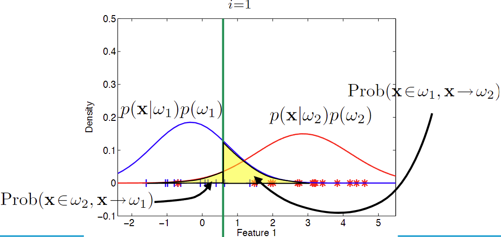

# Probability and Bayes' Rule

---
## 1. Objects in feature space
Let's look at a classification problem.
- Given labeled data: x
- Assign to each object a class label ω
  - The feature space is separated in regions, each regions representing each class
- For each object in the feature space, we should estimate: p(ω|x). These are called posterior probabilities
- Each of the posteriors represents the probability that the unclassified vector x belongs to the respective class.
- We classify x to the class with the highest posterior probability.

So we want to calculate p(w|x). But this is hard to directly derive. Then how can we estimate this?

## 2. Bayes' Decision Theory
$$ p(wi|x) = \frac{p(x)}{p(x|wi)p(wi)} $$
 
Let's have a look at the formula.
### Bayes' rule
- Prior probability p(wi)
  - The probability that wi occurs, regardless of the feature vector.
  - We could use external knowledge to obtain this, or we can simply estimate it by calculation
    
- Class conditional probability density function p(x|wi)
  - This density function is the probability that x occurs given that x is member of class wi.
    
- Unconditional probability p(x)
  - This is the probability that x occurs, regardless of which class it belongs to.
  - This can be calculated by calculating the total probability of x.
    - e.g. p(x) = p(x|wi)p(w1) + p(x|w2)p(w2)
  - If we are comparing probabilities, this factor can be left out as we divide by the same factor.

## 3. Errors
We can have classification errors in the following region: 
 
The error could be calculated as $p(error) = \sum_{i=1}^{C} p(error|w_i)p(w_i)$

### Bayes error ε*
Bayes error is the minimum error: typically larger than 0. 
In practice, we cannot obtain them because we do not know the true distribution. The Bayes error does not depend on the classification rule,
but the distribution of the data.

### Misclassification cost
Sometimes misclassifying A as B could be more dangerous than misclassifying B as A. So we apply misclassification cost to take the risk into account when calculating total risk.