# Unsupervised Learning

---
So far, we have only looked at training models with labeled datasets. What if we have to train a model with unlabeled datasets? 
This is when unsupervised learning comes in to play. We are going to have a look at two models in unsupervised learning:
- Clustering
  - discover structures in unlabelled data
- Dimensionality reduction
  - does not use information about the labels

## 1. Clustering
Clustering is about finding natural groups in data where:
- Items within the groups are close together
- Items between groups are far apart

### Applications
- Market research: find groups of similar customers
- Social networks: find communities with similar interests/characteristics
- Recommender systems: find groups of users with similar ratings

### Clustering: how to
#### 1. Proximity measure
First, we need a proximity measure. Proximity measure is the measure of (dis)similarity. 
We could use either:
- Similarity measure s(x_i, x_k)
  - higher s if two elements are similar
- Dissimilarity measure d(x_i, x_k)
  - lower d if two elements are similar

Similarity of two elements depends on their distances. We have many ways to define distances: 
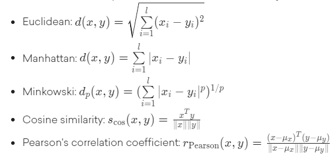 

#### 2. Cluster evaluation
We then need a criterion function to evaluate clustering: 
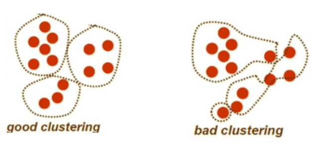 

We could use either:
- Intra-cluster cohesion (compactness)
  - measures how near the datapoints are to the cluster's mean
  - calculated by the sum of squared errors
- Intro-cluster separation (isolation)
  - measures the distance between two clusters
  - which should be as large as possible

#### 3. Clustering algorithms
Lastly, we need an algorithm to compute clustering (e.g. by optimizing the criterion function). There are a few options: 
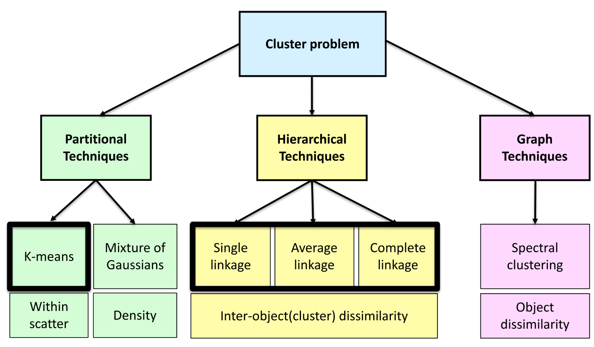 

We can divide the assignments to a cluster in two categories:
- Hard assignments
  - each point is assigned to 1 cluster
  - k-means, hierarchical clustering
- Soft assignments
  - each point is assigned cluster membership
  - fuzzy c-means, probabilistic mixture models

### k-means clustering
Given a dataset of n points each with p features, the k-means algorithm partitions the given data into k clusters, 
where each cluster has a cluster centre(mean), called the **centroid**.

The algorithm works as follows:
1. Choose k (random) data points (seeds) to be initial centroids 
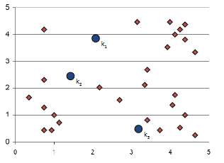
2. Assign each data point to the closest centroid 
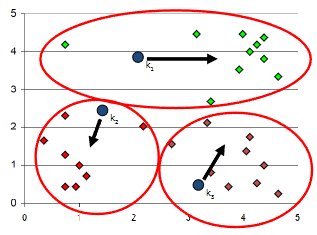
3. Recompute the centroids using the current cluster memberships 
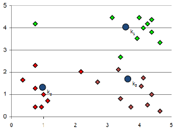
4. If a convergence criterion is not met, repeat steps 2 and 3 
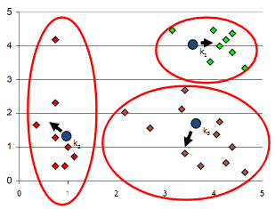 
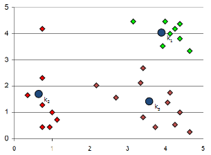 

#### Convergence(stopping) criterion
1. No (or minimum) re-assignments of data points to different clusters or
2. No (or minimum) change of centroids or
3. Minimum decrease in the sum of squared errors. This sum is calculated by J(c,μ) = 1/n * Σ(i=1, m)(||x_i - μ_ci||^2) 
where μ_ci is the cluster center to which x_i is assigned

We might have to run this many times to get this minimum sum of squared error

#### Choosing k
- Inspect visually
- Known purpose
- Elbow method

The elbow method looks at the percentage of variance explained as a function of the number of clusters: 
one should choose a number of clusters so that adding another cluster doesn't give much better modelling of the data: 
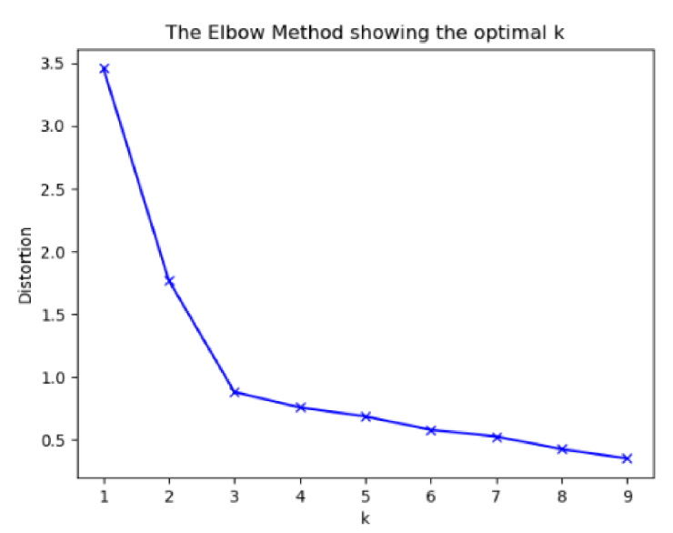 

#### Pros and Cons of k-means clustering
- Pros: it is simple and fast
- Cons: 
  - It finds only round shapes
  - it does not work for non-spherical clusters and clusters of different sizes, different densities, and outliers.
  - it is sensitive to initialisation
  - it can get stuck in local minima

### Hierarchical clustering
It could be very hard to pick the right k for k-means clustering. Instead of picking k, we can also find a hierarchical structure, where:
- The top level contains all the points
- The bottom level contains one cluster per data point

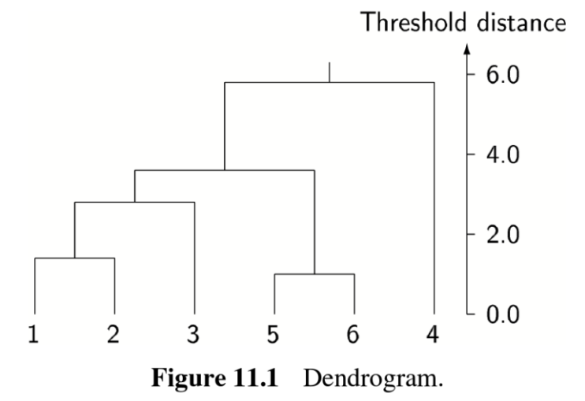 

To obtain this dendrogram we input the dataset or dissimilarity matrix and the linkage type.
The higher up the dendrogram, the more dissimilar the datapoints are.
We set a certain trheshold on where to stop clustering and keep multiple clusters: 
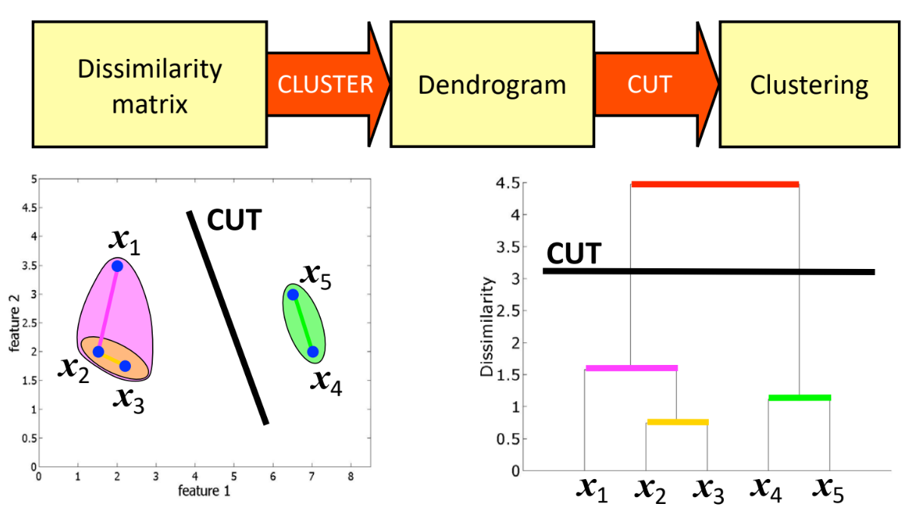 

We can approach the calculation of the dendrogram in two ways, the bottom-up and top-down approach.

#### Bottom-up
In the bottom-up (agglomerative) approach:
- each point starts as a cluster
- we group the two closest clusters
- we stop at some point

Here, we start from individual observations and produce sequence of clusterings of increasing size. 
At each level, two clusters chosen by criterion are merged. 

We merge this by:
1. Determining the distances between all clusters
2. Merge clusters that are closest
3. If the amount of clusters is larger than one, repeat

You can calculate the "closest" cluster in a few ways:
- Single linkage: two nearest objects in the clusters
- Complete linkage: two remote objects in the clusters
- Average linkage: cluster centers

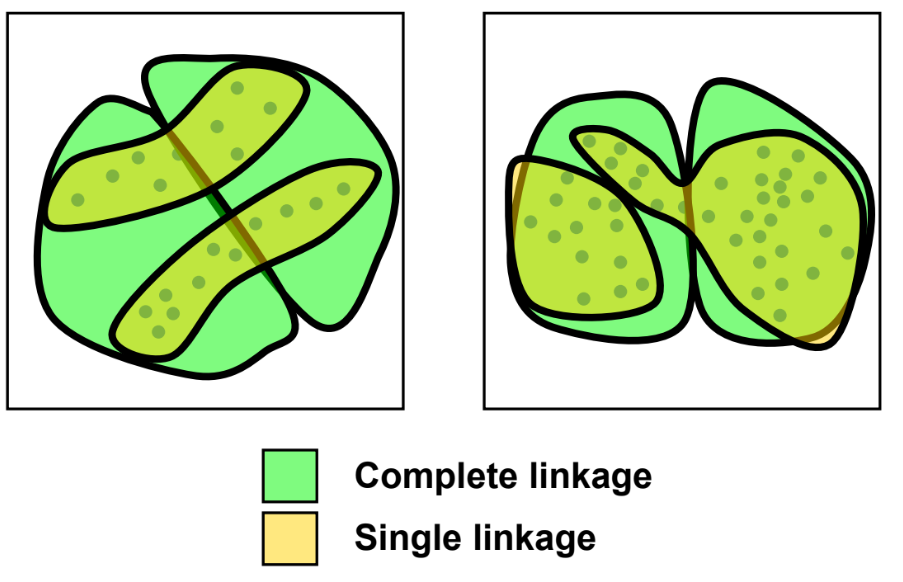 

#### Top-down
In the top-down (divisive) approach:
- all points start in one cluster
- we split the cluster in a sensible way
- we stop at some point

Here we apply k-means recursively:
1. we run k-means on the original data for k=2
2. Each of the resulting clusters runs k-means with k=2: 
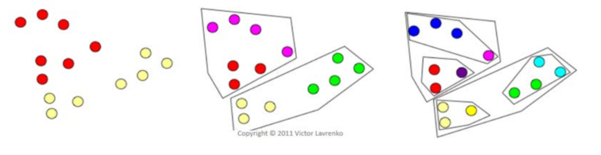 

#### Pros and Cons of hierarchical clustering
- Pros
  - Dendrogram gives overview of all possible clusterings
  - Linkage type allows to find clusters of varying shapes
  - Different dissimilarity measures can be used
- Cons
  - Computationally intensive
  - Clustering limited to "hierarchical nestings"

## 2. Dimensionality reduction
### Why?
Many datasets exist of many features (dimensions)l we can reduce the dimensionality to:
- Make storage or processing of data easier
- (Visual) discovery of hidden structure in the data
- Remove redundant and noisy features
- Intrinsic dimensionality might be smaller
- As dimensionality grows: fewer observations per region

If all data points in a 3-dimensional dataset can be plotted on a single plane, we know that we can reduce a dimension.

### What does it mean to reduce dimensionality?
Reducing dimensionality is done by transforming high-dimensional data to data of lower dimensionality, while preserving the structure in the original data as good as possible. 

1. Feature selection
   - Pick a subset of the original dimensions
   - use domain knowledge
   - use statistics-based selection methods
2. Feature extraction
   - construct a new set of dimensions
   - These are often linear techniques, which project the data on a linear subspace of a lower dimensionality (principal component analysis): 
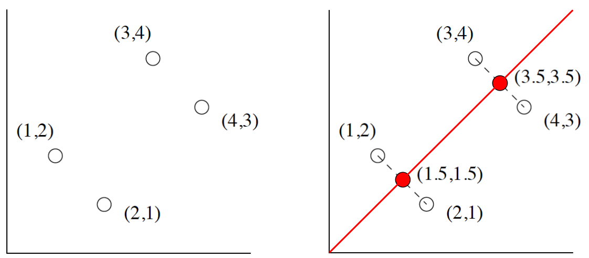 

### PCA
Principal Components Analysis (PCA) maps the data onto a linear subspace, such that the variance of the projected data is maximized 

It defines a set of principal components:
1. the direction of the greatest variability in the data
2. perpendicular to the 1st, greatest variability of what's left
3. etc, until you have the d original dimensions
 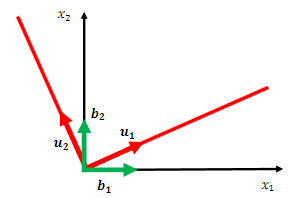

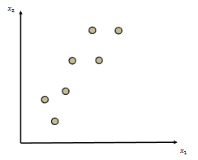 
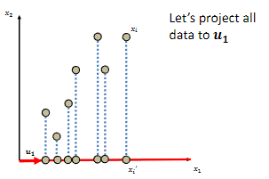 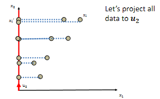 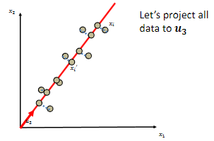 
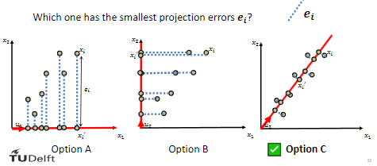 
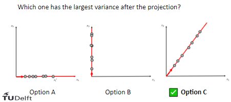 

The first principal component is chosen such that 
It has the smallest projection error/largest variance after projection.

Then the first m components of these become m new dimensions and we change all coordinates of the data points to match these new dimensions. 

What this means mathematically is that we try to maximize the variance Var(X) = E[(X-E[X])^2], which means we will maximize max(||w||^2 = 1)Var(wTx). 

Take the covariance matrix of the data (Cov(x,y) = E[(x-E[X])(y-E[y])])  
The component at index (i,j) of the covariance matrix wil be: 
E[(X_i - μ_i)(X_j - μ_j)] 

The variance of the projected data is given by: 
var(u_Tx) = [u1T X XT u1] = u1T S u1 
where S is the covariance matrix. 

Enforce constraint using Lagrange multiplier λ (condition is u1T u1 = 1): 
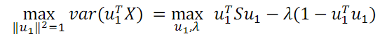 

Find stationary point by setting derivative with respect to u_1 to zero: 
Su1 = λu1 
This proves that eigenvalues of covariance matrix give dimensions with max variance. 

#### Eigenvalues & eigenvectors: definition
For M square matrix, λ constant, e a non-zero column vector: 
λ is an eigenvalue of M 
and e is the corresponding eigenvector of M if:  
Me = λe 

Note: eigenvector is a unit vector. 

λ and e form eigenpairs. 

To calculate the principal components, we use the eigenvectors of the covariance matrix.
The first principal component is given by the eigenvector with the corresponding highest eigenvalue. 

#### Finding eigenpairs
We have a couple of ways to find the eigenpairs. 

1. Pivotal condensation
   - We restate the definition of eigenpair as (M - λI)e = 0, which holds if the determinant of (M - λI) is 0. (from linear algebra)

2. Power iteration
   1. Start with any unit vector x0
   2. compute Mxk until xk+1 := Mxk / ||Mxk|| converge
   3. the limiting vector is the principal eigenvector
   4. when converged, compute the eigenvalue λ1 = xT M x
   5. to find a second eigenpair, create a new matrix M* = M - λ1 x xT
   6. use power iteration on M* and so on

Example of power iteration: 
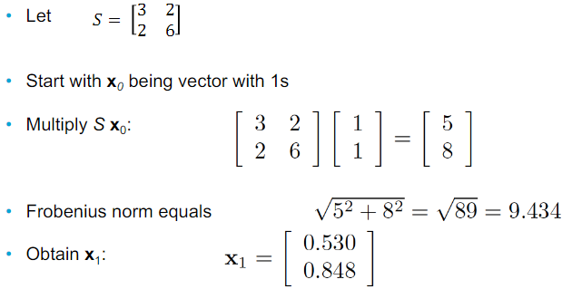 
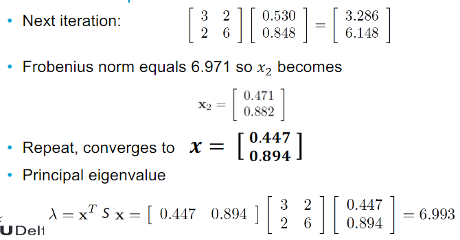 
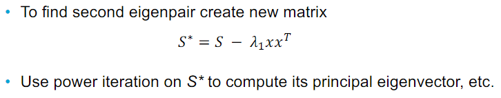 

#### PCA summarized
- Create an X matrix whose rows represent (zero-mean) points in Euclidean space
- Compute covariance X XT and its eigenpairs
- Create an E matrix whose columns are the eigenvectors, ordered as largest eigenvalues first
- Create an XT E matrix which exists of points of X transformed into a new coordinate space where the first axis (from largest eigenvalue) is most significant etc
- Let Ek be first k columns of E
- Then XT Ek is a k dimensional representation of X

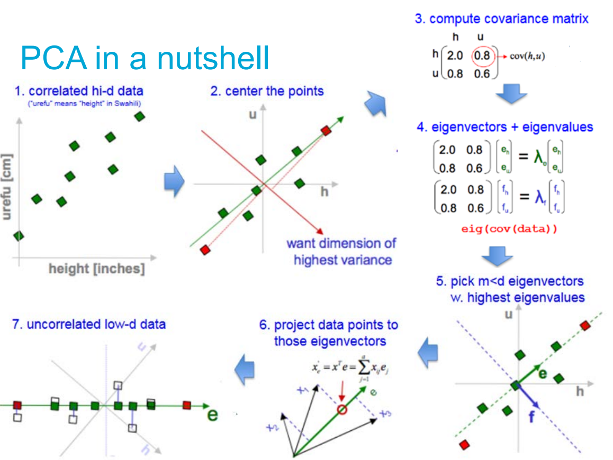 

#### PCA issues
There are a few issues with PCA. For one, the covariance is extremely sensitive to large values:
- If you multiply some dimensions by a big value this will dominate the covariance and become a principal component
- We can solve this by normalizing each dimension to zero mean and unit varaince: x' = x-μ / σ

PCA assumes the underlying subspace is linear so we need to transform it to handle non-linear spaces.

#### PCA and classification
- PCA is unsupervised
  - maximises overall variance of the data along a set of directions
  - does not know anything about class labels
  - can pick direction that makes it hard to separate classes
- Discriminative approach
  - look for a dimension that makes it easy to separate classes
    - Lower dimensions, simpler models, thus less overfitting
    - Training is faster

#### Pros and Cons
- Pros
  - allows to visualise high dimensional data
  - dramatic reduction in size of data
    - faster processing, smaller storage
- Cons
  - too expensive for many applications
  - need to understand assumptions behind the methods (linearity)
