# Generative models: Parametric(Gaussian) Density Estimation

---
## 1. Gaussian distribution
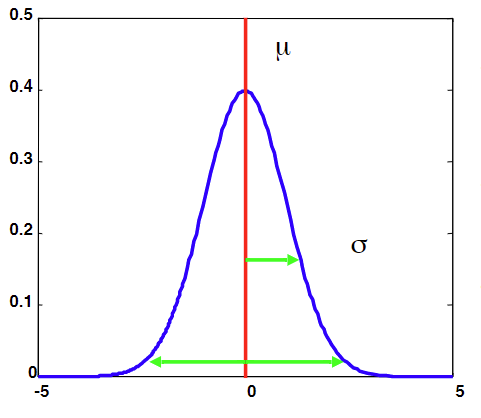 
Gaussian distribution, also known as normal distribution, is a parametric distribution.
It works with two parameters: mean and covariance. In standard normal distribution, the mean is 0 and standard deviation is 1.  
We work with Gaussians because the central limit theorem says that sums of large numbers of i.id. random variables has a Gaussian distribution.
It also occurs in real life often times, and it has few parameters. The parameters are easy to estimate when using maximum likelihood. 
In 1-dimensional feature space, the formula for the distribution is: 
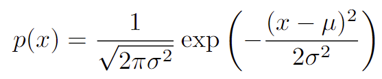 

### Multivariate Gaussians
M-dimensional density function is: 
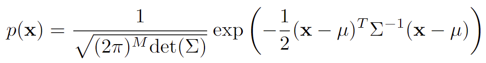 
where:
- x: feature vector
- Σ: covariance matrix
- μ: mean vector

### Maximum likelihood estimates
Maximum likelihood estimator for the mean is: 
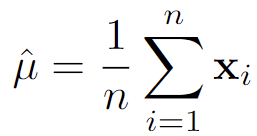 
i.e. just averaging all the feature vectors. 
Maximum likelihood estimator for the covariance matrix is: 
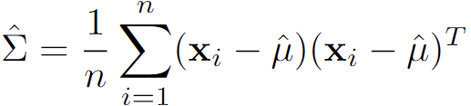 
i.e.averaging all the matrices calculated by performing vector multiplication of the difference between the feature vector and the mean, and the transpose of it. 
 
Now that we can estimate the parameters, we could try to apply some classifiers. 
In order to compare the posterior probability, we need to compute p(x|wi)p(wi). As p(x|wi) is exponential, we can use monotonic log function. 
We then get gi(x) = ln p(x|wi)p(xi) = ln p(x|wi) + ln p(wi). The computation is: 
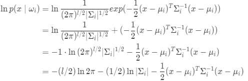 
So the actual function of the discriminator becomes 
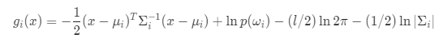 
We can expand this further to get 
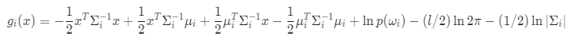

## 2. Quadratic classifiers(QDA)
In order to classify objects based on our discriminant function for 2 classes, we need to calculate f(x) = g1(x) - g2(x). 
The first classifier we will discuss is a quadratic classifier. This is in the form f(x) = xTWx + wTx + w0. The derivation is as follows: 
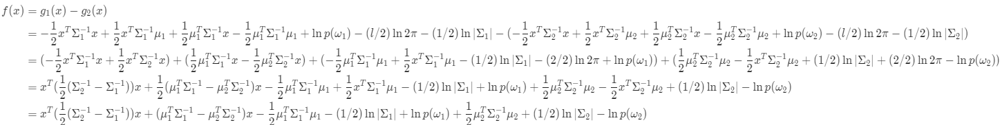 
This gives the following terms: 
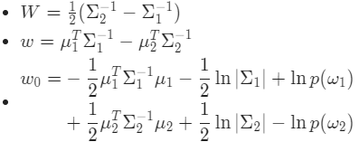 
However, we can encounter a problem if the covariance matrix is not reversible. In this case, we could take the average over all class covariance matrices. 
An even bigger simplification is assuming that all classes have the same covariance matrix, which gives rise to the next classifier.

## 3. Linear classifiers(LDA)
In this classifier, we assume that all classes have the same covairance matrix. Therefore the quadratic term cancels out. 
We now have a linear function, defined as: 
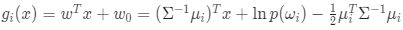 
For two classes, we yield 
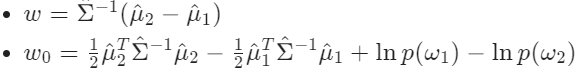 

## 4. Nearest mean classifiers
In some cases it is too much to estimate a full averaged covariance matrix, so we could even simplify it more by assuming that all features have the same variance and are uncorrelated. 
Now we have σ^2 instead of Σi. We now have: 
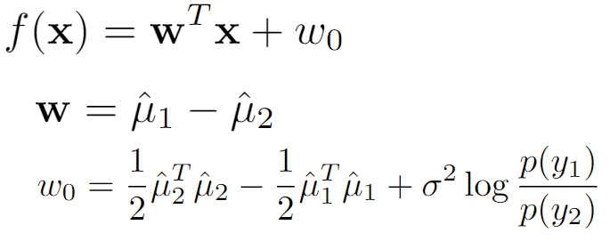 
This is a linear classifier, but it only uses distnace to the mean of each class. Therefore, it depends on feature scaling. 
We have to normalize the features; a common way to do this is zero-mean unit-variance scaling: normalized x = (x-μ)/σ.