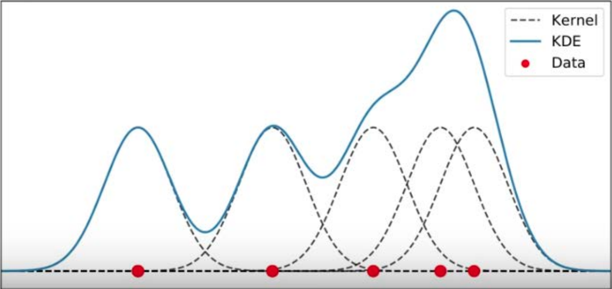
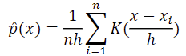

# Generative models: Non-parametric Density Estimation

---
## 0. Non-parametric density estimation
In real life, the distribution of the data is not always Gaussian. In this case we cannot assume the distribution, and there are no global parameters to estimate. 
This is where non-parametric density estimations can be useful.

## 1. Parzen/Kernel density estimation
### Procedure
1. We place cells around our data points
2. Define the cell shape (e.g. Gaussian, Box, Tri, Triweight)
3. Fix the size of the cell (h)
4. Add contributions of cells

### Classifier
 
The dashed lines are individual Gaussian kernel functions and the blue line is the sum of these kernel functions. The density function is as follows: 
 
Where:
- K: kernel function
- (x-xi)/h: normalizing x around the origin
- h: size of the cell
- n: number of points

### Classification algorithm
We classify points based on the posterior probability of all classes, i.e. choose the class that is most often represented in the current window.

### Cell size h
Too small h means overfitting (focusing on the smaller regions) and too large h means underfitting (losing important details) 
There are a few ways to optimize h:
- Use a heuristic
- Optimize the likelihood
- Use the average k-nearest neighbor distance

## 2. K-nearest neighbours
### Procedure
- Locate the cell on the new point x
- Do not fix the volume of the cell and grow the cell until it covers k objects
- Predict the class w of new point x

### Classifier
- p(x|wi) = ki / niVk   where
  - Vk: volume of the sphere centered at x
- The class prior is p(yi) = ni/n

### Classification algorithm
Given training examples {xi, wi} and a testing point x we want to classify, we can:
- Compute the distance D(x,xi) to every training example xi
  - We could use different distances and this has a big impact on the performance
    - Euclidean
    - Hamming
    - Minkowski
- Select the k closest instances xi1, ..., xik and their labels yi1, ..., yik
- Output the class y which is most frequent in yi1, ..., yik
  - If we have a tie, we could use:
    - Use an odd k to avoid ties (does not work for more than 2 classes)
    - Random flip
    - Priority
    - Nearest

### Choosing k
- Set aside a portion of the training data
- Vary k
- Pick the k that gives the best generalization performance

### Missing values
- If we have missing values we have to fill something in; otherwise we cannot compute the data.
- A reasonable solution would be choosing an average value across the entire dataset

### Pros and Cons of k-nn
- \+ Simple and flexible classifiers
- \+ Often a very good classification performance
- \+ It is simple to adapt the complexity of the classifier
- \- Relatively large training sets are needed
- \- The complete training set has to be stored
- \- Distances to all training objects have to be computed
- \- The features have to be scaled sensibly
- \- The value for k has to be optimized

## 3. Naive Bayes Classifier
When we have a feature space with high dimension, it is hard to use Bayes' classifiers due to the curse of dimensionality. In these cases, we could try to use Naive Bayes: 
Naive Bayes assumes that all features are independent. We derive p(x|wi) by multiplying the conditionals per features: 
p(x|wi) = p(x1|wi) p(x2|wi) ... p(xd|wi) 
Naive Bayes does not work if the data is heavily dependent on each other.

### Zero frequency problem
It is a bad idea to estimate the probability of some event to be zero, just because we have not seen it before. 
To solve this problem, we will never allow zero probabilities.

### Fooling Naive Bayes
We can easily fool Naive Bayes by just adding a lot of features that is specific to one class.

### Missing data
We can just ignore the missing value.

### Pros and Cons of Naive Bayes
- /+ Can handle high dimensional feature spaces
- /+ fast training time
- /+ can handle missing values
- /+ transparent
- /- cannot deal with correlated features
