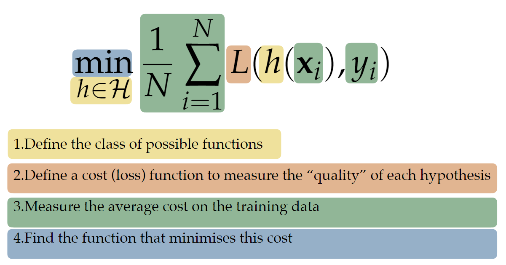
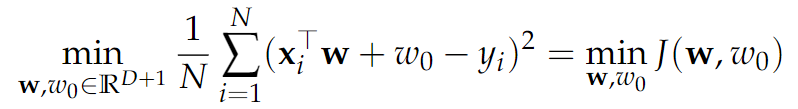
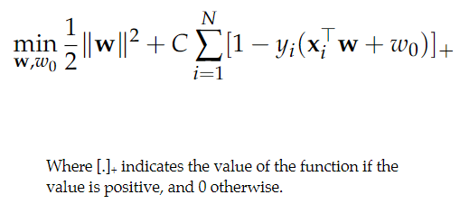
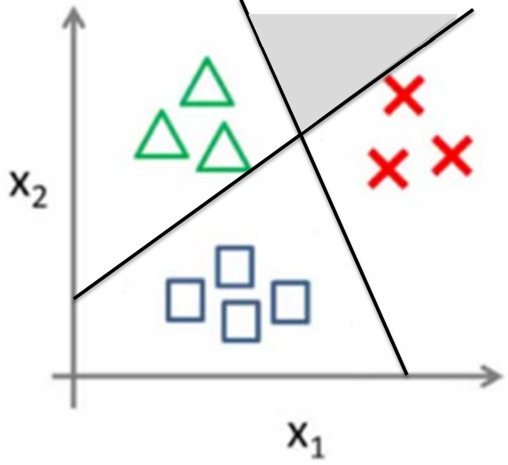
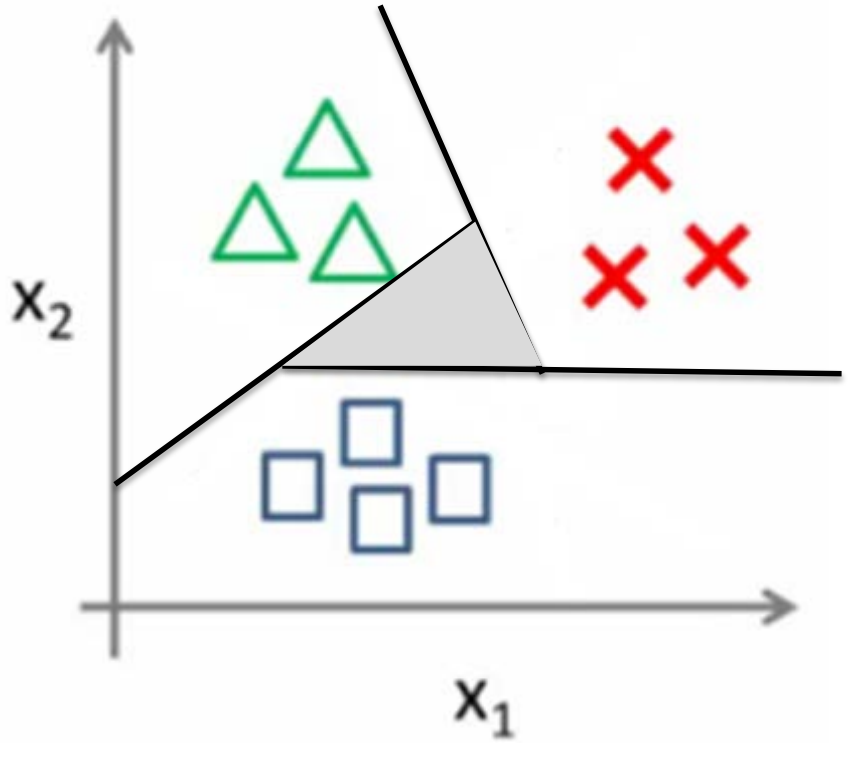

# Discriminative models: Linear Classifiers

---
## 0. Risk Minimisation - the Empirical Risk
For joint probability, we directly model the decision function (the posterior) or the decision boundary.
We can construct the classifier using empirical risk minimisation. 
 
where
- x, y: observed values corresponding to the input features and outcome of interest
- h: hypothesis function that maps input to a decision value
- L: loss/cost function that measures how well the prediction matches the actual outcome

### Hypothesis function
- When the outcome is continuous(regression), h(x) can directly correspond to the function we want to find
- In classification, h(x) is the decision function which gives a real-valued output
  - To go from this output to a class decision, we still need to set a cut-off, for instance at 0:
    - y = c1, if h(x) > 0
    - y = c0, if h(x) <=0

#### Linear Hypothesis
The h(x) decision function is a weighted linear combination of the input features, plus a constant(bias):  
$ h(x) = w_1 x_1 + w_2 x_2 + ... + w_D x_D + w_0 = x^Tw + w_0 $  

Linear hypothesis functions are simple and interpretable. The optimisation is also often possible and fast. 

### Cost/Loss function
This is how well our model solves the problem. We have different cost functions for regression and classification.

## 1. Regression loss function: Linear Regression
Let's consider a hypothesis function h(X) = wTx + w0. We now look at the outcome of this hypothesis function (the predictions) and the actual labels and compare them.
By comparing, we can measure how well our hypothesis function did.  
There can be many ways to measure this:
- looking at the absolute difference
  - $ L(h(x), y) = |x^T w + w_0 - y| $
- looking at the squared difference (to penalise large differences):
  - $ L(h(x), y) = (x^T w + w_0 - y)^2 $

We then take the average of this by looking at the loss function for all objects.  
 
Now we have to minimise the loss: 
 
How can we find the best w?

### Gradient descent
We can follow the derivative until we hit a (local) minimum.

1. Take the derivative of the loss function: in terms of both
   - w (slope/weight)
   - w0 (intercept/bias)
2. Pick random values for the parameters
3. Plug the parameter values into the derivatives
4. Calculate the step sizes: Step Size = Slope x Learning Rate
5. Calculate the New Parameters:
   - New parameter = old parameter - step size
6. Go back to Step 3 and repeat until
   - Step size is smaller than the minimum step size
   - or you reach the Maximum number of steps.

The learning rate is the speed of the descent. If it is too large, we may overshoot the minimum.
If it is too small, it will take a long time to reach the minimum. 
 
The initial parameter is also important; depending on this value, we may reach a local minimum or the global minimum.
  
#### Stochastic gradient descent
If we have too many datapoints, it may take too long to compute the loss for each of them. To solve this problem, we could update the parameters on each datapoint.
The step is less precise, but we can take many steps at the same time. Regular gradient descent does one update per epoch, whereas stochastic gradient descent does multiple within an epoch.

## 2. Classification loss function: logistic regression
Intuitively, finding classification loss should be simple; can't we just count the number of mistakes? 
Unfortunately, it is not so simple. Accuracy is difficult to optimize, and there could be multiple good solutions. 
We have to use some other loss function because:
1. There are other objectives in classification: different weight for different mistakes, accuracy of probabilities, correct "ordering" of the objects, etc
2. Find a good solution for accuracy, by using some other "surrogate" loss

So let's try to find a function that accurately approximates the probability of a label: 
$ h(X) `=. P(Y = 1|X) $ 
The probability has to be between [0,1], but our h(X) can return any continuous value. So let's use some function to map this to [0,1].

### Logistic function
$$ σ(z) = \frac{1 + e^(-z)}{1} $$ 
This is known as the logistic function, which is an example of a sigmoid function. 
If we assume that Y is either 0 or 1, we could model the class posterior probability using σ. 
The likelihood function is: 
$ L(h) = prod_{i=1}^{N}σ(h(x_i))^(y_i) (1-σ(h(x_i)))^(1-y_i) $
  Since the likelihood is the opposite of loss, so let's minimise the negative log likelihood: 
$ J(h) = - \sum_{i=1}^{N} y_i log[σ(h(x_i))] + (1-y_i)log[1-σ(h(x_i))] $ 
 
The higher the certainty of the correct label, the lower the loss. 
The loss is infinite if the prediction is certain but wrong. 
The loss is zero if the prediction is certain and is correct. 
 
Now find the optimal values for the parameter using the gradient descent.

### Summary
- Logistic regression is a linear classifier
- We maximise the (log) likelihood of the observed posterior probabilities
- or alternatively, we could minimise the negative (log) likelihood
- There is no analytical solution, so we use iterative procedures, like gradient descent.

## 3. Classification loss function: Support Vector Machine
There could exist many possible decision boundaries with zero errors. In this case, how can we choose the location of the decision boundary? 
As long as all objects are correctly classified, we want the classifier to have the maximum margin: the distance of the closest points to the decision boundary. 
We call the objects on the margin support vectors. They are what we care about; the others do not affect the classifier. 
 
We want the closest objects to be "far away" from the decision boundary, so we set a decision value of at least M. 
We can scale w to reach M without changing the decision boundary.  
 
so we maximise the margin which is 2/||w||, or minimise ||w||^2 / 2. 
Note that this is subject to M = 1. 
 
However, the points might not be linearly separable. In this case, we could allow for "violations" of the margin and penalise how far the object is on the wrong side of the margin. 
We could use the hinge loss, which is defined by $ max(1- y*h(x), 0) $ 
And we can introduce Soft-Margin SVM: 
 

### Summary
- For linearly separable data: maximise the margin
- The objects on the margin completely determine what the decision boundary looks like: support vectors
- Removing the other objects will not change the decision boundary
- SVMs can also be formulated as a risk minimisation problems.

## 4. Multiclass Classification
What if we have more than 2 classes?  
For generative models, we could model the extra posteriors. 
For discriminative models, we could directly construct a multi-class classifier, or we could combine multiple 2-class classifiers. Let's look at how to combine classifiers.

### One-versus-rest
We can use k-1 binary classifiers to separate on class from the rest. 
 
The downside of this is that we get ambiguously classified regions.

### One-versus-one
We can use k(k-1)/2 binary classifiers to discriminate between all pairs of classes. 
 
but again, we get ambiguous regions. 

To solve the ambiguity, we could use the decision values rather than predicted labels of the classifiers