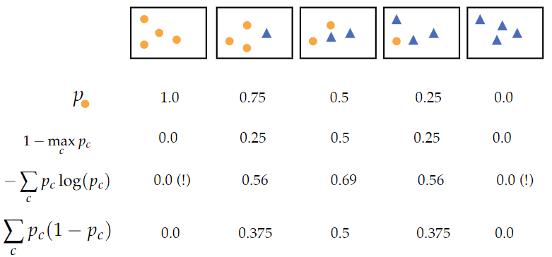

# Discriminative models: Non-linear Classifiers

---
Non-linear classification is about separating classes which don't have a straight decision boundary. Think of an XOR problem.

## 1. Decision Trees
### Definition
We have a root node at the top, from which we have branches to decision nodes which have test functions. 
This goes on until we get to leaves, which classify the sample. 

### Training
1. We make partitions in the feature space
2. We assign values to each part
   - If all objects in a node belong to one class: we are done.
   - If not: find a node-variable combination that increases the quality of the tree the most if we split the node further
     - How do we measure quality?

### Measure of Improvement
#### Information gain
 
where:
- I: Impurity
- S: Set of objects in the node
- F: Feature that we consider
- S_V: Number of objects in the node with value V

We have many choices for I: if we choose the misclassification error as I, this measures how much the 0-1 loss will decrease if we split the node into multiple nodes using feature F. 

##### Different choices for impurity
 
 
 
An example calculation (using node entropy as I(S)): 
 

#### Gain ratio
The information gain is biased towards features with many discrete values. This means that we may overfit on such features. 
We can correct this by using the intrinsic value(IV), the entropy of the feature. 
We then divide the information gain by this intrinsic value to get the gain ratio. 
 

### When to stop training
If we fit pure trees, we quickly start overfitting when we split further.
In order to define a stopping criterion we could define the minimum node size, maximum tree depth, minimum information gain, etc. 
Also, there is an alternative strategy: grow and prune.

#### Pruning
To avoid overfitting, we stop splitting when it is not statistically significant. We can use subtree replacement pruning:
- For each node we pretend to remove the node and all its children and measure performance on the validation set.
- Remove node that result in the greatest improvement
- Repeat until further pruning is harmful

### Summary
- Decision tree is a non-linear classifier
- Choices in learning
  - Splitting criterion
    - information gain / gain ratio
    - entropy / gini index, etc
  - Stopping
    - minimum gain
    - node size
    - max depth
  - Pruning (remove parts based on performance on validation set)

### Pros and Cons
- Pros
  - "Interpretable"
  - Automatic feature selection
  - Easy to incorporate discrete features and missing values
  - Fast
- Cons
  - Unstable
  - Cannot model linear relationships efficiently
  - "Greedy"

## 2. Classifier combining
There are many different supervised models. If we combine different classifiers and exploit their own individual strengths we get an overall better performance than for individual classifiers. 
Even if two classifiers have the same accuracy, they make errors on different patterns, so we can use complementary information that seemingly resides in the different classifiers. 

### Combining strategies
- Fixed rules
  - Hard rules e.g. majority voting
  - soft rules e.g. mean, product
- Learned rules
  - Learn a classifier to output a decision based on the outputs of a set of base classifiers.

### What to combine
Single tree might easily overfit and might be unstable. We therefore combine multiple trees together; multiple trees should be sufficiently different. 
We can select random features and create a classifier on them, and we can also randomly select samples and create a classifier on them too. 
*Random forest*: construct a large number of trees using randomly selected objects and features and combine their decisions 
 
Randomly selecting samples: bagging 
 
 
Randomly selecting features: random supspaces 
 

### Pros and Cons
- Pros
  - Flexible/low bias
  - Works for many different types of data
  - Embarrasingly parallel
  - Produces out-of-bag estimates
    - OOB estimate/error: mean prediction error on each training sample xi, using only the trees that did not have xi in their bootstrap sample
  - (Scale) invariant
  - (Relatively) few hyperparameters
- Cons
  - Harder to interpret than single trees
  - Computationally expensive

## 3. Multilayer Perceptron
Multilayer perceptron is the common learning algorithm used in machine learning today.
It is connected to the topics we have covered so far:
- Logistic regression
- Gradient descent
- Classifier combining

### Perceptron
A multilayer perceptron exists of several layers of connected perceptrons. A single perceptron is a binary classifier which contains the following elements:
- x_j: an input unit. j = 1, ..., d
- x_0: bias (always 1)
- w_j: connection weight
- y: output unit

Visualisation: 
 

#### Single class case
The easiest way of calculating y would be just computing y = wTx + b.
In a case where there is only one class, we can just apply a threshold θ:
- y = 1  if wTx+b >= θ
- y = 0  otherwise

This is called the activation function. We use such a method for linear problems, for non-linear problems we can use a sigmoid function

#### Multiple classes
If we extend this to k classes, we will get k output units with their individual calculations for y_i where i = 1,...,k. As of the input units remain the same, we will just get extra connection(weight vectors). 
Thus our original calculation for y is transformed into y_i = w_iTx + b, which can also be written as y = Wx + b where W is a k x d matrix. 

### Multi-layer perceptron
Sometimes it is not enough to use just one layer of perceptrons: for example the XOR gate. So we use multiple layers. 
We use two consecutive steps:
1. Calculate the position of the data point to each of the decision boundaries
2. Combine the results of 1 to determine position of the data point to both decision boundaries and determine class

#### Layers
1. Input layer: a single layer which does no computations and has a bias
2. Hidden layer: layer(s) that does computations and have a bias. Inputs are the outputs of the previous nodes. Could be more than 1 layer.
3. Output layer: only does computations.

Example: XOR gate 
 

### Perceptron training
Given wTx + b, we want to learn the weights so that the value of y given x is correct. We can use (stochastic) gradient descent.

#### Forward-pass
Forward pass is a process of perceptron training by passing on the result of the activation function of the previous layer to the next layer's activation function.
1. Initialize weights with a random value
2. Push input through the MLP row by row (matrix)
3. Calculate and push forward the activations
4. Produce output value

Because the random values are not sufficient, we apply gradient descent on the output value to find the optimal weights.
This means we are moving backwards: backpropagation.

#### Backpropagation
1. Output value of forward pass is compared to the label
2. Calculate error using a loss function
3. Error is propagated back through the network, layer by layer:
   - Update weights depending on how much they contributed to the error, thus trying to find the weights that minimize the loss function:
     - Calculate the gradients of the error function with respect to each weight
     - The gradient vector indicates the direction of the highest increase in a function, while we want the highest decrease

The iterative updating of the weights can be done as follows:
1. Recalculate the gradients at the beginning of each training iteration step
2. Stop when error < θ or if we are at the max number of iterations
3. The general to update weights is as follows: w_t <- w_(t-1) - α (δE/δw), where
   - α is the leraning rate
   - δΕ / δw are partial derivatives of the error function E with respect to each weight of the array w

### Pros and Cons
- Pros
  - Flexible model class
  - Good empirical performance on many (structured) problems
  - Can be easily adapted to different learning settings
- Cons
  - Computationally expensive
  - Lots of hyperparameters
  - Does not converge to a unique optimum
  - Optimizing then be hard
  - Hard to interpret