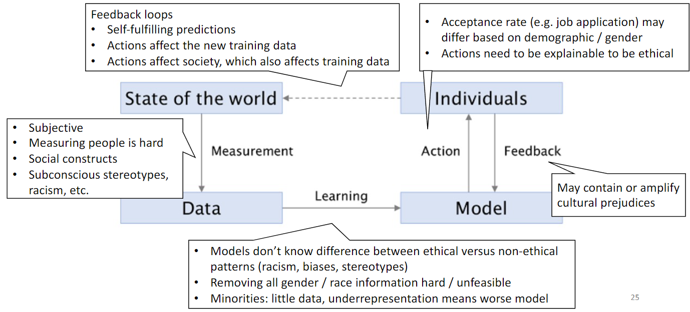
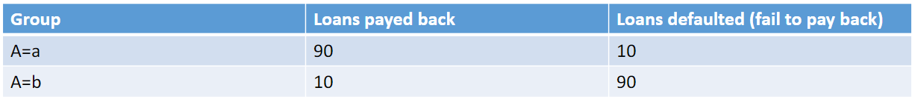
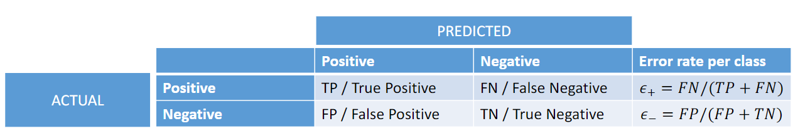
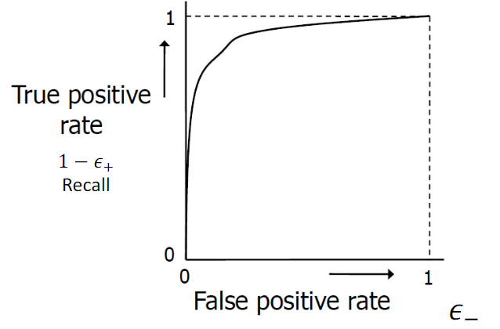
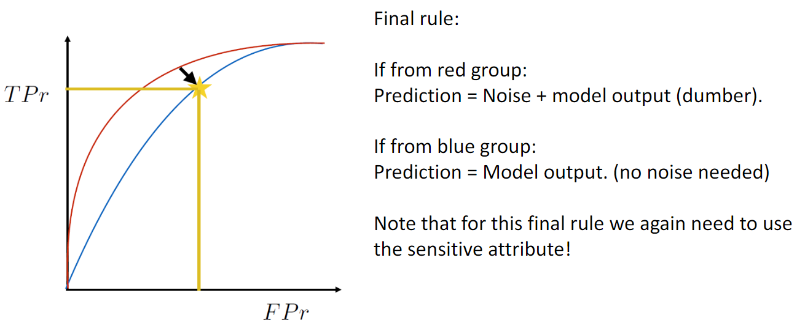

# Bias and Fairness

---
## 1. What is Bias?

### Bias
> Preference or inclination for or against something.  
> Often accompanied by a tendency to ignore the merits of relevant alternatives or others points of view.

#### Implicit Bias
> Expectations based on learned coincidences, which unknowingly affect everyday perceptions, judgement, memory, and behaviour.  
> An implicit bias may lead to discrimination.
#### Explicit Bias
> The explicit bias is informed by our implicit bias but is also at least in part a conscious choice. 
> For example, walking on the other side of the street when you see a scary-looking person(implicit bias).

### Prejudice
> An assumption made without adequate knowledge. 
> It is most commonly used to refer to a preconceived judgement toward a person or a group of people because of a personal or specific characteristic.

Prejudice is usually resistant to rational influence.

### Discrimination
> Actions taken based on a prejudice.  
> For example treating a person or group of persons based solely on their membership of a certain group or category.

### Proxy Bias
> Proxy variable: a variable that is related to a variable of interest to the degree that it can operate as a substitute. 
> A proxy bias is a bias by way of a proxy variable

For example, in the US, zipcodes are proxies for crime, income, ethnicity etc.

## 2. Bias in ML
AI systems or ML techniques are not inherently "bad" nor turn "bad" by themselves; an important source for bias is the training set. 
This can happen because some features might seem correlated, even though they aren't, thus leading to incorrect (biased) conclusions. 

Other sources could be:
- Lack of diversity in ML developers
- Implicit human biases in our culture
- Evil programmers

### Fairness
> The absence of bias or discrimination on specific realms.

There are three ways of quantifying fairness in ML:
1. Data vs Model
   - Fairness can be measured at different stages in a machine learning pipeline. Specifically, fairness can be quantified in the training dataset or in the learned model of a machine learning solution.
2. Individual vs Group
   - Individual fairness: in its broadest sense, seeks for similar individuals to be treated similarly.
   - Group fairness: in its broadest sense, partitions a population into groups defined by protected attributes and seeks for some statistical measure to be equal across groups.
3. WAE vs WYSIWIG
   - WAE (we are all equal): defines fairness as an equal distribution of skills and opportunities among the participants in a machine learning task
   - WYSIWIG (what you see is what you get): observations reflect ability with respect to the task
   - Example: using SAT scores as future success
     - WAE: SAT score could contain structural bias and distribution in scores is not the same is distribution in ability
     - WYSIWIG: it correlates well with the future success and can be used correctly for prediction

### Debiasing
To debias the three previously mentioned measurements, we can do the following:
- Data vs Model
  - Check the distribution of class labels in training set. If there are more examples in group A than in B, equalize the distribution in the training set
- Individual vs Group
  - Individual fairness: 2 individuals on either side of the line are very similar but different outcome
  - Group fairness: be aware of correlations of variables with other variables that the algorithm uses, e.g. surnames with geographical census data
- WAE vs WYSIWIG
  - Can be debiased by a smart implementation of the algorithm

### Why do disparities get into our machine learning models?

## 3. Measuring fairness & adapting models
We can measure fairness using statistics. We have two approaches for the criteria:
1. Independence
2. Separation

Before getting on to the content, here are some notations for examples:
- A: sensitive attribute (e.g. A=a(female), A=b(male))
- X: other features (e.g. word occurrences in resume)
- Y: classification target (e.g. Y=0(job rejection), Y=1(accept))
- R: classifier output (e.g. R=0(predict: reject), R=1(predict: accept))

### Criteria 1: Independence
$$ P(R = 1|A = a) = P(R = 1|A = b) $$ 
The acceptance rate for each group should be the same. 
The classification rule does not have to be the same for each group. 

Note that independence criteria needs sensitive attribute to compute; do not remove the sensitive attribute from the dataset! 

We have two approaches to satisfy independence:
1. Having different model per group
2. Pre-processing the data

 

#### Pre-process
Pre-processing the data is a way to satisfy independence. The data should be pre-processed in such a way, that it becomes impossible to tell from which group a candidate comes. 
However, there are also problems to this: how are we going to achieve this? Also, we might lose too much information. 

For bigger datasets, this is even more problematic. 

 

#### Problems with Independence
 
Let's have a look at the example below. The bank does not want to use a classification model that satisfies independence here. Why not? 

It is because that the acceptance rate in both groups need to be the same and that means we need to accept a lot from group b and reject a lot from a. 
This can be too much of a loss of profit for the bank. 

So for the extreme cases, independence can be very inefficient.

### Criteria 2: Separation
Instead of having equal acceptance rate, we can go for equal fraction of mistakes for each group. 
In separation, ε+ and ε- have to be the same for each group. See the table below: 
 
We have learnt the ROC curve before: 
 
We model the ROC curve for both models, and separation is satisfied when the two curves intersect. 

We also can have cases where the two curves never intersect: in that case, we add noise to one model so the prediction is affected: 
 

### Limitations of Statistics
Criteria only look at the statistics. However, for fairness we need to know how a decision was made. 
For example, it would not be fair if we hire from group A using interview score and from group B randomly. Therefore, statistics can only judge fairness on group level.

### Summary
Ignoring sensitive attributes is not enough to achieve fairness.
- Criteria 1: independence
  - How to satisfy it:
    1. Different model per group
    2. Pre-processing
  - Problems with pre-processing
  - problem with independence criterion
- Criteria 2: separation
  - Can have different acceptance rate per group
  - How to satisfy it: making a smart model dumber, ROC curve
- We need to keep sensitive attributes
  - To make models more fair
  - To measure fairness