# Classifier evaluation

---
## 0. Deciding which classifier to use
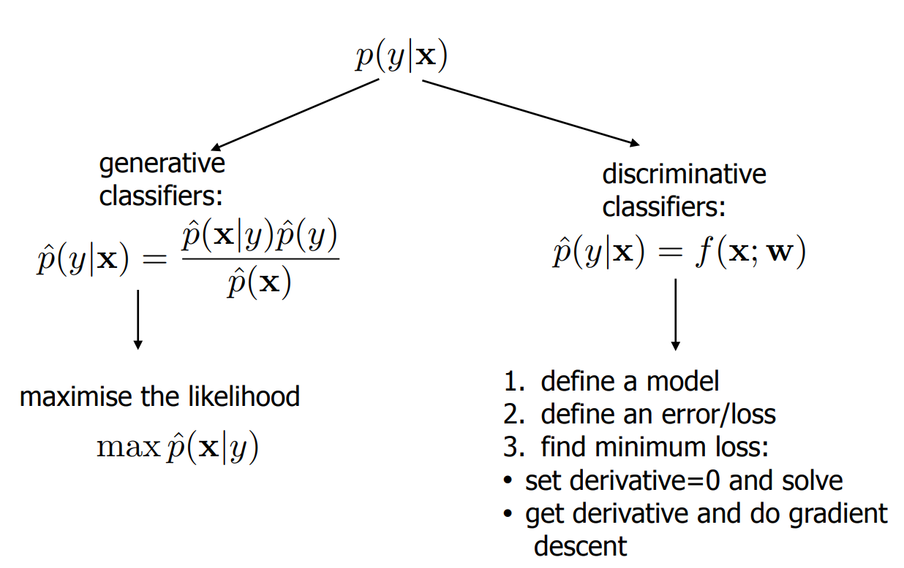 
Above is the recap of the classifiers we have covered so far. We have:
- Generative
  - Parametric
    - QDC: a classifier yielding a quadratic curve as the decision boundary; used when the covariance matrix is different between the classes
    - LDC: a linear classifier used when the covariance matrix is the same for all classes
    - Nearest Mean Classifier: a linear classifier which uses the distance to the mean of each class and creates a decision boundary based on that
  - Non-parametric
    - k-nearest neighbours: look for the k nearest neighbours and pick the class with the most samples in this region
    - Parzen: place cells of fixed size around the data points and decide which class to choose based on posterior probability
- Discriminative
  - Linear
    - Logistic: the go-to method for binary classification, modelling the probability of the first class
    - Support Vector: find a hyper-plane that maximizes the margin between positive and negative examples
  - Non-linear
    - Decision tree: ask yes or n questions to split the data
    - Neural network: multi layer perceptrons which all do binary classifications, combined to give a class estimate

We need to choose a classifier to use for each classification problem. If we have many dimensions and we cannot visualise the data, this can be a hard work to do.
Therefore, we need some criterion to see how well a classification model solves the problem (typically classification performance/error). We need to estimate this performance on independent data. 

Note that the classification error of the training set is a good measure of the true classification error (unless the error is too large). 
Also, we are not only after a good estimate of the actual error, but the weighted classification errors

### Error estimation 
We divide our data set into a training and (independent) testing set. This gives as output our classification error estimate. A different training or test set will yield a different classifier and another error estimate respectively. 

This error ε can easily be defined: the sum of wrongly classified samples. 
The variance would be Var(ε) ε(1-ε) / Ν, where N is the amount of training samples

## 1. Test/training set division
In order to get the error estimation, let's divide the training and test set. But how can we divide them? 
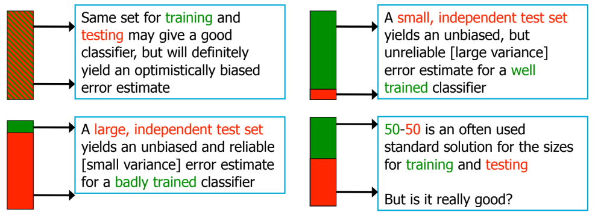 
There are a few other techniques which can help with dividing the training and test set in a smarter way. 

### 1. Bootstrapping
Given a training set D of size n, generate m new training sets D_i, each of size n`. We generate these training sets by randomly choosing elements from the entire dataset. 
This means it is possible that you select certain elements twice, and train on it twice. This makes re-sampling truly random instead of choosing from the leftover data set. 
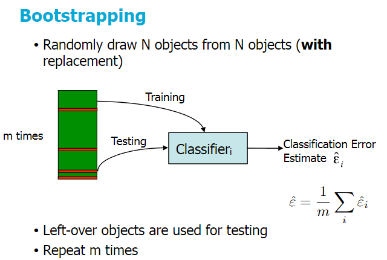 

The classification error estimate is the average of the classification errors.

### 2. K-fold cross validation
Divide the dataset in groups of k samples. Use 1 sample for testing, k-1 for training. Each time you train and test your error, then you repeat this until you have tested on all k groups. 
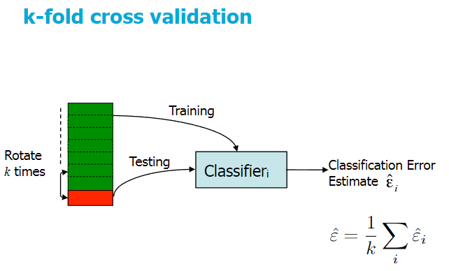 

The classification error estimate is the average of the classification errors.

### 3. Leave-one-out cross validation
k-fold with k = 1. So you train k times, each with only 1 test example. 
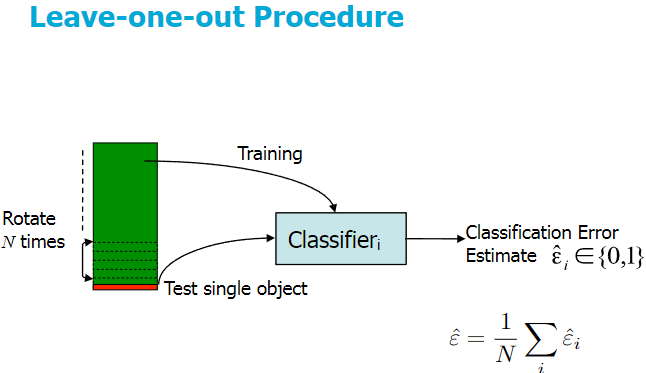 

This is optimal for training, but is very computationally intensive. That's why 10-fold cross validation is often used(k=10).

### 4. Double cross validation
Machine learning methods have "hyperparameters", which are parameters of the machine learning method itself (like the width h in Parzen). You shouldn't optimize the parameters of the learning methods by looking at the test set. 
You should optimize them by using cross validation inside another cross-validation. Once you found the value of the hyperparameter with the lowest error, retrain the entire classifier with the optimal h_j. 
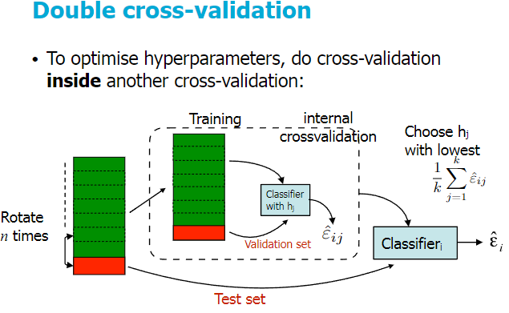 

It is possible that the different folds yield different parameters with the same error; then you can just average them and retrain.

## 2. Learning curves
> A learning curve shows how our error is changing with the number of training samples. 

In principle, this error is the true error. So learning curves are curves that plot classification errors against the number of samples in training set, which gives insight in:
- overtraining
- usefulness of additional data
- comparison between different classifiers
- stability of training, etc

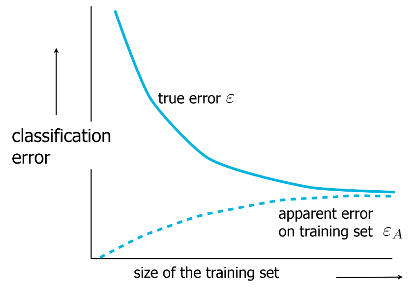 

But we can also look at the apparent error on the training set. The higher the amount of samples, the higher the error seems to be, but the lower the true error will be.
This is because with a low amount of samples, we have a lot of overfitting. So these learning curves plots the error on both training and the test set. 

Realistically, these learning curves have a very large variability. To fix this, we average them a few times. 

There is no "best classifier", which classifier is better depends on the amount of samples we have.

## 3. Bias-Variance dilemma
If we have the squared error L(x) = E[||g(x) - y||^2] we can derive something more general. 
But, the expected squared error is not suitable for all possible datasets, so in order to say something general about a classifier, we need to *average* the error over different training sets.
So our classifier will now also be a function of the training set D: g(x;D) 

Given the squared error E_D[(g(x;D) - E[y|x])^2], where E[y|x] is the optimal mean-squared regressor, and we can rewrite it to: 
$ MSE = E_D[g(x;D) - E_D[g(x;D)])^2] + E_D[(E_D[g(x;D)] - E[y|x])^2] $  
The first term can be seen as the variance(how much does the classifier g vary over different training sets), 
whereas  the second term is the bias squared (how much does the average classifier g differ from the true output). 

The result of this is that we get that a simple classifier is more stable, and a complex classifier only works on sufficient number of training data.
We can also see this in the feature curve below. 

The dilemma is about the following: we try to minimize both the variance and the bias, which is not possible:
- Bias error
  - is an error from erroneous assumptions in the learning algorithm.
  - High bias can cause an algorithm to miss the relevant relations between features and target output
  - Thus leading to underfitting
- Variance
  - is an error from sensitivity to small fluctuations in the training set.
  - High variance can cause an algorithm to model the random noise in the training data, rather than the intended outputs
  - Thus leading to overfitting

### Feature cure
The feature curve describes the classification errors with respect to the complexity of your feature set. 
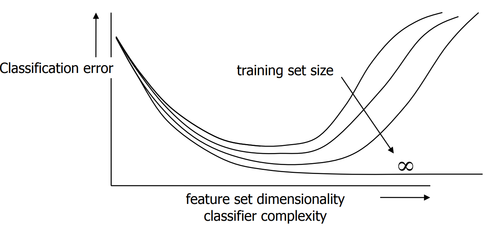 
More features give a better performance, but in order to use them, you need a bigger amount of samples.

## 4. Confusion matrices
The actual error of a classifier depends on more than just the global error. In order to see the clas dependent errors, we use a confusion matrix. 
This provides the counts of class-dependent errors: how many objects have been classified as A that should have been classified as B? 

This confusion matrix for k classes is a k x k matrix, with N real labels (λ_Ν) and N predicted labels (l_N) for which the elements are filled as c_ij = N x P[l_j | λ_i] 
This means: how many items from class i are actually classified as j? 
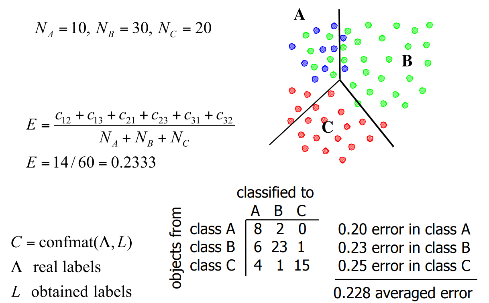 
Errors can be calculated as seen in the picture above; by averaging the percentage that is misclassified between the classes. Note that in this example all the classes are equally important(not weighted). 

If you see that classification of a certain class is very good but that for other is bad, you can remove this good class from the classifier and make a new classifier for the other classes, which will probably use different features and parameters. 

Another thing you can use the confusion matrix for is by seeing that classes with a low prior are classified poorly. In some cases, that should not be the case (e.g. diagnosing a disease). 
Then you can use this confusion matrix and a cost function in order to determine what to do.

## 5. ROC curves
For a 2 class classification problem, we can define a Receiver-Operator Characteristic curve. It is a curve where on each axis is the error of the classes, so you look at the possible trade-offs of the two classes.
This curve is obtained by varying classifier threshold d: 
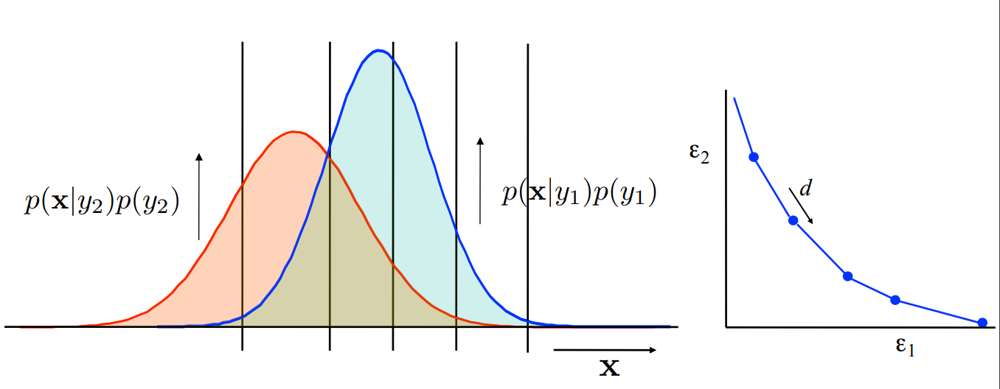 

Using this ROC curve we can see the result of changing the prior probabilities of classes. This can be useful when the amount of samples of a class really depends on the dataset or when the priors are unknown.
Then using this ROC curve you can find the optimal parameters. 
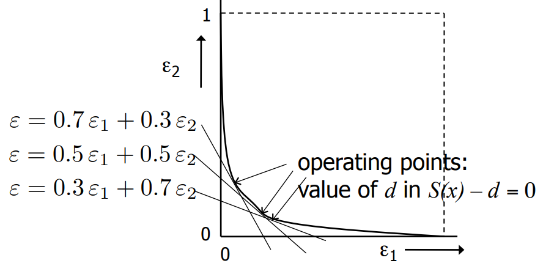 

### AUC
The area under the ROC curve is called the AUC. This area gives a performance measure that is insensitive to class priors. If this area is 1, you have a perfect classifier. If this area is 0.5 you have a random classifier. 

If we were to use a logistic regression algorithm and we classify data, we will get correct classifications and false positives/negatives. We want to improve our amount of correct classifications: 
We could do this by changing our threshold and trying again. But this gives many confusion matrices, which is very inefficient. 
So we can use the ROC curve to plot false positives vs true positives, performance vs cost etc.