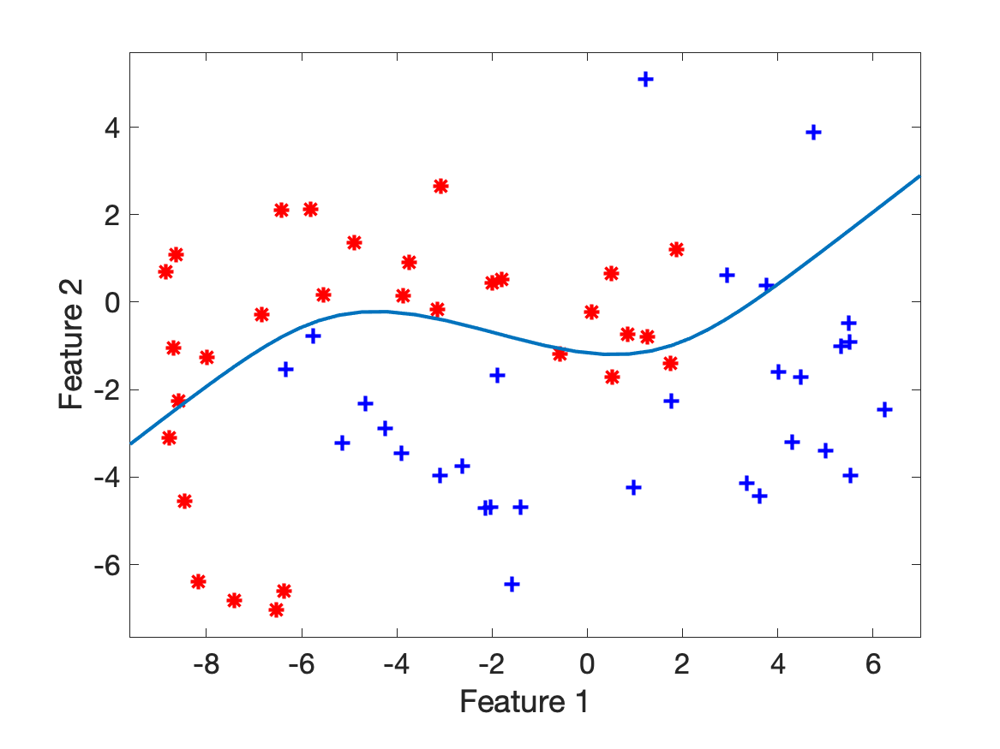
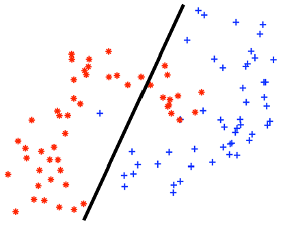

# Machine learning Weblab questions summary

----

## Week 1. Introduction
## Week 2. Parametric Generative Models
## Week 3. Non-parametric Generative Models & Evaluation
## Week 4. Linear Discriminative Models
### 1. Discriminative objective (*)
* Q. Which of the following best describes what probabilistic discriminative approaches try to model? (w are the parameters of the model)
  </br></br>
* A. p(y|x,w)
  </br></br>
    * *Discriminative models try to directly model the conditional probability of the outcome (y) given the feature values (x), rather than modelling the joint or class conditional distributions.*
    * Discriminative models
        - p(y|x)
        - When we know the posterior probability densities, we can directly classify objects

    * Generative models
        - p(y|x) α p(y)p(x|y)
        - When we know the prior and conditional densities, we know everything about the data for classification

### 2. Linear Classifier Definition
* Q. The decision function of a linear classifier can be described by the equation:
* h_w(x) = wTx + w0
* What does w0 signify?
  </br></br>
* A. The bias ("intercept")

### 3. Gradient descent
* Q. What is true for the gradient descent algorithm?
    * Gradient descent always finds the global optimum.
    * The update of the parameters is proportional to the gradient of the function at the current point.
    * The choice of starting point could have an effect on whether a global optimum is found.
    * The descent continues until the gradient is very large.
      </br></br>
* A. 2 and 3
  </br></br>
* *The graph might also have local minimum; the starting point does matter because it could lead to the local mimimum.*
* *The descent continues until the gradient is very small i.e. zero.*

### 4. Stochastic Gradient Descent
* Q. Stochastic gradient descent performs fewer computations per update than batch gradient descent. (T/F)
  </br></br>
* A. True
  </br></br>
* *Stochastic gradient descent sums over fewer objects than batch gradient descent to calculate an update.*
* To calculate the full gradient, we need to sum over all objects.
* Instead, Stochastic GD estimates the gradient using one or a few objects and take a step using this estimate of the gradient
* The step is less precise, but we can take more steps in the same amount of time
  </br></br>
* Epoch: visiting all the data once
* Stochastic gradient descent does updates within an epoch
* Regular (batch) gradient descent does only one update per epoch
* Read [this article](https://machinelearningmastery.com/difference-between-a-batch-and-an-epoch/) for more information about batch and epoch

### 5. Logistic Classifier Decision Value
* Q. The function used to model p(y|x) in logistic regression is:
* h_w(x) = σ(wTx) where
* σ(z) = 1/(1+e^-z) is the logistic function.
* What is the value of wTx for points on the decision boundary?
  </br></br>
* A. wTx = 0
  </br></br>
* The logistic function is always in the boundary [0,1]. The decision boundary, unless set somewhere else, is the halfway between the boundaries.

### 6. Logistic Regression Decision Boundary 1
* Q. The function used to model p(y|x) in logistic regression is:
* h_w(x) = g(wTx) where g(z) = 1/(1+e^-z) is the logistic function.
* Given the 2-dimensional, 2-class dataset in the figure below, is this a possible decision boundary of the logistic classifier?
  <br>
  </br></br>
* A. No
  </br></br>
* *Logistic regression is a linear classifier*

### 7. Logistic Regression Decision Boundary 2
* Q. (same question as 6)
<br>

  </br></br>
* A. Yes

### 8. Logistic Regression (Separable) (*)(?)
* Q. Suppose we have a linearly separable dataset. If we run gradient descent to find the optimal parameters for logistic regression, what will these parameters converge to?
  </br></br>
* A. *As long as the direction of the decision boundary is correct, increasing the magnitude of w will continue to increase the log likelihood. So the magnitude will converge to infinity.*
  </br></br>

### 9. Empirical Risk Minimisation and Logistic Regression (*)(?)
* Q. In the empirical risk minimization framework, classifiers are defined as the function that minimizes the observed loss within a hypothesis class. For logistic regression, what is the hypothesis class?
  </br></br>
* A. Linear functions

### 10. Logistic Regression Calculation
* Q. We use logistic regression where we estimate p(Y=1|x) using p(Y=1|x) = σ(xTw), where σ(.) is the logistic function
* Suppose that w is such that for a particular x1 we have that x1Tw = 1.
* If x2 = 2x1, what will the value of p_hat(Y=1|x2) be?
  </br></br>
* A. log(p(Y=1|x2)/p(Y=0|x2)) = 2
  </br></br>
* *First note that xT2w=2. We can either fill in the values in the logistic function to verify each claim, or reason about each claim using the insight that p^(Y=1|x2), which eliminates two options. To reason about the correct answer, one could prove that the “log of the odds ratio” is the inverse of the logistic function.*
```
p(Y=0|x2) = 1 - p(Y=1|x2)
          = 1 - 1/(1-e^-x2)
          = (1-e^-x2)/(1-e^-x2) - 1/(1-e^-x2)
          = -e^-x2 / (1-e^-x2)

log(p(Y=1|x2)/p(Y=0|x2)) = log(1/(1-e^-x2)) - log(-e^-x2 / (1-e^-x2))
                         = log(1) - log(1-e^-x2) - log(-e^-x2) + log(1-e^-x2)
                         = log(1) - log(-e^-x2)
                         = x2 = 2
```

### 11. Logistic Regression Properties
* Q. Logistic regression is a ______ technique that is used to model data having a ______ outcome
  </br></br>
* A. linear, binary

### 12. Logistic vs. Squared Loss
* Q. The logistic cost function for one object is:
* L(h_w(x),y) = -ylog(h_w(x)) - (1-y)log(1-h_w(x))
* whereas for linear regression it is:
* L(h_w(x),y) = (h_w(x)-y)^2
* Explain for what reasons the cost function for logistic regression is different from one for linear regression
  </br></br>
* A. *The squared loss is usually used in a regression setting. In that case, we want to compare a continuous prediction with a continuous outcome, and either predicting too large values or too small values seems equally bad.
  For the logistic regression case, we want to penalize confident but wrong predictions, hence predicting probability 0 and observing 1 should get a large (infinte) cost.*

### 13. SVM objective
* Q. A support vector machine estimates p(y|x) (T/F)
  </br></br>
* A. False
  </br></br>
* *It only tries to fit a decision function, but it does not model the probabilities*

### 14. SVM example
### 15. SVM application
* Q. Consider a dataset with 2 objects per class and 2 features. For the positive class, the objects are located at [0,1] and [1,0] and for negative class at [0,-1] and [-1,0].
* Give the weight vector w and the number of support vectors (SVs) that the support vector machine will find.
  </br></br>
* A. w = [1,1], wo = 0, 4 SVs

### 16. SVM properties
* Q. Given are four statements about hard-margin Support Vector Machines, indicate which statment is true.
    * The objective of the SVM training procedure is to minimize the function J(w) = 1/2 * ||w||^2
    * The objective of SVM training procedure is to minimize the value 2/||w||
    * For the SVM classification of positive classes we want wTx >= 0 and for negative classes wTx < 0
    * Support Vector Machines are low bias and high variance classifiers
      </br></br>
* A. 1
  </br></br>
* The loss function of SVM is ||w||^2 / 2
* The margin length is 2/||w||
* For decision value M,
    * xiTω + ω0 >= M if yi = +1
    * xiTω + ω0 <= -M if yi = -1
    * The support vector machine algorithm has low bias and high variance, but the trade-off can be changed by increasing the C parameter that influences the number of violations of the margin allowed in the training data which increases the bias but decreases the variance. ([see this link](https://machinelearningmastery.com/gentle-introduction-to-the-bias-variance-trade-off-in-machine-learning/))

### 17. One-vs-Rest
* Q. Suppose we want to train a classifier to differentiate between apples, pears, oranges and strawberries. We would like to use the one-versus-rest classification approach. How many boundaries do we need to find?
  </br></br>
* A. 4 or 3
  </br></br>
* 4 classes so 4
* Book says K-1 classifiers for K classes

## Week 5. Biases & Fairness

### 1. Bias
- Q. Imagine you are going home after a party, late at night. There are two routes you can take: a shorter one where you will have to walk through an alleyway where regularly scary-looking people hang out and a longer one where you will be able to walk through a residential neighbourhood. You decide to take the longer route.
<br>Indicate all correct statements.
  - Implicit bias causes you to be afraid of scary-looking people.
  - Discrimination causes you to take the longer route.
  - Explicit bias causes you to take the longer route.
  - Explicit bias causes you to be afraid of scary-looking people.
  - Implicit bias causes you to take the longer route.
  - Discrimination causes you to be afraid of scary-looking people.
<br><br>
- A. 1 and 3
  <br><br>
- Implicit bias is an unconscious thought
- Explicit bias is the action you take from that unconscious thought
- Discrimination is an action taken based on prejudice, which is a stereotype.

### 2. Racial Bias
- Q. Amazon developed a face recognition tool that turned out to be biased: people of colour and especially women of colour, were less well classified on a gender classification task.<br>
  What sources might have caused this bias in classification results? Explain each source in a few sentences.

- A.
  - Gender imbalance in programming team: researchers/programmers typically test for their own gender/race
  - Training data bias: too few photos of people of colour and women of colour in the database

### 3. Decision making
- Q. The tax office has a computer system that decides which people’s tax returns need to be checked manually. Investigation of these tax returns that need to be checked manually shows an unexpected bias towards a certain group.
<br> Who is responsible for the decisions that are made?
  - The people who interact daily with individuals who file their tax returns.
  - The management team.
  - The programmers who implement the decision-making algorithm.
  - The individuals who file their tax returns.

- A. 3) the programmers.

### 4. Removing Features
- Q. Removing a sensitive feature will make sure that the trained model cannot discriminate based on the sensitive feature
<br> Is this statement true or false?
<br><br>
- A. False
<br><Br>
- False, it may be possible that the value of the sensitive feature can be inferred from
  the other features, and because of this reason the model can still discriminate based on the
  sensitive feature.

### 5. Profits & Fairness
- Q. In the context of predicting whether people should receive a loan, the Independence criterion allows the bank to make a larger profit than the Separation criterion.
  <br> Is this statement true or false?
<br><br>
- A. False
<br><br>
- False, the Independence criterium means from each group the same percentage needs
  to be accepted. This means the bank will make a large loss, because it needs to accept people
  that cannot pay the loan back. The Seperation criterion does allow acceptance rate to be
  different for each group and thus will allow the bank to have a larger profit.

## Week 6. Non-Linear Discriminative Models