# Machine learning Weblab questions summary

----

## Week 1. Introduction
## Week 2. Parametric Generative Models

### Practice Exam 1 - Q1 (Bayes error)
Q. Below are four statements about Bayes error. Select all statements that are correct.
- Bayes error is the minimum attainable error.
- The Bayes error depends on the classification rule that you apply, and not on the distribution of the data.
- In general, the Bayes error is not computable, since you do not know the true class conditional probabilities.
- In general, the Bayes error is easily computable using (high) dimensional integrals.

A. 1 and 3.<br>

Bayes error is the minimum attainable error. We cannot obtain this error because we do not know the true distribution.
Bayes error depends on the distribution, not the classification rule.

### Practice Exam 1 - Q6 (Curse of Dimensionality)
Q. Which of the following statements are true?
- Adding more features to a classification problem always decreases generalization performance because of the curse of dimensionality.
- Adding more features to a classification problem increases the information available, which always increases generalization performance.
- Adding more features to a classification problem increases the Bayes error because of the curse of dimensionality.
- Adding more features to a classification problem can not increase the Bayes error because it increases the amount of information available.

A. 4

Curse of dimensionality says that increase in the number of features can reduce the error as it gives more information, but only up to a certain point.<br>
Too many features can lead to increase in the error as there are too many parameters to be estimated.

### Practice Exam 1 - Q13 (Computing p(Y|X))
Q. Suppose that you store your socks in 3 drawers and there is equal probability that you will open any of them:

Drawer A contains 8 blue, 6 grey, and 10 red socks;
Drawer B contains 4 blue, 8 grey, and 4 red socks;
Drawer C contains 6 blue, 10 grey, and 8 red socks.

From one of the drawers you take out a sock, what is the probability that you have taken it out of drawer B knowing that the sock is grey?

A. 3/7

p(B|grey) = p(grey|B)p(B) / p(grey)<br>
p(B) = 1/3<br>
p(grey|B) = 8/16 = 1/2<br>
p(grey) = 1/3 * 6/24 + 1/3 * 8/16 + 1/3 * 10/24 = 7/18<br>

p(B|grey) = 1/3 * 1/2 * 18/7 = 3/7

### Practice Exam 1 - Q14 (LDA)
Q. Suppose we have a classification problem with 3 features, 2 classes and a training set of 100 objects. We want to fit an Gaussian linear discriminant analysis classifier. How many parameters do we need to estimate for this model?+

A. 13

We have 3 features, so we have 3 means per class. So 2 classes makes 6 means.<br>
For covariance matrix, we have 3x3 shape: the covariance matrix is symmetrical, so we have 6 parameters (the top-side triangle)<br>
We also have to compute the class prior; if one is computed, we can compute the another by simply taking the original away from 1.<br>
so 6+6+1 = 13.

### Practice Exam 2 - Q1 (Standard Normal Distribution)
Q. Which of the following density functions describes a standard normal distribution?

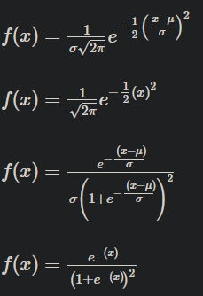

A. 2

Normal distribution has density function:<br>
f(x) = (1 / sqrt(2πσ^2) ) e ^ -1/2 * (x-μ / σ)^2

Standard normal distribution has mean 0 and variance 1.
f(x) = ( 1 / sqrt(2π*1) ) e ^ -1/2 * (x-0 / +-1)^2
     = ( 1 / sqrt(2π) ) e ^ -1/2 * x^2

### Practice Exam 2 - Q2 (QDA)
Q. Consider the following two class classification problem: Suppose the class prior probabilities is equal,
class +1 has a Gaussian distribution with mean [0,0] and covariance [1001]
and class -1 has a Gaussian distribution with mean [0,0] and covariance [5005].
Suppose we have a lot of data, and train a quadratic discriminant analysis model on this data. What will the prediction (c(x)) for this model be for x1=[0,0] and x2=[10,10]?

1. c(x1)=+1,c(x2)=+1
2. c(x1)=+1,c(x2)=−1
3. c(x1)=−1,c(x2)=−1
4. c(x1)=−1,c(x2)=+1

A. 2

Variance means how far the points are distributed. Covariance of [1001] means that the class has higher density at 0,0,
while [5005] means that the class has higher density outside the circle around 0,0.

### Practice Exam 2 - Q5 (Curves)
<br>
This figure shows the error rate of a classifier for a fixed training set size, for different sizes of the set of features. Which curve represents the apparent error, and which curve represents the true error? Does using m features or n features give better generalization performance?

1. A: true error, B: apparent error, using m features is better than using n features
2. A: apparent error, B: true error, using m features is better than using n features
3. A: true error, B: apparent error, using n features is better than using m features
4. A: apparent error, B: true error, using n features is better than using m features

A. B

The apparent error is expected to be lower and monotonic.<br>
The true error is expected to have a concave shape.<br>
Therefore A is apparent error, and B is true error. Also we can conclude that using m features is better than n.

## Week 3. Non-parametric Generative Models & Evaluation

### Practice Exam 1 - Q18 (K-NN ties)
Q. We are using a k-nn to classify c classes where c > 2.
Which tie-breaking rules are guaranteed to resolve the tie?
- Random flip, if there is a tie then you choose one at random
- Prior, pick the class with the greatest prior probability
- Use an odd value of k

A. 1

- Random flip chooses exactly one at random
- It might be that the prior probabilities are the same
- This only works for c = 2

### Practice Exam 2 - Q24 (K-nn)
Q. Which of the following statements is true for k-NN classifiers?

1. The classification accuracy is always better with larger values of k.
2. k-NN is not sensitive to feature scaling.
3. The decision boundary is linear.
4. k-NN does not require an explicit training step.

A. 4

1. Too large value of k can lead to underfitting
2. k-nn is sensitive to feature scaling, because it is a classifier that looks at the distances.
3. K-nn is a non-linear generative model
4. True, because it computes distances for all the test data points and compute the label.

### Practice Exam 2 - Q25 (Naive Bayes)
Q. Select all TRUE statements about Naive Bayes.

1. Naive Bayes can deal with correlated features.
2. Naive Bayes is sensitive to feature scaling.
3. Naive Bayes can handle high dimensional feature spaces.
4. Naive Bayes has a fast training time.
5. Naive Bayes can handle continuous and discrete data.
6. Naive Bayes doesn’t need much training data.

A. 3,4,5,6

1. Naive Bayes work by assuming that all features are independent and individually distributed (i.i.d)
2. Naive Bayes is not sensitive to feature scaling
3. Naive Bayes just multiplies all the feature values, so it can handle high-d feature space
4. It has a fast training time
5. It just multiplies the features, so true
6. True

## Week 4. Linear Discriminative Models
### 1. Discriminative objective (*)
* Q. Which of the following best describes what probabilistic discriminative approaches try to model? (w are the parameters of the model)
  </br></br>
* A. p(y|x,w)
  </br></br>
    * *Discriminative models try to directly model the conditional probability of the outcome (y) given the feature values (x), rather than modelling the joint or class conditional distributions.*
    * Discriminative models
        - p(y|x)
        - When we know the posterior probability densities, we can directly classify objects

    * Generative models
        - p(y|x) α p(y)p(x|y)
        - When we know the prior and conditional densities, we know everything about the data for classification

### 2. Linear Classifier Definition
* Q. The decision function of a linear classifier can be described by the equation:
* h_w(x) = wTx + w0
* What does w0 signify?
  </br></br>
* A. The bias ("intercept")

### 3. Gradient descent
* Q. What is true for the gradient descent algorithm?
    * Gradient descent always finds the global optimum.
    * The update of the parameters is proportional to the gradient of the function at the current point.
    * The choice of starting point could have an effect on whether a global optimum is found.
    * The descent continues until the gradient is very large.
      </br></br>
* A. 2 and 3
  </br></br>
* *The graph might also have local minimum; the starting point does matter because it could lead to the local mimimum.*
* *The descent continues until the gradient is very small i.e. zero.*

### 4. Stochastic Gradient Descent
* Q. Stochastic gradient descent performs fewer computations per update than batch gradient descent. (T/F)
  </br></br>
* A. True
  </br></br>
* *Stochastic gradient descent sums over fewer objects than batch gradient descent to calculate an update.*
* To calculate the full gradient, we need to sum over all objects.
* Instead, Stochastic GD estimates the gradient using one or a few objects and take a step using this estimate of the gradient
* The step is less precise, but we can take more steps in the same amount of time
  </br></br>
* Epoch: visiting all the data once
* Stochastic gradient descent does updates within an epoch
* Regular (batch) gradient descent does only one update per epoch
* Read [this article](https://machinelearningmastery.com/difference-between-a-batch-and-an-epoch/) for more information about batch and epoch

### 5. Logistic Classifier Decision Value
* Q. The function used to model p(y|x) in logistic regression is:
* h_w(x) = σ(wTx) where
* σ(z) = 1/(1+e^-z) is the logistic function.
* What is the value of wTx for points on the decision boundary?
  </br></br>
* A. wTx = 0
  </br></br>
* The logistic function is always in the boundary [0,1]. The decision boundary, unless set somewhere else, is the halfway between the boundaries.

### 6. Logistic Regression Decision Boundary 1
* Q. The function used to model p(y|x) in logistic regression is:
* h_w(x) = g(wTx) where g(z) = 1/(1+e^-z) is the logistic function.
* Given the 2-dimensional, 2-class dataset in the figure below, is this a possible decision boundary of the logistic classifier?
  <br>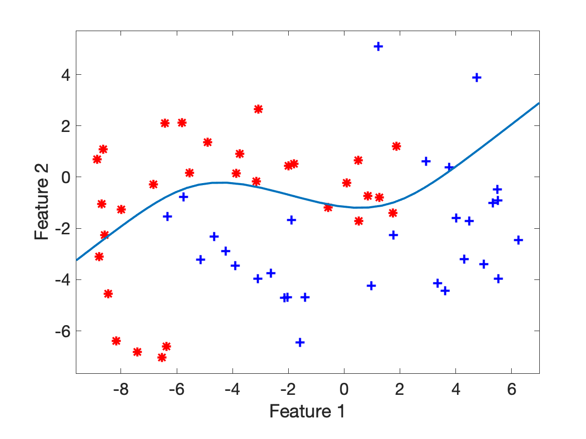
  </br></br>
* A. No
  </br></br>
* *Logistic regression is a linear classifier*

### 7. Logistic Regression Decision Boundary 2
* Q. (same question as 6)
<br>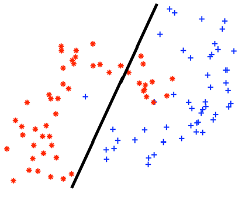

  </br></br>
* A. Yes

### 8. Logistic Regression (Separable) (*)(?)
* Q. Suppose we have a linearly separable dataset. If we run gradient descent to find the optimal parameters for logistic regression, what will these parameters converge to?
  </br></br>
* A. *As long as the direction of the decision boundary is correct, increasing the magnitude of w will continue to increase the log likelihood. So the magnitude will converge to infinity.*
  </br></br>

### 9. Empirical Risk Minimisation and Logistic Regression (*)(?)
* Q. In the empirical risk minimization framework, classifiers are defined as the function that minimizes the observed loss within a hypothesis class. For logistic regression, what is the hypothesis class?
  </br></br>
* A. Linear functions

### 10. Logistic Regression Calculation
* Q. We use logistic regression where we estimate p(Y=1|x) using p(Y=1|x) = σ(xTw), where σ(.) is the logistic function
* Suppose that w is such that for a particular x1 we have that x1Tw = 1.
* If x2 = 2x1, what will the value of p_hat(Y=1|x2) be?
  </br></br>
* A. log(p(Y=1|x2)/p(Y=0|x2)) = 2
  </br></br>
* *First note that xT2w=2. We can either fill in the values in the logistic function to verify each claim, or reason about each claim using the insight that p^(Y=1|x2), which eliminates two options. To reason about the correct answer, one could prove that the “log of the odds ratio” is the inverse of the logistic function.*
```
p(Y=0|x2) = 1 - p(Y=1|x2)
          = 1 - 1/(1-e^-x2)
          = (1-e^-x2)/(1-e^-x2) - 1/(1-e^-x2)
          = -e^-x2 / (1-e^-x2)

log(p(Y=1|x2)/p(Y=0|x2)) = log(1/(1-e^-x2)) - log(-e^-x2 / (1-e^-x2))
                         = log(1) - log(1-e^-x2) - log(-e^-x2) + log(1-e^-x2)
                         = log(1) - log(-e^-x2)
                         = x2 = 2
```

### 11. Logistic Regression Properties
* Q. Logistic regression is a ______ technique that is used to model data having a ______ outcome
  </br></br>
* A. linear, binary

### 12. Logistic vs. Squared Loss
* Q. The logistic cost function for one object is:
* L(h_w(x),y) = -ylog(h_w(x)) - (1-y)log(1-h_w(x))
* whereas for linear regression it is:
* L(h_w(x),y) = (h_w(x)-y)^2
* Explain for what reasons the cost function for logistic regression is different from one for linear regression
  </br></br>
* A. *The squared loss is usually used in a regression setting. In that case, we want to compare a continuous prediction with a continuous outcome, and either predicting too large values or too small values seems equally bad.
  For the logistic regression case, we want to penalize confident but wrong predictions, hence predicting probability 0 and observing 1 should get a large (infinte) cost.*

### 13. SVM objective
* Q. A support vector machine estimates p(y|x) (T/F)
  </br></br>
* A. False
  </br></br>
* *It only tries to fit a decision function, but it does not model the probabilities*

### 14. SVM Example
### 15. SVM application
* Q. Consider a dataset with 2 objects per class and 2 features. For the positive class, the objects are located at [0,1] and [1,0] and for negative class at [0,-1] and [-1,0].
* Give the weight vector w and the number of support vectors (SVs) that the support vector machine will find.
  </br></br>
* A. w = [1,1], wo = 0, 4 SVs

### 16. SVM properties
* Q. Given are four statements about hard-margin Support Vector Machines, indicate which statment is true.
    * The objective of the SVM training procedure is to minimize the function J(w) = 1/2 * ||w||^2
    * The objective of SVM training procedure is to minimize the value 2/||w||
    * For the SVM classification of positive classes we want wTx >= 0 and for negative classes wTx < 0
    * Support Vector Machines are low bias and high variance classifiers
      </br></br>
* A. 1
  </br></br>
* The loss function of SVM is ||w||^2 / 2
* The margin length is 2/||w||
* For decision value M,
    * xiTω + ω0 >= M if yi = +1
    * xiTω + ω0 <= -M if yi = -1
    * The support vector machine algorithm has low bias and high variance, but the trade-off can be changed by increasing the C parameter that influences the number of violations of the margin allowed in the training data which increases the bias but decreases the variance. ([see this link](https://machinelearningmastery.com/gentle-introduction-to-the-bias-variance-trade-off-in-machine-learning/))

### 17. One-vs-Rest
* Q. Suppose we want to train a classifier to differentiate between apples, pears, oranges and strawberries. We would like to use the one-versus-rest classification approach. How many boundaries do we need to find?
  </br></br>
* A. 4 or 3
  </br></br>
* 4 classes so 4
* Book says K-1 classifiers for K classes

### Practice Exam 1 - Q9 (Logistic regression)
Q. Suppose we trained a logistic regression model that uses h(x) to estimate P(Y=1|X=x) on a dataset with a single feature x, and we find parameters w0=0.0 and w1=0.5. Consider the following two predictions of this model: h(4) and h(8). Which statement is true?
- h(4)/h(8) = 2
- h(4)/h(8) = 1.11
- h(4)/h(8) = 2.22
- h(8)/h(4) = 2 
- h(8)/h(4) = 1.11
- h(8)/h(4) = 2.22

A. 5

h(x) = 1 / (1 + e^-(wTx))
h(8) = 1 / (1 + e^-(0.5 * 8 + 0.0)) = 0.982<br>
h(4) = 1 / (1 + e^-(0.5 * 4 + 0.0)) = 0.881<br>
h(8)/h(4) = 0.982/0.881 = 1.11

### Practice Exam 1 - Q10 (Support Vector Machine)
Q. Consider the following 2-class problem with classes {−1,+1} and two features. We are given a training dataset with three objects, one object at (0,2) belonging to class +1, one object at (0,-2) belonging to class -1, and one object at (0,-4) belonging to class -1.

What will the w vector be for a support vector classifier trained on this dataset, and how many support vectors are there? (note: you need to select 2 answers)

A. 2 support vectors, wT = [0, 0.5]

By drawing the points we know that there are 2 points on the margin.

[0,2]w = 1, [0,-2]w = -1<br>
0 * w0 + 2 * w1 = 1<br>
0 * w0 + -2 * w1 = -1<br>

Therefore wT = [w0, 0.5]

### Practice Exam 1 - Q22 (Double Cross-Validation)
Q. We are training a neural network with a single hidden layer to solve a binary classification problem on a dataset of 100 objects and we have 5 features. As a hyperparameter, we are going to consider 2, 3 or 4 nodes in the hidden layer. We are going to select the optimal hyperparameters using 10-fold cross-validation. To get an good estimate of the performance of this procedure, we also use 10-fold cross-validation to estimate the performance. In other words, we will be applying double cross-validation. How many models do we have to train during this process?

A. 310

In each iteration of the inner loop, we train 10 * 3 models to find the optimal setting among the 3 values of the hyperparameter, and then we train a model on all data in the training set for this iteration using this optimal setting.<br>
Since the outer loop has 10 iterations, we need to  fit 31 * 10 = 310 models.

### Practice Exam 2 - Q4 (Regression)
Q. Suppose we trained a linear regression model h(x) on a dataset with a single feature x, and we find parameters w0=−4 and w1=2. Consider the following two predictions of this model: h(4) and h(8). Which statement is true?

1. h(4)/h(8)=2
2. h(8)/h(4)=2
3. h(8)/h(4)=3
4. h(4)/h(8)=3
5. h(4)/h(8)=4
6. h(8)/h(4)=4

A. 3

In linear regression, h(x) = wTx + w0<br>
h(4) = 4*2 -4 = 4
h(8) = 8\*2 -4 = 12

h(8)/h(4) = 12/4 = 3

### Practice Exam 2 - Q6 (Thresholds)
Q. Given a decision function g(x) for a binary classifier, consider the example of an ROC curve as given in the figure. When we increase the threshold used for the classifier, what typically happens to the sensitivity (true positive rate) and specificity (true negative rate) of the classifier?
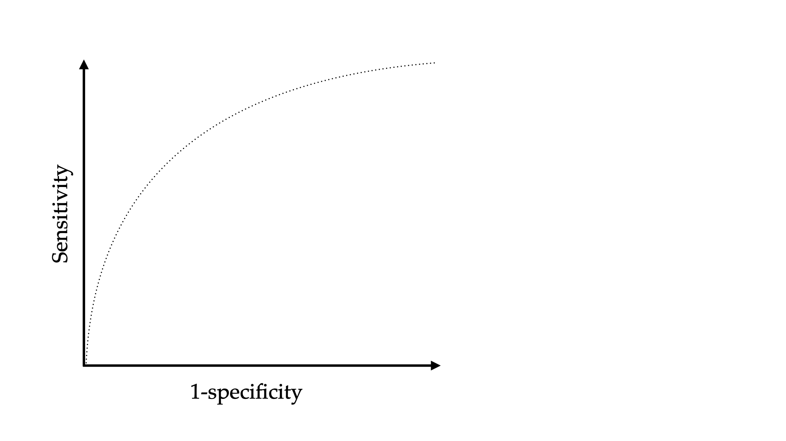

1. The sensitivity will increase, the specificity will decrease.
2. The sensitivity will decrease, the specificity will increase.
3. Both will increase
4. Both will decrease

A. 2

Increase in threshold means that more gets classified as false, and less gets classified as true.
Therefore:
- True positive decreases
- False positive decreases
- True negative increases
- False negative increases

Which means that:
- Sensitivity (true positive rate) decreases
- Specificity (true negative rate) increases

### Practice Exam 2 - Q7 (Support Vector Classifier)
Q. Given are four statements about Support Vector Classifiers, indicate which statement is true.

1. The objective of the support vector training procedure is to minimize the function J(w)=1/2∗||w||^2
2. The objective of the support vector classifier training procedure is to minimize the value of 2/||w||
3. For the support vector classifier the constraints say that it is enough for the positive objects to have wT∗x>=0 and for the negative classes to have wT∗x<0
4. Support Vector Classifiers are low bias and high variance classifiers.

A. 1

1. We want to maximise the margin, which is calculated by 2/||w||. This is equivalent as minimising 1/2 * ||w||^2.
2. We want to maximise 2/||w||
3. The positive objects have wTx - b > 0, and the negative objects have wTx - b < 0
4. SVM is a high bias and low variance classifier, because it is underfitting - linear models that model unlinear data is usually underfitting.

### Practice Exam 2 - Q8 (ERM)
Q. Fill in the blank: In the empirical risk minimization framework, we minimise the empirical risk over all functions that are elements of the (ANSWER).

1. Hypothesis class
2. Loss function 
3. Maximum Likelihood 
4. Gradient Descent

A. 1

"The empirical risk minimisation principle states that the learning algorithm should choose a hypothesis h which minimises the empirical risk."

### Practice Exam 2 - Q20 (Discriminative approaches)
Q. Which of the following best describes what discriminative approaches try to model? (w are the parameters of the model.)

1. p(y|x,w)
2. p(y|w)
3. p(x|y,w)
4. p(w|x,y)

A. 1

Discriminative models directly estimate the distribution for the decision boundary, which is p(y|x).

## Week 5. Biases & Fairness

### 1. Bias
- Q. Imagine you are going home after a party, late at night. There are two routes you can take: a shorter one where you will have to walk through an alleyway where regularly scary-looking people hang out and a longer one where you will be able to walk through a residential neighbourhood. You decide to take the longer route.
<br>Indicate all correct statements.
  - Implicit bias causes you to be afraid of scary-looking people.
  - Discrimination causes you to take the longer route.
  - Explicit bias causes you to take the longer route.
  - Explicit bias causes you to be afraid of scary-looking people.
  - Implicit bias causes you to take the longer route.
  - Discrimination causes you to be afraid of scary-looking people.
<br><br>
- A. 1 and 3
  <br><br>
- Implicit bias is an unconscious thought
- Explicit bias is the action you take from that unconscious thought
- Discrimination is an action taken based on prejudice, which is a stereotype.

### 2. Racial Bias
- Q. Amazon developed a face recognition tool that turned out to be biased: people of colour and especially women of colour, were less well classified on a gender classification task.<br>
  What sources might have caused this bias in classification results? Explain each source in a few sentences.

- A.
  - Gender imbalance in programming team: researchers/programmers typically test for their own gender/race
  - Training data bias: too few photos of people of colour and women of colour in the database

### 3. Decision making
- Q. The tax office has a computer system that decides which people’s tax returns need to be checked manually. Investigation of these tax returns that need to be checked manually shows an unexpected bias towards a certain group.
<br> Who is responsible for the decisions that are made?
  - The people who interact daily with individuals who file their tax returns.
  - The management team.
  - The programmers who implement the decision-making algorithm.
  - The individuals who file their tax returns.

- A. 3) the programmers.

### 4. Removing Features
- Q. Removing a sensitive feature will make sure that the trained model cannot discriminate based on the sensitive feature
<br> Is this statement true or false?
<br><br>
- A. False
<br><Br>
- False, it may be possible that the value of the sensitive feature can be inferred from
  the other features, and because of this reason the model can still discriminate based on the
  sensitive feature.

### 5. Profits & Fairness
- Q. In the context of predicting whether people should receive a loan, the Independence criterion allows the bank to make a larger profit than the Separation criterion.
  <br> Is this statement true or false?
<br><br>
- A. False
<br><br>
- False, the Independence criterium means from each group the same percentage needs
  to be accepted. This means the bank will make a large loss, because it needs to accept people
  that cannot pay the loan back. The Seperation criterion does allow acceptance rate to be
  different for each group and thus will allow the bank to have a larger profit.

### Practice Exam 1 - Q8 (Ethics)
Q. Which of the following statements best characterizes the difference between normative and descriptive ethics?
- Descriptive ethics offers psychological accounts of how we ought to act, whereas normative ethics offers sociological accounts of how we ought to act.
- Descriptive Ethics offers characterizations of how we act morally and think about morality as a matter of fact, while normative ethics offers a prescriptive account on how we ought to act and understand ourselves as moral beings.
- Descriptive ethics offers a characterization of how others behave morally, while normative ethics characterizes how I behave morally.
- Descriptive ethics offers a characterization of how we ought to behave while normative ethics characterizes the norms that we as a matter of fact obey as members of society.

A. 2

Descriptive ethics offers characterizations of how we act morally and think about morality as a matter of fact<br>
Normative ethics offers a prescriptive account on how we ought to act and understand ourselves as moral beings<br>

The main difference between normative ethics and descriptive ethics is that normative ethics analyses how people ought to act whereas descriptive ethics analyses what people think is right.

Basically, normative ethics is the study of ethical action whereas descriptive ethics is the study of people’s views about moral beliefs.
- https://pediaa.com/difference-between-normative-ethics-and-descriptive-ethics/

Put simply, normative -> norm, descriptive -> describes people

### Practice Exam 1 - Q11 (Debiasing)
Q. The results of a speech recognition algorithm show a strong bias against a particular group of speakers. What can you do to mitigate this bias?
- You change the parameters of your algorithm to disfavour the group of speakers towards which the bias occurs (i.e., which are better recognised).
- You check the distribution of the speaker groups in the training material and change these if necessary.
- You add more training data of the speaker group against which the bias occurs.

A. All three

In order to fix the bias against one group, we can either
- make the favoured group little more disfavoured (change the parameters)
- change the distribution of the training set
  - add more training data of the disfavoured group

### Practice Exam 1 - Q23 (Proxy problem)
Q. Which of the following statements best characterizes the ‘proxy problem’ that we will likely have to confront in our effort to avoid biases in ML applications?

...

A. Biases are due to ‘proxy attributes’: seemingly innocuous attributes that correlate with socially sensitive attributes, serving as proxies for the socially-sensitive attributes themselves. The problem is that these attributes also function to increase the accuracy of the application. We are thus confronted with a trade-off between de-biasing an application by decreasing its reliance on proxy attributes and the positive role these same attributes might play in increasing the accuracy of the application.

Example of a proxy attribute: zip code.<br>
zip code is the region, and from this we can assume race, income, relgion etc.

## Practice Exam 1 - Q24 (Bias and Discrimination)
Q. Ethics in/of machine learning is really important. As computer scientists we have a responsibility to make our software fair. There are different concepts important in ethics in machine learning. This question is about bias. Which two statements regarding bias are correct?
- Bias in software can lead to discrimination against or for groups of people.
- Bias is not likely to occur in most software.
- Bias is not easily avoided or removed from software.
- Bias is primarily caused by inadequate or even evil programmers.

A. 1,3

### Practice Exam 2 - Q19 (Ethics)
Q. The introduction of IT and machine learning on decision-making has made life a lot easier for many people. People simply need to fill in an online form to apply for something and the decision about the application is quickly made. However, there are problems with this increasing dependency on software. Name three and describe them in maximally 2 sentences each.

A.
- Many people are computer illiterate and do not know or cannot fill online forms
- Forms are processed digitally, no room for sympathy or empathy for the applicant by the computer
- Data is shared between different companies and offices, and these data do not always have the same meaning
- Decisions are pre-programmed by programmers who are not decision makers and do not know anything of the process about which they develop the software to make the decision
- The underlying algorithm might be biased against certain group of people
- It is hard to make an appeal against a decision by the person affected.

### Practice Exam 2 - Q22 (Fairness in ML)
Q. An important part of developing software based on machine learning techniques is ensuring that the outcome of the model is as fair as possible. Which of the following statements related to fairness in machine learning are correct?

1. One can try to be fair to similar groups of people or to similar people, but not to groups and individuals at the same time.
2. Assuming that different people have different abilities for a given task is a form of fairness.
3. Fairness can be viewed as equal opportunities for everyone irrespective of their skills set.
4. In order to improve fairness one only needs to change the distribution of the training data.

A. 1,2,3

1. In fairness, there can be individual fairness or group fairness but not individual to group.
2. WYSIWIG approach
3. WAE approach
4. . 

### Practice Exam 2 - Q23 (Bias)
Q. Harmful biases in ML applications are not always known or predictable before they are put into practice. Which statements about biases are correct?

1. An ML application is as biased as it is taught to be; ‘garbage in, garbage out.’ ML applications are not inherently biased.
2. Despite the current opacity in the working of many ML applications, further research may allow us to make them fully transparent and explainable. Once we understand better how complex ML application work, we can systematically get rid of any harmful biases.
3. Shifts in the domain of application of an ML application can lead to the application suddenly exhibiting harmful biases.


## Week 6. Non-Linear Discriminative Models

### 1. Decision Tree Properties
- Q. True or false?
  - A) Decision trees are non-linear classifiers.
  - B) Decision Trees are parametric classifiers.
  - C) Decision trees grow depending on the complexity of the training data.
  - D) The structure of the decision tree is predefined.
  - E) Decision trees explicitly model the joint probability distribution p(x|y) of each class and use Bayes Rule to compute the posterior probability p(y|x).
<br><Br>
- A.
  - A) True
  - B) True
  - C) True
    - The more complex the data is, the more decision nodes there have to be.
  - D) False
    - We can prune them to avoid overfitting as well.
  - E) False
    - Decision Tree is a discriminative model; the description is about generative models

### 2. Entropy
- Q. In building a decision tree, entropy is used in the determination of the “best” attribute to split the node on. What does entropy measure?
  - The number of positive examples in the subset after splitting the data.
  - The difference between the number of positive examples in the subset before and after the split.
  - The pureness of the subset of examples after splitting the data.
  - The improvement in pureness of the subset of examples after splitting the data compared to the pureness before the split.
<br><br>
- A. 3. The pureness
<br><Br>
- Entropy is one of the measure of impurity we use to calculate improvement.

### 3. Split calculation
Easy question; skipped

### 4. Decision Trees selection
- Q. A decision tree is created by splitting the data sequentially on the basis of an attribute. How do you determine which attribute to split the data on?
<br><br>
- A. You pick the best attribute, where 'best' is defined as the split that leads to the highest information gain.

### 5. Perceptron Definition
- Q. Here you see a graphical depiction of a perceptron. What do the x, w, and y denote?<br>
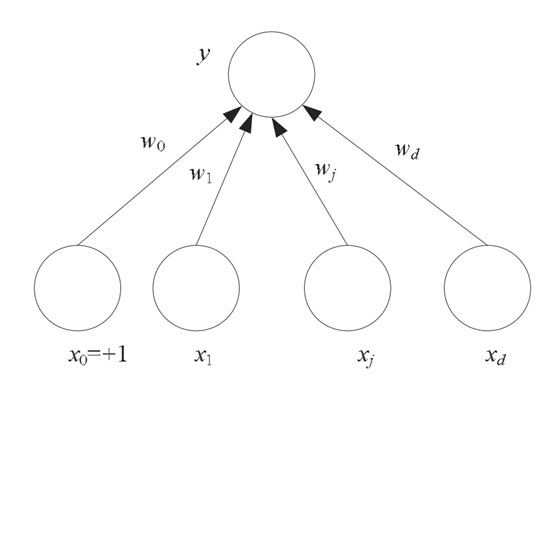<br>
<br>
- A. x = input values / w = weights / y = output value

### 6. Perceptron Properties
- Q. A perceptron is a linear classifier. True or False?
<br><br>
- A. True
<BR><BR>
- A single perceptron is a linear classifier; multiple makes it nonlinear.

### 7. MLP Properties
- Q. Multi-layer perceptrons are
  - Linear/Nonlinear
  - Discriminative/Generative model
<BR><BR>
- A. Nonlinear, Discriminative

### 8. Backpropagation
- Q. Backpropagation is a method to 
  - Efficiently calculate the gradient of the loss of a neural network
  - Efficiently calculate the loss of a neural network
  - Revert the network back to a previous state in which it performed better
  - Revert the network back to the initial state before training
<BR><BR>
- A. 2. gradient of loss of a neural network
<BR><BR>
- For each layer, we calculate the gradient of the error function with respect to each weight.
  The gradient vector indicates the direction of the highest increase in a function, while we want the highest decrease

### 9. MLP Flow
- Q. Here you see a graphical depiction of a multi-layer perceptron. How is the value of the hidden units calculated?<br>
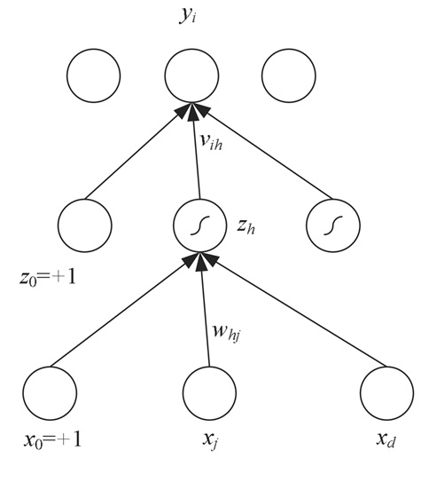<br>
<BR>
- A. An activation function is applied to the multiplication of the input x and the weights w, plus the bias x0.
<BR><BR>
- An activation function is how we work with x, w and bias. It is used to determine the output of neural network (like yes or no)

### 10. MLP Flow 2
easy question; skipped

### 11. MLP Calculation
<br>
- Q. Consider the multi-layer perceptron depicted in the figure, where the numbers next to the edges denote the weight of each connection. Suppose we use a logistic activation function for both the hidden nodes and the output node.
<br>
- If the input to this model is xT=[5,−2], what will the value for y^ be?
  - y^=0.0
  - 0.0<y^<0.5
  - y^=0.5
  - 0.5<y^<1.0
  - y^=1.0
<BR><BR>
- A. 0.0<y^<0.5
<BR><BR>
- input at h1 = 1 * 0 + 5 * 0.2 + -2 * 1 = -1
- value at h1 = σ(-1) -> 0 < h1 < 0.5
- input at h2 = 0
- value at h2 = σ(0) = 0.5
<br><br>
- input at y is lower than 0
- Therefore value at y is 0.0 < y^ < 0.5

### 12. ERM, MLP, Decision Trees
- Q. In this course, we used the framework of Empirical Risk Minimization to introduce several machine learning methods.
  - Multi-layer Perceptrons are a form of Empirical Risk Minimization, Decision Trees are not
  - Decision Trees are a form of Empirical Risk Minimization, Multi-layer Perceptrons are not
  - Both Multi-layer Perceptrons and Decision Trees are a form of Empirical Risk Minimization
  - Neither Multi-layer Perceptrons nor Decision Trees are a form of Empirical Risk Minimization
<BR><BR>
- A. 3. Both
<BR><BR>
- Pruning is a way to minimise risk in decision tree; Backpropagation for MLP.

### Practice Exam 1 - Q26 (Multilayer Perceptron)
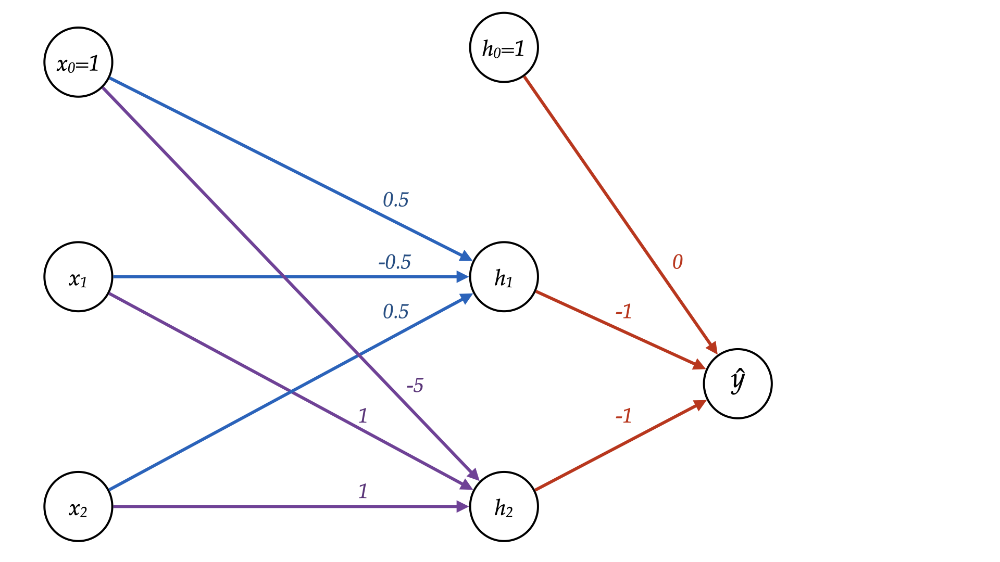<br>
Consider the multilayer perceptron depicted in the figure, where the numbers next to the edges denote the weight of each connection. Suppose we use a step function activation function (a function which returns 1 if its input is bigger than 0, and returns 0 otherwise) for both the hidden nodes and the output node.

If the input to this model is xT=[4,2], what will the value for h2 and y^ be?

A. h2 = 1, y = 0

input at h1 = 1 * 0.5 + 4 * -0.5 + 2 * 0.5 = -0.5<br>
value at h1 = 0<br>
input at h2 = 1 * -5 + 4 * 1 + 2 * 1 = 1<br>
value at h2 = 1<br>
input at y^ = 1 * 0 + 0.5 * -1 + 1 * -1 = -1.5<br>
value at y^ = 0

### Practice Exam 1 - Q7 (Decision Trees)
Q. Select all statements that are true for decision trees.
- If we scale the feature values in both the train and test data, the predictions of the model might change.
- If we use the gini index instead of the entropy to measure node impurity, the predictions of the model might change
- If we multiply all continuous features in our training and test set by -1 (i.e. we flip their sign), the predictions of the model might change.

A. 2

Scaling the train and the test set by the same factor does not affect the prediction of the decision tree, as the decision boundary stays the same with respect to the data points.

### Practice Exam 2 - Q10 (Continuous variables)
Q. Consider splitting on a continuous feature during the training of a decision tree classifier. Which of the following is always true?

1. Scaling the feature values has no effect on the information gain.
2. If the same feature was already used to split in a higher node in the tree (closer to the root), using it again can never improve the tree.
3. The number of thresholds for the split we need to consider is quadratic in the number of objects in the node.
4. Splitting on a continuous feature will lead to higher information gain than splitting on a discrete feature.

A. 1

1. In decision trees, feature scaling has no effect.
2. We can use a feature again and get information gain
3. No, because we can split into more than two nodes.
4. Splitting on a discrete feature usually has higher information gain


## Week 7: Unsupervised Learning
### 1. k-means
- Q. Given are four points: (2, 2), (8,6), (6,8), (2,4) and two randomly selected cluster centroids μ1 = (2,8) and μ2 = (7,2).<br>
What are the new centroids after one iteration of k-means algorithm?
<br><br>
- A. (4,6) and (5,4)
<BR><BR>
- Compute the distances of each points from the two centroids. Add the points to the nearest clusters, and compute the mean

### 2. Agglomerative
- Q. 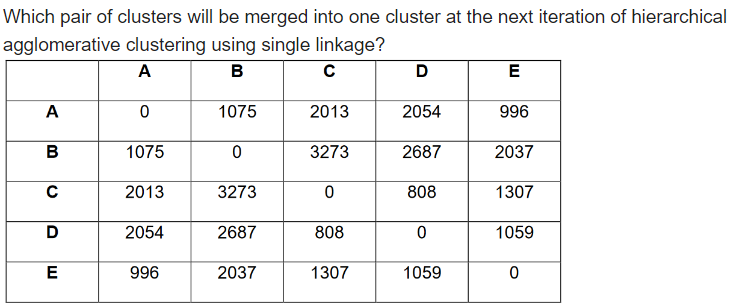
<BR><BR>
- A. C and D
<BR><BR>
- In agglomerative approach, we join two clusters that are the closest.
- For single linkage, the distance of another cluster C from the newly joint cluster of A and B is the minimum distance between d(A,C) and d(B,C)
- For complete linkage, we take max(d(A,C), d(B,C)).
### 3. Clustering k-means
- Q. The choice of k, the number of cluster k-means partitions data into:
  - should always be as large as your computer system can handle
  - has maximum of 10
  - depend on why you are clustering the data
  - is a personal choice that shouldn’t be discussed in public
<BR><BR>
- A. 3

### 4. Dendrogram
Q. What is a dendrogram?<br>
- a type of hierarchical clustering.
- a type of barchart diagram to visualize k-means.
- a tree diagram used to illustrate the arrangement of clusters in partitional clustering.
- a tree diagram used to illustrate the arrangement of clusters in hierarchical clustering.

<br>
A. 4

### 5. K-means
Q. 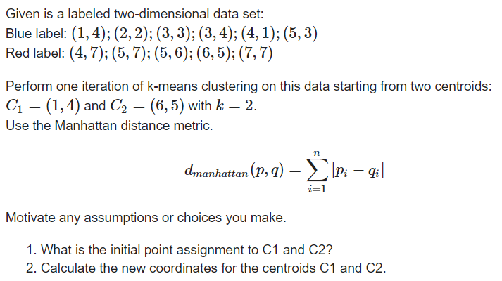<br>

A. Correct point assignment:

C1: (4, 1), (2, 2), (3, 3), (3, 4), (1, 4)<br>
C2: (5, 3), (4, 7), (5, 7), (5, 6), (6, 5), (7, 7)

OR

C1: (2, 2), (3, 3), (3, 4), (1, 4)<br>
C2: (5, 3), (4, 7), (5, 7), (5, 6), (6, 5), (7, 7), (4, 1)

correct centroids:

C1: (13/5, 14/5)<br>
C2: (32/6, 35/6)<br>
or<br>
C1: (9/4, 13/4)<br>
C2: (36/7, 36/7)<br>

### 6. PCA *
Q. Which of the following statements is TRUE about Principal Components Analysis? Assume that each eigenvectors of the covariance matrix has a unique eigenvalue.
- If you use PCA to project d-dimensional points onto j principal components, and then you run PCA again to project those j-dimensional points onto k principal components, with d>j>k, you always get the same result as if you had just used PCA to project the d-dimensional points directly onto k principal components.
- If you perform an arbitrary rotation of the data points as a group in the original feature space before performing PCA, the largest eigenvalue of the sample covariance matrix will change.
- If you perform an arbitrary rotation of the data points as a group in the original feature space before performing PCA, the principal component directions does not change.
- If you append a 1 to the end of every data point the results of performing PCA will not change. The only changes are that the principal component vectors will have an extra 0 at the end, and there is one extra useless component with eigenvalue zero.


A. 1 and 4.<br>

- Regarding rotations, there is no scaling so although all eigenvectors change their direction, eigenvalues remain constant.

### 7. PCA
Q. 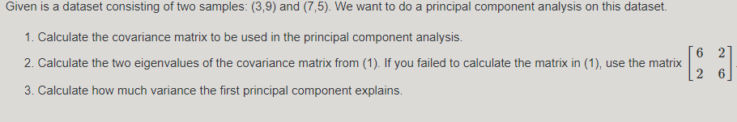<br>

A.
1. [4  -4]<br>
   [-4  4]<br>
2. 8 and 0
3. 100%

- For 1.
  - Var(X) = E[(X-E[X])^2]
  - Cov(X,Y) = E[(X-E[X])(Y-E[Y])]]
- For 2.
  - det([4-λ  -4]) = 0<br>
  .....([-4  4-λ])
  - (4-λ)^2 - 16 = 0
  - λ = 8 or λ = 0
- For 3.
  - 8 / (8+0) = 100%

### 8. PCA what?
Q. Which of the following is/are true about PCA? 
1. PCA is an unsupervised method
2. It searches for the directions where data have the largest variance
3. Maximum number of principal components <= number of features
4. All principal components are orthogonal to each other

A. All

### 9. PCA *
Q. Explain why you need to center the data (subtract mean) before applying a PCA.<br>

A. After we zero-mean the data, the covariance matrix equals 1/n XT X.

### Practice Exam 1 - Q4 (Dimensionality reduction)
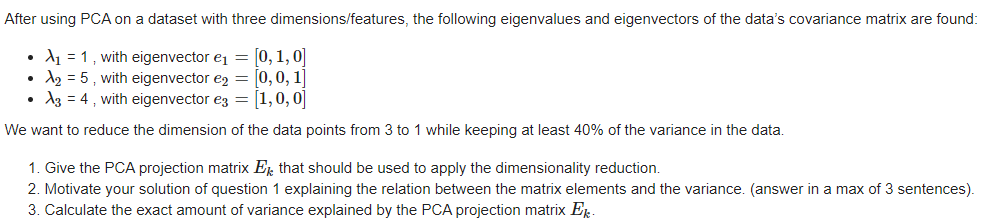<br>

A.
1. [0 0 1]T
2. We always choose the eigenvector with the highest eigenvalue to keep the original variance as much as possible.
3. 50%
   - 5 / (1+5+4) = 0.5

### Practice Exam 1 - Q5 (Hierarchical Clustering)
Q. What does the height of each cluster (the y-axis of each cluster in the dendrogram) represent?

A. The height of the dendrogram indicates the order in which the clusters were joined.

The higher up the dendrogram, the more dissimilar the datapoints are.

### Practice Exam 1 - Q15 (PCA)
Q. Principal component analysis (PCA) is the process of computing the principal components (PCs) and using them to perform a change of basis on the data, sometimes using only the first few principal components and ignoring the rest.

Choose the correct statement:
- Performing the PCA means:
  - projecting the data in the direction of each PC, and scaling it by a factor of λ (eigenvalue) of that direction (eigenvector).
  - projecting the data in the direction of each PC, without scaling it by a factor of λ (eigenvalue) of that direction (eigenvector).
  - translating the data to be zero mean and normalize to have unit variance.
  - performing dimensionality reduction by choosing a subset of features that have maximum variance from the original set of features.

A. 2

The eigenvalues are for us to choose the eigenvalues with the highest variance.

### Practice Exam 2 - Q11 (Hierarchical clustering)
Q. Agglomerative hierarchical clustering is used for clustering a dataset of non-overlapping points. The following parameters were used in the setup:
- Merging rule: Single linkage
- Distance measure: Euclidean

In each iteration of the hierarchical clustering, a new cluster is created. If the merging rule changes to complete linkage, how would that affect the creation of a cluster after the very first iteration of the algorithm. Choose the correct answer from the choices below:

1. Single linkage seeks more isolated groups, so the sum of distances measured between points of the first cluster using complete linkage will be larger.
2. Complete linkage seeks more internal cohesion, so the sum of distances measured between points of the first cluster using complete linkage will be smaller.
3. The first cluster created might not be the same when using different merging rule.
4. None of the answers are correct
5. All of the answers are correct

A. 4

Single linkage seeks more internal cohesion by taking the closest cluster, while complete linkage seeks more isolated groups.<br>
Also, merging rule does not affect the first cluster because it applies on computing the distance between clusters after the cluster is made.

### Practice Exam 2 - Q12 (PCA)
Q. For a given dataset represented by feature vectors of length 6 (6 features per datapoint), the PCA technique is performed and resulted in the following eigen_pairs:

- λ1 = 8 , with eigenvector e1=[1,0,0,0,0,0]
- λ2 = 3 , with eigenvector e2=[0,1,0,0,0,0]
- λ3 = 1.5 , with eigenvector e3=[0,0,1,0,0,0]
- λ4 = 1 , with eigenvector e4=[0,0,0,1,0,0]
- λ5 = 0 , with eigenvector e5=[0,0,0,0,1,0]
- λ6 = 0 , with eigenvector e6=[0,0,0,0,0,1]

Answer the following:
1. Using the elbow method, which PCA components should be chosen for the dimensionality reduction?
2. What is the intrinsic dimensionality of this data?

A.
1. λ1, λ2, λ3, using the elbow method. This is because the elbow will be located at λ3.
2. 4 dimensions.

### Practice Exam 2 - Q13 (PCA - definition)
Q. Which of the following statements about PCA is incorrect:

1. The components we find become the new dimensions of our data.
2. The principal components are ordered from those that account for the largest variance to the ones that account for the smallest variance in the data.
3. The principal components are given by the eigenvectors of the data matrix. 
4. In practice, we tend to use power iteration since it is faster to compute than the analytical solution.

A. 3

1. We project the data onto the components, so true
2. The components that account for the largest variance is prioritised.
3. We use the covariance matrix, not data matrix
4. Power iteration is faster

### Practice Exam 2 - Q14 (K-means)
Q. After a certain number of iterations of the k-means algorithm applied with two clusters and Euclidean distance metric we know the following about the clusters:
- Centroid 1: (-2, 2, 3), number of points: 9
- Centroid 2: (4, 3, 5), number of points: 4

We know that only a single sample S at (2, -1, 2) changed its cluster. Indicate the cluster to which S will be assigned and its new centroid.

1. Cluster 1 with new centroid at (0,0.5,1.5)
2. Cluster 1 with new centroid at (-1.6, 1.7, 2.9)
3. Cluster 2 with new centroid at (3, 1, 3.5)
4. Cluster 2 with new centroid at (3.6, 2.2, 4.4)

A. 2

Computing the euclidean distance from the point to 2 centroids, we learn that centroid 1 is closer and therefore the point is assigned to cluster 1.<br>
New centroid = (-2*9, 2\*9, 3\*9) + (2, -1, 2) / 10 = (-16, 17, 29) / 10 = (-1.6, 1.7, 2.9)

