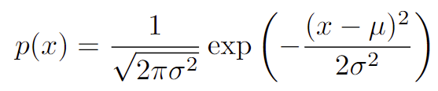
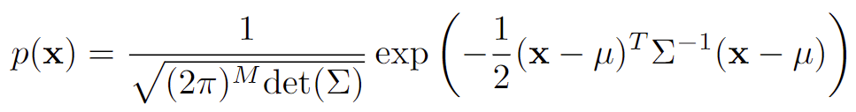
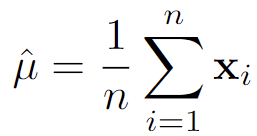
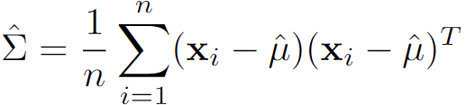
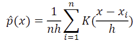
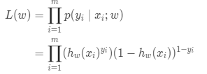
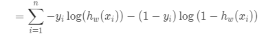
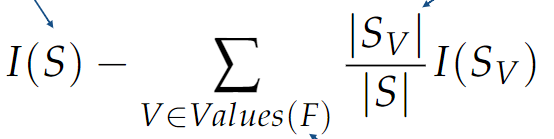
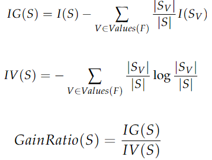

# The Ultimate Cheat Sheet

---

# 0. Probability and Bayes Rule

## Bayes' Rule
$ p(y|x) = \frac{p(x)}{p(x|y)p(y)} $
- p(y) = class prior
- p(x|y) = class conditional pdf
  - usually modelled by Gaussian distribution
- p(x) = unconditional probability

## Classification error
$p(error) = \sum_{i=1}^{C} p(error|w_i)p(w_i)$

## Bayes' error
- Minimum attainable error
- Typically larger than 0
- Cannot obtain them because we do not know the true distribution
- Bayes' error depends on distribution, not classifcation rule

# 1. Generative models
Generative model calculates p(y|x) y approximating p(x|y) and p(x)

## A. Parametric models
Parametric models depend on Gaussian distribution. 
 
 
μ = mean, σ^2 = variance, Σ = covariance matrix.

Mean can be approximated as: 

Covariance matrix can be approximated as: 

### QDA
- Given by ln(p(x|yi)p(yi)) - ln(p(x|yj)p(yj))
- f(x) = wTWx + wTx + w0
  - W = 1/2 (Σ_2^-1 - Σ_1^-1)
- Separate covariance matrix
- High variance - Low bias

### LDA
- Assuming that all covariance matrices are equal.
- f(x) = wTx + w0
- Low variance - High bias

### Nearest mean classifier
- Assuming that all covariance matrices are identity matrix and all features are uncorrelated
- Uses distance to the mean of each class => Sensitive to feature scaling
- Normalisation needed: one method is zero-mean unit-variance (~x = (x-μ)/σ)
- Low variance - High bias

## B. Non-parametric models

### Parzen/Kernel density function
1. Place cells around data points
2. Define the cell shape (box, tri, triweight, Gaussian)
3. Fix the size of the cell (h)
4. Add contributions of cells

 

Depending on the size of h, the model can be underfitting(too large h) or overfitting(too small h)

### K-nearest neighbours
1. Locate the cell on the new point x
2. Increase the cell volume until it covers k objects
3. Predict class y

p(x|yi) = ki / niVk (Vk) 
p(yi) = ni/n

- We could use different distances
- Choose k wisely
- Resolving tie algorithm
- Good because no explicit training is needed
- Sensitive to feature scaling

### Naive Bayes
p(x|yi) = p(x1|yi) p(x2|yi) ... p(xd|yi) 
class conditional pdf is calculated by multiplying all the feature values.

- We assume that all the data are independent
- It can handle high dimensional feature space
- Training time is fast
- Missing values can be ignored
- Easily fooled
- Zero frequency problem: never allow zero probabilities

# 2. Discriminative models
Discriminative models directly approximates p(y|x).

Empirical risk minimisation
- for joint probability, we can construct the classifier using empirical risk minimisation
- min 1/N * Σ(i=1, N) L(h(xi),yi)
  - h: hypothesis function
  - L: loss/cost function

Different measures of loss function:
- Regression: linear regression
- Classification: logistic regression, support vector machine

## A. Linear classifiers

### Linear regression
Comparing the outcome of our hypothesis function and the actual label
- Absolute difference
- Squared difference (can penalise large differences)

min 1/N Σ(i=1, N) (xiTw + w0 - yi)^2 = min _w,w0 J(w,w0)

We can find the best w and w0 using gradient descent.

#### Gradient descent
Follow the derivative until we hit a local minimum.
1. Take the derivative of the loss function in terms of both w and w0
2. Pick random values for parameters
3. Plug the parameter values into derivatives
4. Calculate the step sizes: StepSize = Slope * Learning Rate
5. Calculate the new parameters:
   - New parameter = old parameter - step size
6. Repeat from step 3 and repeat until
   - Step size is smaller than the minimum step size
   - or you reach the maximum number of steps

Learning rate is the speed of descent: too high can lead to overshooting; too small can lead to slow performance

Initial parameter important because it decides if we reach local or global minimum

Stochastic gradient descent updates parameters on each iteration

Linear regression has low variance and high bias

### Logistic regression
Use logistic function σ(x) = 1/(1+e^-x)

Maximum likelihood function: 
 

Equivalent to negative log likelihood, which is the cost function: 
 

Do gradient descent to find optimal parameters

Low variance and high bias

### Support Vector Machine
Maximise the margin
- margin: the distance between the classification boundary and the closest objects
- support vectors: objects on the margin

The decision boundary is defined by wx - b = 0 
The offset from the boundary to the support vectors is given by b/||w|| 
We maximise b/||w||, or minimise ||w||

Hinge loss used for violations (max(1-y h(x), 0))

Low variance and high bias

### Multiclass Classification
1. Directly construct a multi-class classifier
2. Combine multiple binary classifiers
   - One vs rest: k-1 binary classifiers that discriminates each class from all others
   - One vs one: k(k-1)/2 binary classifiers that discriminates between all pairs of classes 

## B. Non-linear classifiers

### Decision Trees
1. Make partitions in the feature space
2. Assign values to each part
   - If all objects in a node belong to one class: we are done
   - If not, find a node-variable combination that increases the quality of the tree the most after splitting
     - Measure of improvement
       - Information gain
         - 
         - I: impurity
           - Misclassification (1 - max_c(p_c))
           - Entropy: -Σ p_c * log(p_c)
           - Gini index: Σ p_c * (1 - p_c)
         - S: set of objects in the node
         - F: feature that we consider
         - S_V: Number of objects in the node with value V
       - Gain ratio
         - Because information gain is biased towards features with many discrete values, we use gain ratio to avoid overfitting
         - 
3. When to stop training
   - minimum node size
   - minimum gain
   - max depth
   - Pruning (subtree replacement pruning)
     - For each node we pretend to remove the node and all its children and measure performance on the validation set
     - Remove node that result in the greatest improvement
     - Repeat until further pruning is harmful

Insensitive to feature scaling

### Classifier combining
Combining different classifiers can lead to improvement in overall performance by exploiting classifiers' strengths.

Combining strategies
- Fixed rules
  - Hard rules e.g. majority voting
  - Soft rules e.g. mean, product
- Learned rules
  - Learn a classifier to output a decision based on the outputs of a set of base classifiers

What to combine
- Randomly selecting samples: bagging
- Randomly selecting features: random subspaces

Random forest: construct a large number of trees using randomly selected objects and features and combine their decisions

It is flexible and has low bias. It also works for many different types of data

### Multilayer Perceptron
A perceptron has:
- input unit xi
- bias x0
- connection weight wi
- output unit y

Then the final output is calculated by putting y into the activation function.

Layers in multilayer perceptron:
1. input layer
2. hidden layer
3. output layer

Perceptron training
1. Forward-pass
   - Process of perceptron training by passing on the result of the activation function of the previous layer to the next layer's activation function
   - We initialise the weights with a random value, but this is not sufficient. We therefore apply gradient descent on the output value to find the optimal weights.
   - This means we need to move backward: backpropagation
2. Backpropagation
   1. Output value of forward pass is compared to the label
   2. Calculate error using a loss function
   3. Error is propagated back through the network, layer by layer:
      - Update weights depending on how much they contributed to the error, thus trying to find the weights that minimise the loss function:
        - Calculate the gradients of the error function with respect to each weight
        - The gradient vector indicates the direction of the highest increase in a function, while we want the highest decrease
   
    The iterative updating of the weights can be done as follows:
   1. Recalculate the gradients at the beginning of each training iteration step
   2. Stop when error < θ or if we are at the max number of iterations
   3. The general to update weights is as follows :w_t <- w_(t-1) - α(δΕ/δw), where
      - α is the learning rate
      - δΕ/δw are partial derivatives of the error function E with respect to each weight of the array w

# 3. Unsupervised learning

## Clustering
1. Proximity measure
   - Similarity measure, or Dissimilarity measure using:
     - Euclidean, Manhattan, Minkowski, etc
2. Cluster evaluation
   - Intra-cluster cohesion (compactness)
     - measures how near the datapoints are to the cluster's mean
     - calculated by the sum of squared errors
   - Intro-cluster separation (isolation)\
     - measures the distance between two clusters
     - which should be as large as possible
3. Clustering algorithms
   - K-means
   - Hierarchical

### K-means clustering
Partition the given data into k clusters with cluster centroid (mean)
1. Choose k (random) data points to be initial centroids
2. Assign each data point to the closest centroid
3. Recompute the centroids using the current cluster memberships
4. If a convergence criterion is not met, repeat steps 2 and 3
   - Convergence criterion
     - No (or minimum) re-assignments of data points to different clusters
     - No (or minimum) change of centroids or
     - Minimum decrease in the sum of squared errors

Choosing k
- Inspect visually
- Known purpose
- Elbow method

### Hierarchical clustering
We form a dendrogram; the top level contains all the points, and the bottom level contains one cluster per data point

Two approaches
1. Bottom-up (agglomerative)
   1. each point starts as a cluster
   2. merge the two closest clusters
     - determine the distances between all clusters
     - merge clusters that are the closest
       - Single linkage: two nearest objects in the clusters
       - Complete linkage: two remote objects in the clusters
       - Average linkage: clusters centers
     - If all the points don't belong to one cluster, repeat
   3. stop at some point
2. Top-down (divisive)
   1. All points start in one cluster
   2. split the cluster in a sensible way
      - run k-means on the original data
      - on each resulting cluster, run k-means again
   3. stop at some point

## Dimensionality Reduction
We can reduce the dimensionality to:
- make storage or processing of data easier
- discovery of hidden patterns in the data
- remove redundant and noisy features
- intrinsic dimensionality might be smaller

1. Feature selection
2. Feature extraction

### PCA
Principal components analysis (PCA) maps the data onto a linear subspace, such that the variance of the projected data is maximised

We have to look at eigenvectors and eigenvalues of the covariance matrix. We prioritise the eigenvectors with higher eigenvalues, because they account for greater variance. 
Calculating how much an eigenvector accounts for the total variance can be computed by: (corresponding eigenvalue) / (sum of all eigenvalues)

Finding eigenpairs:
1. Pivotal condensation
   - Restate the definition of eigenpair as (M - λI)e = 0, which holds if the determinant of (M - λI) is 0. (M: original matrix, λ: eigenvalue, e: eigenvector, I: identity matrix)
2. Power iteration
    1. Start with any unit vector x0
    2. compute Mxk until xk+1 := Mxk / ||Mxk|| converge
        1. get Sx0 vector
        2. compute the sum of squares of the vector components (frobenius norms)
        3. divide each component of the vector by frobenius norms to obtain x1
        4. repeat until convergence
    3. the limiting vector is the principal eigenvector
    4. when converged, compute the eigenvalue λ1 = xT M x
    5. to find a second eigenpair, create a new matrix M* = M - λ1 x xT
    6. use power iteration on M* and so on

Issues of PCA:
1. Covariance is extremely sensitive to large values
2. PCA assumes the underlying subspace is linear so we need to transform it to handle non-linear spaces

PCA is an0 unsupervised discriminative model

# 4. Classifier evaluation
We have learnt to use many different classifiers; we need to choose one that is appropriate to our problem. 
We decide this by looking at their performance, i.e. their classification errors. 
We can get the classification error by splitting the data set into training and test sets, and there are many ways to divide them.

## Test/training set division
1. Bootstrapping
   - Randomly draw N objects from N objects with replacement
   - Use the leftover objects for testing
2. K-fold cross validation
   - Divide the dataset in k sets
   - Use 1 for testing, the rest for training
   - rotate k times so that all sets are used for testing once
3. Leave-one-out
   - k-fold with k=1. So all objects are tested as test object
4. Double cross validation
   - Do cross validation inside cross validation
   - In the internal cross validation, test different hyperparameters
   - Choose the best hyperparameter, and use that to test on the test set
   - Rotate

## Learning curves
A learning curve shoes how our error is changing with the number of training samples.
- Apparent error is usually lower, and it increases with increasing number of training set
- True error is usually higher, and it decreases with increasing number of training set

A very complex classifier is flexible enough to to model any decision boundary if it is given a lot of training set.

## Bias-Variance dilemma
Bias
- error from erroneous assumptions in the learning algorithms
- high bias can cause algorithm to miss the relevant relations between features and target output
- high bias = underfitting

Variance
- error from sensitivity to small fluctuation in the training set
- high variance can cause an algorithm to model the random noise in the training data
- high variance = overfitting

## ROC curves
> A curve where on each axis is the error of the classes 
> Allows to look at the possible tradeoffs of the two classes 
> Obtained by varying the classifier threshold

Using ROC, we can see the result of changing the prior probabilities of classes. 

Sensitivity, Specificity and Threshold
- Sensitivity
  - True positive rate
  - Decreases as threshold increases
- Specificity
  - True negative rate
  - Increases as threshold increases

# 5. Bias and Fairness
## Definitions
- Bias
  - > Preference or inclination for or against something.
  - > Often accompanied by a tendency to ignore the merits of relevant alternatives or other points of view.
  - Implicit bias
    - > Expectations based on learned coincidences, which unknowingly affect everyday perceptions, judgement, memory, and behaviour
    - > An implicit bias may lead to discrimination.
  - Explicit bias
    - > The explicit bias is informed by implicit bias but is also at least in part a conscious choice.
    - > For example, walking on the other side of the street (conscious action) when you see a scary-looking person (implicit bias).
- Prejudice
  - > An assumption made without adequate knowledge
  - > Usually resistant to rational influence
- Discrimination
  - > Actions taken based on a prejudice
- Proxy Bias
  - > Bias by a way of a proxy variable
  - Proxy variable
    - > A variable that is related to a variable of interest to the degree that it can operate as a substitute

## Bias in ML
Source of bias is the training set.
- Lack of diversity in ML developers
- Implicit human biases in our cultures
- Evil programmers

### Fairness
> The absence of bias or discrimination on specific realms

How to quantify fairness:
1. Data vs Model
   - Fairness can be quantified in the training dataset
   - or in the learned model
2. Individual vs Group 
   - Individual fairness: seeks for similar individuals to be treated similarly
   - Group fairness: partitions a population into groups defined by protected attributes and seeks for some statistical measure to be equal across groups
3. WAE vs WYSIWIG
   - WAE (we are all equal): defines fairness as an equal distribution of skills and opportunities
   - WYSIWIG (what you see is what you get): observations reflect ability with respect to the task

### Debiasing
1. Data vs Model
   - Check the distribution of class labels in the training set.
   - Equalise the distribution in the training set
2. Individual vs Group
   - Individual fairness: 2 individuals on either side of the line are very similar but different outcome
   - Group fairness: be aware of correlations of variables with other variables that the algorithm uses (e.g. surnames with geographical census data)
3. WAE vs WYSIWIG
   - Can be debiased by a smart implementation of the algorithm

## Measuring fairness & adapting models
We can measure fairness using statistics. We have two approaches for the criteria:
1. Independence
2. Separation

### Independence
> The acceptance rate for each group should be the same. 
> The classification rule does not have to be the same for each group

P(R = 1|A = a) = P(R = 1|A = b) 
Where R: classifier output, A: sensitive attribute

Two approaches:
1. Having different model per group
2. Pre-processing the data
   - pre-process the data in such a way that it becomes impossible to tell from which group a candidate comes.

Problem: for extreme cases, independence can be very inefficient

### Separation
> Instead of having equal acceptance rate, go for equal fraction of mistakes for each group
> False negative / actual positive = False positive / actual negative

