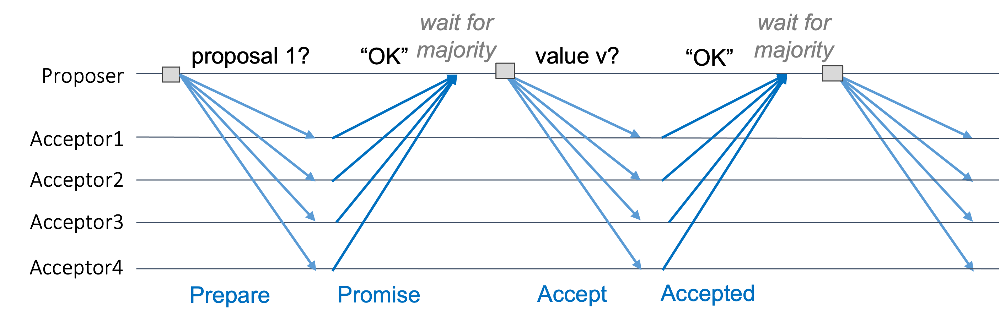

# 1. Introduction to Distributed Systems
> Distributed system is a software system in which
> components located on _networked computers communicate and coordinate
> their actions by passing messages_

## Parallel vs Distributed systems
Parallel: shared memory vs. Distributed: no shared components

## Why use distributed systems?
- Inherent distribution:
    - Information dissemination (publishers/subscribers)
    - Distributed process control and storage
    - Cooperative work (different nodes on a network for read/write)
- Distribution as an artifact:
    - Performance
    - Scalability
    - Availability
    - Fault tolerance

## Characteristics of DS
- Computational entities each with own memory
    - Need to synchronize distributed state
- Entities communicate with message passing
- Each entity maintains parts of the complete picture
- Need to tolerate failure

## Main problems in DS
1. Partial failures
    - Some parts of the system may fail, while other parts work fine
2. Unreliable networks
    - Distributed systems communicate over unreliable networks
3. Unreliable time
    - Although time is a universal principle, it cannot be used to determine order of events happening
4. No single source of truth, different options
    - Distributed systems need to coordinate and agree upon a truth

## 1. Partial failures
If one part of the system fails but the system as a whole works, it can cause some outages.

It is hard to detect whether something failed or not because it takes time for a message to travel across the network.

 

## 2. Unreliable networks
There are two types of network systems:
- Synchronous system
    - Process execution speeds or message delivery times are bounded.
    - Pure synchronous system only exists in theory
- Asynchronous system
    - No assumptions about process execution speeds or message delivery times are made.
    - Most DS's use some form of asynchronous networking

Failures in asynchronous system: upon waiting for response to a request, it is not possible to distinguish whether: 
- the request was lost,
- the remote node is down,
- or the response was lost.

Common solution: set timeouts and retry until it works.
This is used by Ethernet, TCP, etc.

Because retransmission introduces delays, we could use partially-synchronous systems: 
There exist upper bounds on the network delay, but the programmer does not know them.

 

## 3. Unreliable time
Time is essential because it is the only global constraint that nodes can rely on to make decisions on ordering problems.

However, because each node has its own sense of time,
instead of using the precise clock time, we could introduce other logical ways to determine orders.

- for a single sender, FIFO should be enough to maintain order.
- for multiple sender/receiver, we need external ordering scheme
    - Total order
        - if our message rate is globally bounded and less fine-grained than our clock accuracy, then use RTCs
    - Causal order
        - otherwise, rely on happens-before relationship

### Happens-before relation (->)
Events in the distributed system:
1. a process performs some local computation
2. it sends a message
3. another process receives a message

Happens-before relation captures dependencies between events:
- if a and b are events in the same node and a occurs before b, then a -> b
- if a is the event of sending a message and b is receiving that, then a -> b
- the relation is transitive

Two events not related to happens-before are concurrent

**1. Lamport Timestamps**
 How they work:
- Each individual process p maintains a counter: LT(p)
- When a process p performs an action, it increments LT(p)
- When a process sends a message, it includes LT(p) in the message
- When a process q receives a message from p with LT(p), q updates its LT(q) to max(LT(p), LT(q)) + 1

For two events a and b, if a->b then LT(a) < LT(b)

However, we could have two processes that did not have any interaction but still satisfy the happens-before relation.

**2. Vector clocks**
 How they work:
- On a system with N nodes, each node i maintains a Vector V_i of size N.
    - V_i[i] is the number of events that occurred at node i
    - V_i[j] is the number of events that i knows occurred at node j
- They are updated as follows:
    - Local event increments V_i[i]
    - When i sends a message to j, it includes V_i
    - When j receives V_i, it updates all elements of V_j to the larger one

For two events a and b, a->b iff VC(a) < VC(b)

Vector clocks are expensive to maintain: they require O(n) timestamps to be exchanged with each communication.

## 4. Distributed decision making
Nodes in DS cannot know anything for sure because clocks are unsynced and their own information might not be true anymore.
  Therefore reaching consensus is a fundamental problem in DS.

We can come across different types of problems, and we have different algorithms to solve them.

 

### Problem 1: The 2-generals problem
Context: 2 armies are camped in opposing hills with the enemy in between, and they need to decide on a time to attack.
They are only able to communicate by messengers, but the enemy can intercept the messengers.

In this case, it is impossible to make a reliable decision.

 

### Problem 2: The Byzantine generals problem
Context: several divisions of the Byzantine army are camped around the army. They need to agree upon whether they attack or retreat.
The problem is that the generals can only communicate by messengers, and there can be traitors. All loyal generals must agree on a plan

With only three generals no solution can work in the presence of a single traitor. 
Byzantine generals problem only work with at least 3f+1 nodes with f traitors.

 

### Consensus algorithm 1: Paxos consensus algorithm
Three roles:
- Proposer
    - chooses a value and sends it to a set of acceptors to collect votes
- Acceptor
    - vote to accept or reject the values proposed by the proposer
- Learner
    - adopt the value when a large enough number of acceptors have accepted it

Acceptance of the proposals by a majority of processes/servers provide fault tolerance.

Steps:
1. Voting
    - Prepare
        - a proposer selects a proposal number n
        - sends a "prepare" request Prepare(n) to acceptors
    - Promise
        - if n is higher than every previous proposal number received, the acceptor returns "Promise" to the proposer
        - this ignores all future proposals having a number less than n (used as a reference)
2. Replication
    - Accept
        - if the proposer receives a response from a majority of acceptors, then it sends Accept(n) with highest n among the responses.
    - Accepted
        - if an acceptor receives an accept request for a proposal numbered n
        - it accepts the proposal unless it has already responded to a prepare request having a n >= the proposal number

 

 

### Consensus algorithm 2: Raft consensus algorithm
> A leader-based asymmetric model: 
> a node in a system can only be one of the three states: leader, follower, or candidate

1. Leader election
    - Raft defines the following server states:
        - Candidate
            - Candidate for being a leader, asking for votes
        - Leader
            - Accepts log entries from clients, replicates them on other servers
        - Follower
            - Replicate the leader's state machine
    - If the leader server crashes, a new leader is voted

 

2. Log replication
    - The leader accepts log entries from clients and replicates them across the servers
        - each log entry also has an integer index identifying its position in the log
        - the leader sends *AppendEntries* message to append an entry to the log
        - a log entry is committed once the leader that created the entry has replicated it on a majority of the servers

  

Paxos and Raft algorithm tolerate crash faults with 2f+1 nodes with f faulty nodes. 
They cannot tolerate Byzantine fault because they assume that the messages are valid and true. 

Algorithms for tolerating Byzantine faults are: Practical Byzantine Fault Tolerance (PBFT), Bitcoin

 