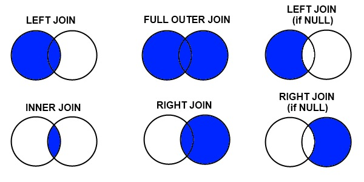

# Spark

---
## 0. The world before Spark
### Parallelism
Parallelism is about speeding up computations by using multiple processors.
- Task parallelism
  - Different computations performed on the same data
- Data parallelism
  - Apply the same computation on dataset partitions

When processing big data, data parallelism is used to move computations close to the data, instead of moving data in the network.

However, there are some issues with data parallelism also:
- Latency
  - Operations are 1000 times (disk) or 1000000 times (network) slower than accessing data in memory
- (Partial) Failures
  - Computations on hundreds of machines may fail at any time.

### Map/Reduce
```
map((K1, V1), f: (K1, V1) -> (K2, V2)): List[(K2, V2)]
reduce((K2, List[V2])): List[(K3, V3)]
```

## 1. Spark

### What is Spark?
> Spark is an open source cluster computing framework.

Spark:
- automates distribution of data and computations on a cluster of computers
- provides a fault-tolerant abstraction to distributed datasets
- is based on functional programming primitives
- provides two abstractions to data, list-like(RDD) and table-like(Dataset)

## 2. RDDs

### What is RDD?
> Resilient Distributed Datasets<br>
> The core abstraction used by Spark

RDDs make datasets distributed over a cluster of machines look like a Scala collection.<br>
RDDs:
- are immutable
- reside (mostly) in memory
- are transparently distributed
- feature all FP programming primitives

In practice, RDD[A] works like Scala's List[A]

### RDD creation
1. Reading from external file<br>
```val rdd1 = sc.textFile("file://...")```
2. Converting a local dataset<br>
```val xs = (list)```<br>
```val rdd = RDD[A] = sc.parallelize(xs)```
3. Transforming another RDD<br>
```rdd.map(func)```

### RDD transformations
One type of operation we can do on an RDD is transformation. Transformation is applying a function that returns a new RDD. They are lazy.

1. map
   - Apply f on all items in the RDD and returns an RDD of the result
   - ```RDD[A].map(f:A → B): RDD[B]```
2. flatMap
   - Apply f on all RDD contents and return an RDD with the contents of all intermediate iterators
   - ```RDD[A].flatMap(f:A → Iterable[B]): RDD[B]```
3. filter
   - Apply predicate p and returns items that satisfy it
   - ```RDD[A].filter(p:A → Boolean): RDD[A]```


### RDD actions
Another type of operation is action. Action requests the computation of a result. They are eager.

1. collect
   - Return all elements of an RDD
   - ```RDD[A].collect(): Array[A]```
2. take
   - Return the first n elements of the RDD
   - ```RDD[A].take(n): Array[A]```
3. reduce, fold
   - Combine all elements to a single result of the same type
   - ```RDD[A].reduce(f:(A,A) → A): A```
4. aggregate
   - Aggregate the elements of each partition, and then the results for all the partitions
   - ```RDD[A].aggr(init:B)(seqOp:(B,A) → B, combOp: (B,B) → B): B```
   - Example: calculating average of a collection of integers
     - ```
       val inputRdd = sc.parallelize(List(1, 2, 3, 4, 5))
       val forAvg = inputRdd.aggregate((0 ,0))((acc, value) => (acc._1 + value, acc._2 + 1),
       (acc1, acc2) => (acc1._1 + acc2._1, (acc1._2 + acc2._2)))
       val avg = forAvg._1.toDouble / forAvg._2.toDouble
       ```
  <br>

### Pair RDDs
RDDs can represent any complex data type if it can be iterated.<br>
RDD of a key-value pair is treated specially, named PairRDDs.

#### Transformations on Pair RDDs
```
val odyssey = sc.textFile("sample.txt").flatMap(_.split(" "))
val words = odyssey.flatMap(_.split(" ")).map(c => (c, 1))
```
1. groupByKey
   - Group the values to form a key value pair
   - Example: counting words
     - ```
       val counts = words.groupByKey() // RDD[(String, Iterable[Int])]
          .map(row => (row._1, row._2.sum)) // RDD[(String, Int)]
          .collect() // Array[(String, Int)]
       ```

2. reduceByKey
   - Merge the values for each key using an associative and commutative reduce function
   - ```reduceByKey(f:(V,V) → V): RDD[(K,V)]```
   - Example: counting words
     - ```
       val counts2 = words.reduceByKey(_ + _) // RDD[(String, Int)]
          .collect()  // Array[(String, Int)]
       ```
3. aggregateByKey
   - Aggregate the values of each key, using given combine function and a neutral "zero value"
   - ```aggrByKey(zero:U)(f:(U,V) → U, g:(U,U) → U): RDD[(K,U)]```
   - Example: counting words
     - ```
         val counts3 = words.aggregateByKey(0)(_ + _, _ + _) // RDD[(String, Int)]
       ```
4. join
   - Return an RDD containing all pairs of elements with matching keys
   - ```join(b: RDD[(K,W)]): RDD[(K,(V,W))]```
   - have to use ```rdd.keyBy(_.(field))``` in order to specify which key to join the rdds on

  - join types
    - <br>
    - Given a “left” RDD[(K,A)] and a “right” RDD[(K,B)]
      - Inner Join (join): The result contains only records that have the keys in both RDDs.
      - Outer joins (left/rightOuterJoin): The result contains records that have keys in either the “left” or the “right” RDD in addition to the inner join results.
        - ```
          left.loj(right): RDD[(K,(A,Option[B]))]
          left.roj(right):RDD[(K,(Option[A],B))]
          ```
      - Full outer join: The result contains records that have the keys in any of the "left" or the "right" RDD in addition to the inner join results.
        - ```left.foj(right):RDD[(K,(Option[A],Option[B]))]```

## 3. Spark Internals
Internally, each RDD is characterized by five main properties:
- a list of partitions
- a function for computing each split
- a list of dependencies on other RDDs
- Optionally, a partitioner for Pair RDDs
- Optionally, a list of preferred locations to compute each split on

### Partitions
Data in RDDs are split into partitions. Partitions define a unit of computation and persistence.

#### How does partitioning work
Spark supports 3 types of partitioning schemes:
1. Default partitioning
   - Splits in equally sized partitions, without knowing the underlying data properties
2. Range partitioning
   - Only configurable on Pair RDDs
   - Takes into account the natural order of keys to split the dataset in the required number of partitions.
   - Requires keys to be naturally ordered and keys to be equally distributed across the value range
3. Hash partitioning
   - Only configurable on Pair RDDs
   - Calculates a hash over each item key and then produces the modulo of this hash to determine the new partition.
   - ```key.hashCode() % numPartitions```

#### Partition dependencies
- Narrow dependencies: each partition of the source RDD is used by at most one partition of the target RDD.
- Wide dependencies: multiple partitions in the target RDD depend on a single partition in the source RDD.


### Shuffling
When operations need to calculate results using a common characteristics (e.g. a common key), this data needs to reside on the same physical node.<br>
The process of re-arranging data so that similar records end up in the same partitions is called shuffling.

Shuffling is very expensive and we want to avoid it.

Shuffling example:<br>


In order to minimize shuffles, we could use transformations such as ```groupByKey``` and ```reduceByKey```<br>


### RDD lineage
RDDs contain information on how to compute themselves, including dependencies to other RDDs.

Lineage information allow an RDD to be traced to its ancestors.


### Persistence
Data in RDD is stored in three ways:
- As Java objects: each item in RDD is an object
- As serialised data: special memory-efficient formats which are costly to create but faster to send
- On the filesystem: in case the RDD is too big, it can be mapped on a file system (usually HDFS)

We can configure and store frequently used computations in memory by caching it (using ```.persist(StorageLevel.//storage level)```)<br>
Storage levels:
- MEMORY_ONLY
  - default level
  - store RDD as deserialised Java objects in the JVM
  - if it doesn't fit, it is not cached
- MEMORY_AND_DISK
  - same as MEMORY_ONLY but extra data is stored on the disk
- MEMORY_ONLY_SER
  - store RDD as serialised Java objects
  - more space-efficient but more CPU-intensive to read
- MEMORY_AND_DISK_SER
  - store whatever doesn't fit in the disk
- DISK_ONLY
  - store in disk only


## 4. Spark SQL
We can make RDDs as Data Frames in a form of tables with columns, which allows us to perform operations that are similar to those in SQL.

SparkSQL is a library which provides two main abstractions:
- Datasets: collections of strongly-typed objects
- Dataframes: essentially Dataset of Dataset rows.
- SQL syntax

### Creating Data Frames and Datasets
1. From RDDs with tuples, e.g. RDD[(String, Int, String)]
   - ```val df = rdd.toDF("name", "id", "address")```
2. From RDDs with known complex types, e.g. RDD[Person]
   - ```val df = persons.toDF() // Columns names/types are inferred!```
3. From RDDs, with manual schema definition
   - ```
     val schema = StructType(Array(
     StructField("level", StringType, nullable = true),
     StructField("date", DateType, nullable = true),
     StructField("client_id", IntegerType, nullable = true),
     StructField("stage", StringType, nullable = true),
     StructField("msg", StringType, nullable = true),
     ))
     val rowRDD = sc.textFile("ghtorrent-log.txt")
     .map(_.split(" ")).
     .map(r => Row(r(0), new Date(r(1)), r(2).toInt, r(3), r(4)))
     
     val logDF = spark.createDataFrame(rowRDD, schema)
     ```
4. By reading (semi-)structured data files

### RDD vs Dataset
- Similarity
  - Strongly typed
  - Contain objects that need to be serialised
- Difference
  - Datasets use special Encoders to convert the data in compact internal formats so that Spark can directly apply operations

### Dataframe operations
1. Projection
    - select
    - drop
2. Selection
    - filter
3. Join
   - all types of joins are supported
     - ```people.join(department, people.deptId == department.id, how = left_outer)```
4. Grouping and Aggregations
   - groupBy
   - Aggregations only work after groupBy

### What makes SparkSQL so fast
1. Optimisation
2. Code generation