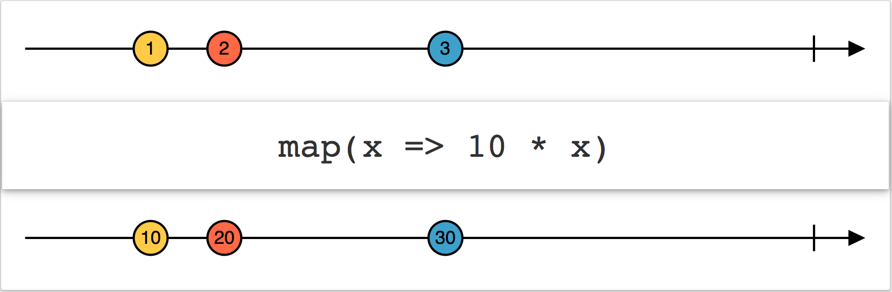
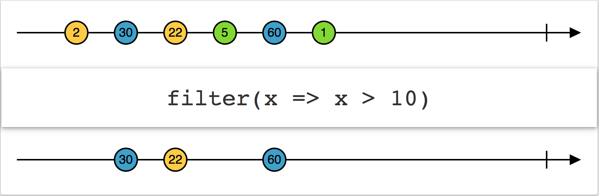
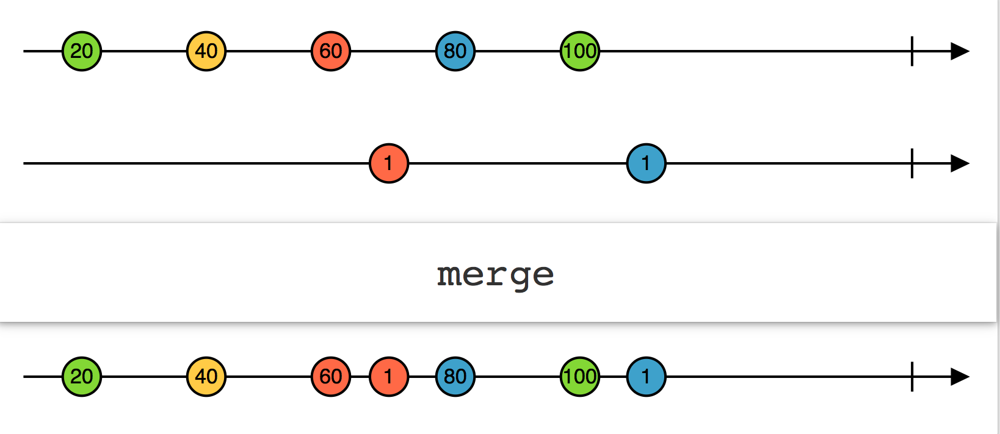
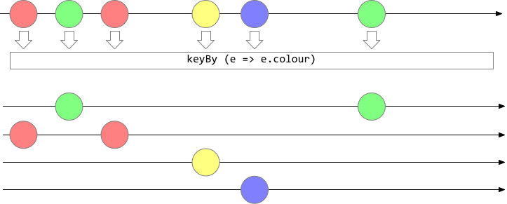
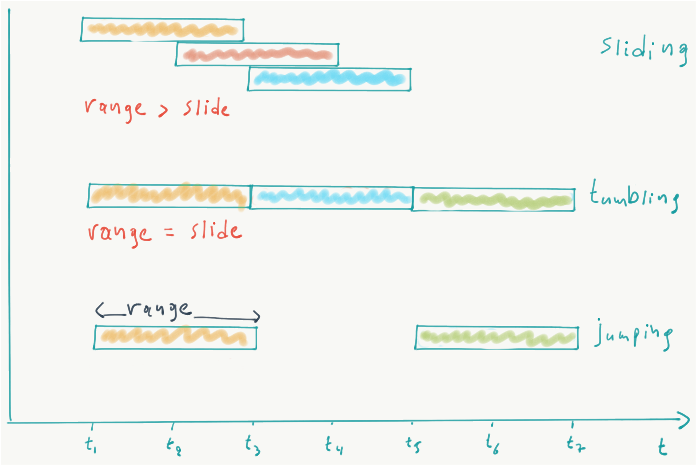
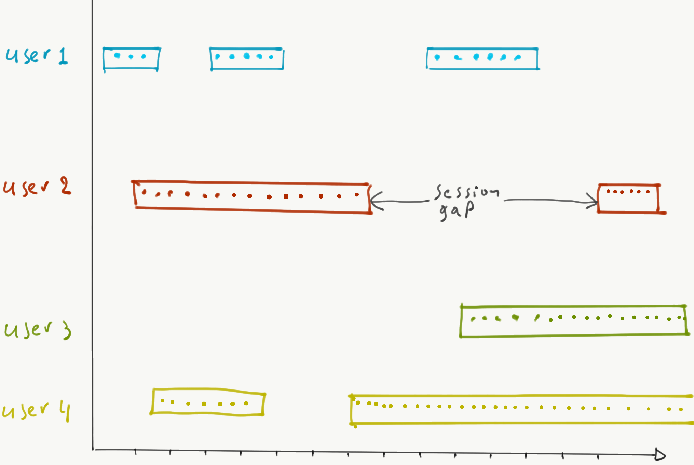

# Stream Processing

---
## 1. Stream processing and Batch processing
> Batch processing: applies an algorithm on a bounded dataset to produce a single result at the end<br>
> example: Unix, Map/Reduce, Spark

> Stream processing: applies an algorithm on continuously updating data and continuously creates results<br>
> example: Flink, Storm


### Bounded and unbounded data
> Bounded data is a dataset that can be enumerated and/or iterated upon<br>
> example: students, countries etc

> Unbounded data is a dataset that we can only enumerate given a snapshot. They do not have a size propety
> <br>example: facebook posts, natural numbers etc


### Use cases for stream processing
- Intrusion and fraud detection
- Algorithmic trading
- Process monitoring
- Traffic monitoring

<br>


Stream processing is a set of techniques and corresponding systems that process **timestamped events**.<br>
For a stream processing system to work, we need two major components:
1. A component that acquires events from producers and forwards it to consumers
2. A component that processes events

Both of them need to be scalable, distributable, and fault-tolerant.


## 2. Messaging systems
> Messaging systems connects consumers to producers.

Stream processing deals with *events*. Events are produced by continuous processes and in order for an event to be processed it must be consumed.<br>

### Publish/Subscribe
An N-to-N messaging system
- Direct messaging systems
  - use simple network communication (usually UDP) to broadcast messages to multiple consumers.
  - they are fast but there is data loss
  - example: ZeroMQ
- Message brokers / Queues
  - centralised systems that sit between producers and consumers
  - deal with the complexities of reliable message delivery

### Broker-based messaging
The producers send messages in any of the following modes:
- Fire and forget
  - The broker acks the message immediately
- Transaction-based
  - The broker writes the message to permanent storage prior to acking it

The broker:
1. buffers the messages (spils to disk also if needed)
2. routes the messages to the appropriate queues
3. notifies consumers when messages have arrived

The consumers:
1. subscribe to a queue that contains the desired messages
2. ack the message receipt

#### Drawbacks of broker-based messaging
After a message is received, it disappears.
- We cannot reprocess images
- We cannot prove that a message was delivered

To solve this, we can store before forwarding the message.

### Log-based messaging systems
> A log is an append-only data structure stored on disk.

We can exploit logs to implement messaging systems:
1. Producers append messages to the log
2. The broker partitions and distributes the log to a cluster of machines (for performance), and keep track of the current message offset for each consumer per partition
3. All consumers connect to the log and pull messages from it. A new client starts processing from the beginning of the log


## 3. Programming Models for Stream Processing
> Programming models for streams enable processing of events to derive a state.

- Event sourcing / Command Query Segregation (CQS)
- Reactive programming
- The DataFlow model

### Event sourcing & CQS
> Capture all changes to an application state as a sequence of events

Instead of mutating the application state, we store the event that causes the mutation in an immutable log.<br>
The application state is generated when processing the events.

### Reactive programming
> Declarative programming paradigm concerned with data streams and the propagation of change<br>

Reactive APIs model event sources as infinite collections on which observers subscribe to receive events.

### The DataFlow model
> The DataFlow model attempts to explain stream processing in What, Where, When, How.

- What: results are being computed
- Where: in *event time* they are being computed
- When: in *processing time* they are materialised
- How: earlier results relate to later refinements

<br>

- Processing time vs Event time
  - Processing time is the time events are observed in the system
  - Event time is the time events ocurred

<br>

### What: operations on streams
- Element wise operations: apply a function to each individual message. Similar to map or flatMap in batch systems
  - map
    - convert types of stream elements
    - ```Stream[A].map(x: A → B): Stream[B]```
    - 
  - filter
    - Only keep events that satisfy the predicate.
    - ```Stream[A].filter(x: A → Boolean): Stream[A]```
    - 
  - merge
    - Emit a stream that combines all events from both streams.
    - ```Stream[A].merge(b: Stream[B>: A]):Stream[B]```
    - 
  - flatMap
    - Apply f on all elements of Stream[A] and flatten any nested results to a new stream.
    - ```flatMap(f: A → Stream[B]): Stream[B]```
  - keyBy
    - Partition a stream using a discriminator function and produce (a stream of) streams that emit the partitioned data.
    - ```Stream[A].keyBy(f: A → K): Stream[(K,Stream[A])]```
    - 
  - join
    - Join streams A and B using key selector functions kl and kr. The result selector rs derives the result type.
    - ```
      Stream[A].join(b: Stream[B],
               kl: A => K,
               kr: B => K,
               rs: (A,B) => R): Stream[R]
      ```
- Aggregations: group multiple events and apply a reduction
  - our event stream is infinite, so how can we aggregate events?
  - we can create event groups by timeframe or by count

<br>

### Where: Streaming Windows
Different windowng in streaming systems:<br>
<br>
Windows are static size (e.g. 1000 events) or time-length "batches" of data.

1. Tumbling windows
   - Segment events into fixed sizes and then perform a function against the events in the collection
   - Segmentations can be based on the count or period of time etc.
   - There is no overlap between windows; an event can only be part of one window
2. Jumping windows
   - Based on fixed time intervals
   - Windows may overlap (events can belong to multiple windows)
   - Defined by window time size and the advance interval
3. Sliding windows
   - Sliding windows produce an output only when events occur
   - Every window has at least one window
   - Events may belong to multiple windows
4. Session windows
   - Group events that arrive at similar times and filters out periods of time without any data
   - Three main parameters:
     - timeout - if no events within this timeout, close window
     - maximum duration - maximum period of window
     - partitioning key - if provided, the session window is applied to a group of events with specific keys independently.



#### Things to remember
- Buffering: aggregation functions are applied when the window finishes. This means that in-flight events need to be buffered in RAM and spilled to disk
- Completeness: given that events may arrive out of order, how can we know that a window is ready to be materialised?

### When: Window Triggers
> A trigger defines when in _processing time_ the results of a window are processed.

Types of triggers:
- Per-record triggers - fire after x records in a window have been encountered
- Aligned delay triggers - fire after a specified amount of time has passed across all active windows
- Unaligned delay triggers - fire after a specified amount of time has passed after the first event in a single window

#### Watermarks
> Watermarks are a declaration that by a point in stream, all events carrying a timestamp up to the watermark timestamp should have arrived.

Event-time processors need to determine how much event time has progressed in order to trigger windows. Relying on processing time to trigger windows is not enough.<br>
This is why we need watermarks. Watermarks allow late messages to be processed up to a specified amount of (event-time) delay.


### How: Window Refinements
In certain complex cases, a combination of triggers and watermarks flowing may cause a window to be processed multiple times.<BR>
In such cases, we can discard, accumulate, or accumulate and retract the window state.m 