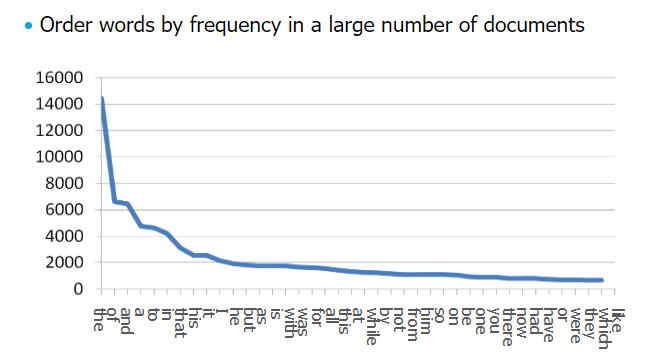
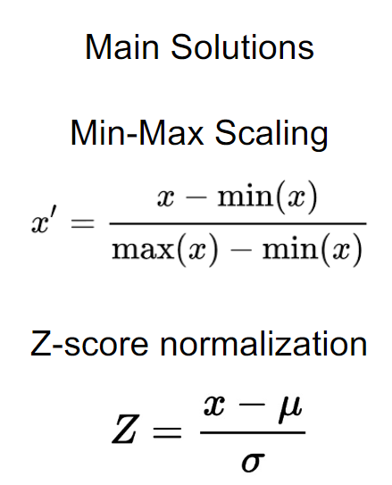

# Preprocessing

---

> How to deal with Data

## Overview
- Distributions
  - Gaussian
  - power laws
  - transformation
- Feature
  - extraction
  - reduction
  - transformation
  - addition
- Data
  - sampling
  - synthesis
  - imputation

## 1. Distributions

### Gaussian distributed
In machine learning, we have learnt that much data is often Gaussian distributed. 
Central Limit Theorem: the normalised sum of any independent random data tends towards a Gaussian distribution.

Several ML model assume Gaussian distributed data for computational reasons, though most work fine on non-Gaussian data.
  How can we use them on non-normal data?

### Power Laws
> Power law: a linear relationship between the logarithms of two variables

Real-world data often follows power laws. 
They usually have long tails, like the example below: 

To use these data, we often need to lessen the effect of very large values. In order to do this, we usually take the log of the data. 
In other words, we transform the data.

### Distribution Transformation
Several ML algorithms require specific (typically normal) distributed data. 
However, some patterns become obvious only after transformation, so we need to apply transformation and visualise the data.

#### Box-Cox transform
Transform different distributions, or make any data normally distributed via optimisation:

Finding λ for: 

For different value of λ, Box-Cox can model several transformations.

In order to optimise λ, we have to try different values and pick the maximum.

#### Quantile transform
1. Compute the rank R(x) (percentile) for data point x
2. Assume a distribution D() (e.g. normal, over a fixed range (0,1))
3. Every point x' in the range ((0,1)) has a rank R_D(x') under D()
4. Map x to x' such that R(x) = R_D(x')

#### Feature range and Row normalisation
Different feature ranges can be a problem because:
- Computing distances becomes problematic
- Feature weights are not very meaningful
- Loss/errors are problems, especially when squared

Solutions for feature range: 

Even after normalising features, rows have different sizes. 
Row normalisation fixes this by ensuring every row's norm is the same (i.e., sums to 1, or different norm) 

  

Deciding which transformation to perform:
- Depends on
  - Data
  - Pipeline (classifier/clusterer/etc)
- If the algorithm requires normal distribution, use power or quantile transform
- Keep in mind that transformation changes distances
- Also be careful about the interpretation (large may actually be small)

## 2. Features

An example: find similarities between a collection of text documents, using a machine learning model

### Feature extraction
Counting the frequency of each word would give a feature vector for each document.

This process is called feature extraction. 
Afterwards, you can run any classifier on the obtained data.

### Feature reduction/selection
When we extract features, the rows(number of features) can be very large.

This is a problem because:
- long run-time, large overhead
- curse of dimensionality

We can fix this by:
- dropping useless features
- reduce the dimensionality

Which features to choose?
1. Choose features that correlate with the class
2. Choose features that explain a large part of the data variance
3. Choose those that do not correlate with already selected ones
4. Choose those that lead to the best performance

### Feature transformation
Think of a situation where we need to use categorical data in continuous models. 
Category is a discrete value, but we need to predict them for classes that are continuous. 
Example:  

How can we transform the data to be usable in continuous models?
1. Label encoding
   - 
   - However, it can be difficult to separate values.
2. Target encoding
   - Sort according to positive class probability
   - 
   - However, it would be "cheating" if the test set is used to determine the label for each category
3. One-hot encoding
   - Every value is a new column
   - 
   - Unseen values need to be handled
   - Blow-up in dimensionality
4. Binning
   - Option 1. Equal range (binning)
   - Option 2. Equal frequency (percentiles)
   - Then use distances (for clustering) or class labels (for classification) to learn a model
   - Or reduce dimensionality first, cluster the latent space

Which encoding to use depends on the classifier.

### Feature addition
We can add features to make a non-linearly separable dataset into a linearly separable one.

We need to make sure that the new features can be added to the test data without requiring the class label.

## 3. Data handling
Let's suppose we have unbalanced data, e.g. 99% of our data is benign and 1% is fraudulent. 
Most ML fail because it reaches 99% accuracy if it labels everything as benign, and the loss function essentially does not match our objective.

How can we still use machine learning in this setting?
1. Sampling
   - Oversample minority class
   - Undersample majority class
2. Weighting
   - Assign large weights to minority class
   - Assign small weights to majority class
3. Synthesizing
   - Add artificial minority class instances

### Sampling
Issue: by sampling, you force the algorithm to learn from a distribution different from the testing distribution

- Oversampling issues:
  - Overfitting: the sampled examples provide false evidence of a positive label at a very specific point, possibly an anomaly
  - Ignorance: some classifiers ignore multiple copies (can also be a good thing)
- Undersampling issues:
  - Information loss: some examples can be essential for good performance

### (Re)Weighting
Reweighting is similar to sampling, but it does not remove information.

However, not all classifiers use weights. Another option is adjusting the prior distribution, but overfitting still remains as a problem.

### Adding synthetic minority instances - Handling unbalanced dataset
#### SMOTE
Synthetic Minority Oversampling Technique
1. For every minority instance i
2. Randomly select one of the k nearest neighbours x
3. Compute the vector v(i,x) between i and x
   - i + v(i,x) = x
4. Randomly select a point p along this vector
   - p = i + rand(0,1) * v(i,x)
5. Add p to the minority instances

#### Tomek links
> When two objects of different classes are each other's nearest neighbour, we call them Tomek links.

To further improve the performance of SMOTE, some Tomek links can be removed.

Idk, #whateverworks ¯\_(ツ)_/¯

### Imputations - Handling missing values
> Imputation: replacing missing values

1. Hot-deck
   - replace with values from similar rows
2. Cold-deck
   - replace with values from another dataset
3. Mean substitution
   - replace with the mean value of the feature
4. Matrix factorization
   - reduce the dimension, treating ? as latent
   - Latent values are not observed but can be inferred
   - Many ML models aims to find likely values for latent values through optimisation (e.g. find L such that P(data|L) is maximised)
5. Regression/prediction
   - predict the values from available data
6. Multiple imputation
   - It is wrong to find a point-estimate...
     - Point-estimate: finding a missing value or a prediction provides a point estimate.
     - There are typically many of them
   - Instead of picking the best point-estimate, it is often better to average over their outcomes (multiple imputation)
     1. Impute values
     2. Replace the imputed values with near neighbours (hot-deck)
     3. Go to 1.

## Overview
- Distributions
  - Gaussian
    - useful assumption for computation, but required in practice?
  - power laws
    - occur very often in practice
  - transformation
    - Box-cox transform
    - row/column normalisation
- Feature:
  - extraction
    - bag of words
    - embeddings
  - reduction
    - feature selection
    - dimensionality (next lecture)
  - transformation
    - label/target encoding
    - one-hot encoding
    - binning
  - addition
    - kernels
    - feature engineering
- Data:
  - sampling
  - synthesis
    - SMOTE
    - Tomek links
  - imputation
    - hot-deck
    - multiple imputation
    - point-estimate

